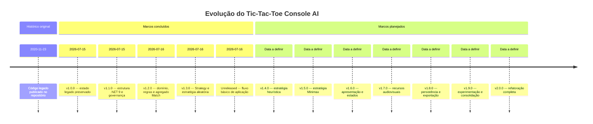

# Changelog

Todas as alterações relevantes deste projeto serão documentadas neste arquivo.

O projeto utiliza versionamento semântico. A versão `1.0.0` identifica o
estado legado preservado antes do início da refatoração. A série `1.x`
registrará a evolução incremental, enquanto a versão `2.0.0` representará
a conclusão da nova arquitetura.

## Linha do tempo

O diagrama distingue o histórico original, os marcos efetivamente concluídos
e as versões futuras, cujas datas ainda não foram definidas.

As versões intermediárias poderão ser ajustadas conforme a granularidade
real das implementações, sem modificar os marcos `v1.0.0` e `v2.0.0`.

## [Unreleased]

### Added

- `IReadOnlyBoard` e `BoardView` para exposição segura do tabuleiro de `Match`.
- `IComputerMoveStrategyResolver` e resolvedor configurável por símbolo.
- Testes de fronteira do agregado, resolução de Strategy e propagação de falhas.
- `docs/09-correcao-fronteiras-arquiteturais.md` com decisões e diagramas.
- Revisão documental após o Prompt 10, com datas na timeline e atualização do estado do projeto.
- Camada `Application` com controlador mínimo de partidas.
- Portas `IGameInput`, `IGameOutput` e `IMoveSelector`.
- `DefaultMoveSelector` para participantes humanos e computacionais.
- Testes do fluxo completo sem Console ou interação humana.
- `docs/07-fluxo-aplicacao.md` com componentes e sequência.

### Changed

- Dependência `Domain → AI` removida de `ComputerPlayer`.
- Estratégias passaram a receber `IReadOnlyBoard`.
- `MatchController` passou a capturar apenas falhas da aplicação de jogadas.

## [1.3.0] - 2026-07-16

### Added

- Contrato `IMoveStrategy` para algoritmos intercambiáveis de decisão.
- Contrato `IRandomSource` para geração pseudoaleatória injetável.
- `SystemRandomSource` com suporte a semente controlável.
- `RandomMoveStrategy` para seleção de casas livres.
- Associação obrigatória entre `ComputerPlayer` e uma estratégia.
- Testes de validade, delegação, intervalo e reprodutibilidade.
- `docs/10-inteligencia-artificial.md` com documentação do padrão Strategy.

### Changed

- Versão do projeto e metadados de citação atualizados para `1.3.0`.

## [1.2.0] - 2026-07-16

### Added

- `LICENSE.md` com síntese acessível das condições de licenciamento.
- `NOTICE` com origem, atribuições e observações sobre o legado.
- `CITATION.cff` com metadados para citação acadêmica do software.
- `docs/00-decisoes-e-escopo.md` com convenções, política de idioma, documentação XML, fluxo Git, dependências e versionamento.
- `docs/02-requisitos.md` com escopo, requisitos funcionais, requisitos não funcionais, restrições e critérios de aceitação.
- `docs/03-arquitetura.md` com camadas, responsabilidades, contratos e regras de dependência.
- Diagramas Mermaid de contexto, componentes, sequência e estados com interpretação textual.
- `docs/04-modelo-conceitual.md` com entidades, objetos de valor, enumerações e relações do domínio.
- Enumerações `Symbol`, `GameState` e `GameResult`.
- Objetos de valor imutáveis `BoardPosition` e `Move`.
- `Board` com armazenamento encapsulado, consulta de símbolos, casas livres, aplicação e desfazimento de jogadas.
- `GameRules` para detecção de vitória, empate e partida em andamento.
- `GameEvaluation` com resultado e sequência vencedora imutável.
- `Player`, `HumanPlayer` e `ComputerPlayer`.
- Agregado `Match` com tabuleiro, jogadores, turno, histórico, estado e resultado.
- `docs/05-game-rules.md` com diagramas e interpretação das regras.
- `docs/06-match-aggregate.md` com invariantes e diagrama de sequência.
- Testes automatizados do domínio, das regras e do agregado.

### Changed

- Licença da linha de refatoração alterada de MIT para Apache License 2.0.
- Timeline do projeto consolidada entre `v1.0.0` e `v2.0.0`.
- Política de dependências definida para privilegiar a biblioteca padrão do .NET.
- Descoberta de testes xUnit habilitada no projeto de testes.
- Versão do projeto atualizada para `1.2.0`.

## [1.1.0] - 2026-07-15

### Added

- Solução `TicTacToe.sln` configurada para .NET 9.
- Projeto Console em `src/TicTacToe.Console`.
- Projeto de testes xUnit em `tests/TicTacToe.Tests`.
- Configuração compartilhada de nullable, implicit usings, UTF-8 e documentação XML.
- `.editorconfig` com indentação de quatro espaços e proibição de tabulações.
- `.gitignore` para C#/.NET, ambientes de desenvolvimento, testes, cobertura, publicação e dados locais.
- Diretórios iniciais para documentação, dados, exportações, patches e prompts.
- Inventário técnico do projeto legado em `docs/01-projeto-original.md`.
- Registro das responsabilidades, dependências, riscos e oportunidades de reutilização.
- Classificação inicial dos arquivos para a refatoração.
- Diagrama de dependências do código legado.

### Changed

- Arquivos C# legados movidos para `legacy/`, fora da compilação da nova solução.
- `README.md` ampliado com requisitos, estrutura e comandos básicos.

## [1.0.0] - 2026-07-15

### Added

- Preservação do estado legado anterior à refatoração.

### Known limitations

- Ausência de solução e projeto .NET versionados.
- Ausência de testes automatizados.
- Forte acoplamento entre regras, fluxo e interface Console.
