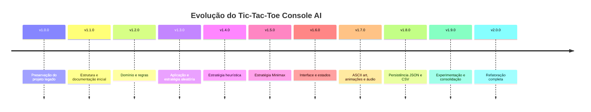

# Changelog

Todas as alterações relevantes deste projeto serão documentadas neste arquivo.

O projeto utiliza versionamento semântico. A versão `1.0.0` identifica o
estado legado preservado antes do início da refatoração. A série `1.x`
registrará a evolução incremental, enquanto a versão `2.0.0` representará
a conclusão da nova arquitetura.

## Linha do tempo

O diagrama apresenta o planejamento geral da evolução entre a preservação
do sistema legado e a conclusão da refatoração arquitetural.

As versões intermediárias poderão ser ajustadas conforme a granularidade
real das implementações, sem modificar os marcos `v1.0.0` e `v2.0.0`.

## [Unreleased]

### Added

- Inventário técnico do projeto legado em `docs/01-projeto-original.md`.
- Registro das responsabilidades, dependências, riscos e oportunidades de reutilização.
- Classificação inicial dos arquivos para a refatoração.
- Diagrama de dependências do código legado.

## [1.0.0] - 2026-07-15

### Added

- Preservação do estado legado anterior à refatoração.

### Known limitations

- Ausência de solução e projeto .NET versionados.
- Ausência de testes automatizados.
- Forte acoplamento entre regras, fluxo e interface Console.
