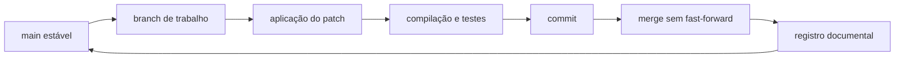
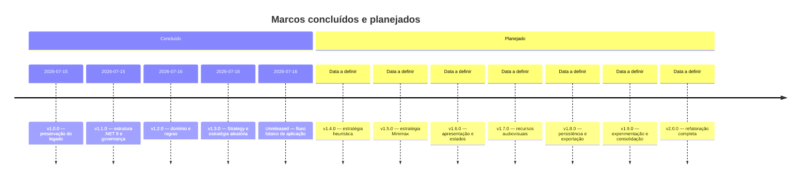

# Decisões e escopo da refatoração

## 1. Finalidade

Este documento registra as decisões de governança técnica e documental da refatoração do **Tic-Tac-Toe Console AI**. Ele complementa o inventário do projeto legado e deve orientar todas as etapas de desenvolvimento entre `v1.0.0` e `v2.0.0`.

A finalidade didática do projeto exige que decisões arquiteturais, convenções e alterações permaneçam explícitas, justificadas e rastreáveis no repositório.

## 2. Escopo

A refatoração produzirá uma aplicação Console em C# e .NET 9 com:

- arquitetura modular;
- modo pessoa contra inteligência artificial;
- estratégias aleatória, heurística e Minimax;
- modo demonstrativo entre agentes;
- persistência em JSON;
- exportação experimental em CSV;
- interface com ASCII art, cores e animações configuráveis;
- feedback sonoro com fallback silencioso;
- testes automatizados;
- documentação acadêmica e técnica em Markdown.

O aprendizado de máquina, bancos de dados relacionais, serviços externos, contêineres de injeção de dependência e frameworks de interface gráfica permanecem fora do escopo inicial.

## 3. Dependências

A implementação deverá privilegiar os recursos da biblioteca padrão do .NET. Bibliotecas externas somente poderão ser introduzidas quando houver justificativa técnica e didática clara, acompanhada de registro no `CHANGELOG.md`, no `NOTICE` quando aplicável e na documentação arquitetural.

O xUnit permanece restrito ao projeto de testes. A aplicação de produção não deverá depender do framework de testes.

## 4. Convenções de código

As convenções adotadas são:

- classes, interfaces, enumerações, registros e namespaces em inglês;
- classes, interfaces, enumerações e registros em `CamelCase`;
- métodos, variáveis, parâmetros e campos em `snake_case`;
- nomes de arquivos de código em inglês e correspondentes ao tipo principal;
- uma classe pública principal por arquivo;
- indentação com quatro espaços;
- proibição de tabulações nos arquivos novos;
- codificação UTF-8;
- finais de linha LF, conforme `.editorconfig`;
- dependências fornecidas por construtores;
- ausência de acesso direto ao Console ou ao sistema de arquivos no domínio.

## 5. Política de idioma

| Elemento | Idioma |
|---|---|
| Identificadores do código | Inglês |
| Namespaces e arquivos de código | Inglês |
| Comentários XML `///` | Português do Brasil |
| Comentários internos `//` | Português do Brasil |
| Mensagens da aplicação | Português do Brasil |
| Documentação Markdown | Português do Brasil |
| Descrições de commits | Português do Brasil |
| Nomes de branches | Inglês técnico |
| Nomes oficiais de tecnologias | Forma oficial |

Os prefixos técnicos de commits, como `feat`, `fix`, `docs`, `test`, `refactor` e `chore`, poderão permanecer em inglês. A descrição posterior deverá ser escrita em português do Brasil.

## 6. Documentação XML

Classes, interfaces, enumerações, registros, propriedades, construtores e métodos relevantes deverão utilizar comentários XML com `///`.

A documentação deverá explicar:

- responsabilidade do elemento;
- camada arquitetural;
- parâmetros e valores de retorno;
- pré-condições e pós-condições;
- efeitos colaterais;
- invariantes;
- exceções intencionais;
- padrões de projeto envolvidos;
- limitações relevantes.

Comentários internos não devem repetir o código. Eles devem explicar intenção, motivação, restrição ou decisão não evidente.

```csharp
/// <summary>
/// Define o contrato para algoritmos responsáveis pela escolha de uma jogada.
/// </summary>
/// <remarks>
/// O contrato aplica o padrão Strategy e permite substituir o algoritmo sem
/// modificar o fluxo principal da partida.
/// </remarks>
public interface IMoveStrategy
{
    /// <summary>
    /// Seleciona uma jogada válida para o estado atual do tabuleiro.
    /// </summary>
    /// <param name="board">Estado atual do tabuleiro.</param>
    /// <returns>Jogada escolhida pela estratégia.</returns>
    Move choose_move(Board board);
}
```

O exemplo mostra que a documentação descreve a intenção arquitetural e o contrato, sem reproduzir mecanicamente a assinatura.

## 7. Documentação Markdown e Mermaid

Toda documentação técnica será produzida em Markdown e em português do Brasil.

Todo diagrama Mermaid deverá possuir:

1. pelo menos um parágrafo anterior, explicando objetivo, escopo e elementos observados;
2. o bloco Mermaid;
3. pelo menos um parágrafo posterior, interpretando relações, decisões, fluxos ou limitações.

Diagramas isolados não serão aceitos como documentação suficiente.

## 8. Fluxo Git

O branch `main` deverá representar sempre um estado funcional, compilável e testado. Cada alteração será desenvolvida em uma branch curta.

O diagrama representa o fluxo mínimo adotado para cada prompt de implementação.



Cada branch nasce do `main` atualizado. O merge será realizado somente depois da validação e utilizará `--no-ff` para preservar o histórico didático da etapa.

Fluxo de referência:

```bash
git switch main
git pull
git switch -c tipo/nome-da-etapa

git apply --check patches/arquivo.patch
git apply patches/arquivo.patch

dotnet restore TicTacToe.sln
dotnet build TicTacToe.sln --configuration Release
dotnet test TicTacToe.sln --configuration Release

git add .
git commit -m "tipo(escopo): descrição em português"

git switch main
git merge --no-ff tipo/nome-da-etapa
git branch -d tipo/nome-da-etapa
```

## 9. Versionamento

O projeto utiliza versionamento semântico:

- `MAJOR`: nova geração arquitetural ou alteração incompatível;
- `MINOR`: etapa funcional relevante e compatível dentro da série;
- `PATCH`: correção ou melhoria localizada e compatível.

A versão `v1.0.0` preserva o legado. A série `1.x` registra a refatoração incremental. A versão `v2.0.0` indicará a consolidação da nova arquitetura.

O diagrama registra datas apenas para marcos concluídos. As versões futuras permanecem com data a definir, evitando transformar estimativas em compromissos artificiais.



O `CHANGELOG.md`, o `CITATION.cff`, a versão da aplicação e as tags Git deverão permanecer coerentes entre si.

## 10. Licenciamento e atribuições

A tag `v1.0.0` preserva o projeto legado originalmente distribuído sob a licença MIT. A linha de refatoração adota a Apache License 2.0.

Os arquivos obrigatórios são:

- `LICENSE`: texto integral da Apache License 2.0;
- `LICENSE.md`: explicação resumida em português do Brasil;
- `NOTICE`: origem, atribuições e observações aplicáveis;
- `CITATION.cff`: metadados para citação acadêmica;
- `CHANGELOG.md`: histórico de versões e alterações.

Novas dependências ou recursos de terceiros deverão ter licença verificada antes da incorporação.

## 11. Critério de integração

Uma etapa somente poderá ser integrada ao `main` quando:

- o patch for aplicado sem erros;
- não houver tabulações nos arquivos novos;
- `dotnet restore` concluir com sucesso;
- `dotnet build --configuration Release` concluir sem erros;
- `dotnet test --configuration Release` concluir sem falhas;
- a documentação afetada estiver atualizada;
- o `CHANGELOG.md` estiver coerente;
- não houver binários, dados locais, segredos ou arquivos temporários versionados.
