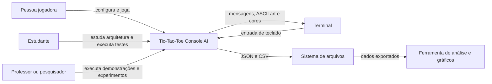
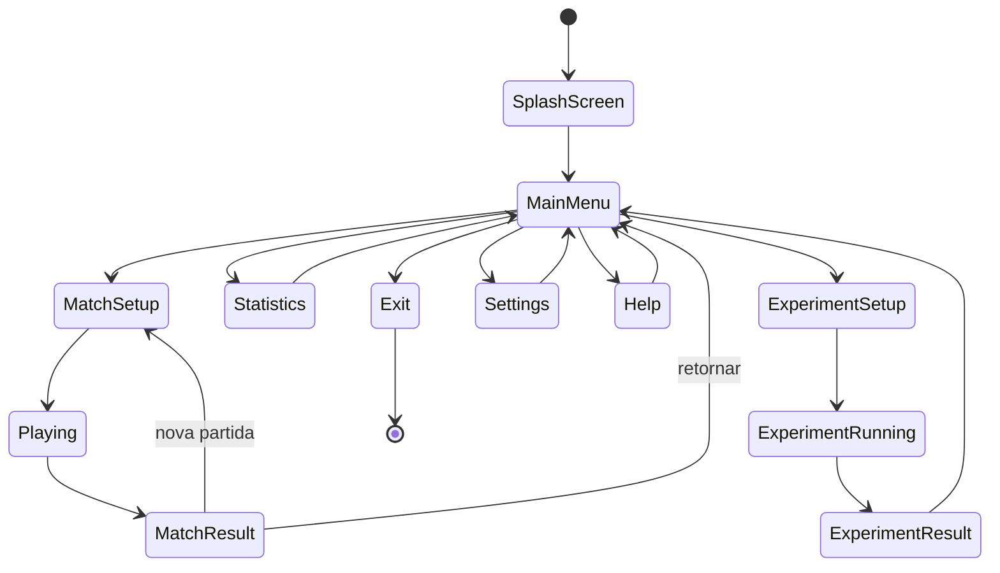

# Requisitos do Tic-Tac-Toe Console AI

## 1. Finalidade

Este documento especifica os requisitos iniciais da refatoração do **Tic-Tac-Toe Console AI**. O objetivo é estabelecer um contrato verificável para a evolução do projeto entre a versão legada `v1.0.0` e a versão consolidada `v2.0.0`.

Os requisitos aqui descritos orientam o domínio, a aplicação, a apresentação, a inteligência artificial, a persistência, a experimentação, os testes e a documentação. Alterações posteriores deverão manter rastreabilidade com este documento e com o `CHANGELOG.md`.

## 2. Objetivo geral

Reestruturar e ampliar o projeto legado de jogo da velha em C# e .NET 9, produzindo uma aplicação Console multiplataforma, modular, testável e documentada, com modos interativo, demonstrativo e experimental.

## 3. Objetivos específicos

1. Encapsular as regras centrais do jogo em objetos de domínio.
2. Separar domínio, aplicação, inteligência artificial, apresentação, persistência e áudio.
3. Permitir partidas entre pessoa e inteligência artificial.
4. Permitir partidas automáticas entre agentes.
5. Implementar estratégias aleatória, heurística e Minimax.
6. Persistir configurações, partidas, estatísticas e experimentos em JSON.
7. Exportar resultados experimentais em CSV.
8. Produzir feedback visual e sonoro configurável.
9. Garantir execução em Windows e em sistemas Unix-like compatíveis.
10. Produzir testes automatizados e documentação técnica didática.
11. Manter dependências externas no menor nível possível.
12. Conduzir a evolução por branches curtas, patches, testes e versionamento semântico.

## 4. Escopo funcional

O sistema deverá oferecer:

- cadastro simples do nome da pessoa jogadora;
- escolha de símbolo ou definição do primeiro participante;
- seleção de estratégia de inteligência artificial;
- partida pessoa contra computador;
- partida automática entre dois agentes;
- validação de jogadas;
- detecção de vitória, derrota e empate;
- reinício de partidas;
- estatísticas de sessão e persistidas;
- configuração de som, cores, Unicode e animações;
- execução de experimentos em lote;
- exportação de dados para JSON e CSV;
- ajuda e instruções;
- apresentação em terminal por ASCII art.

## 5. Elementos fora do escopo inicial

Não fazem parte do escopo inicial:

- interface gráfica de desktop;
- aplicação web;
- aplicação móvel;
- banco de dados relacional;
- serviços em nuvem;
- autenticação;
- modo multijogador em rede;
- aprendizado de máquina;
- redes neurais;
- aprendizado por reforço;
- modelos generativos;
- microserviços;
- arquitetura orientada a eventos completa;
- contêiner externo de injeção de dependência;
- frameworks de interface gráfica;
- bibliotecas externas sem justificativa explícita.

## 6. Atores e contexto

O sistema será utilizado por uma pessoa jogadora, por estudantes e pelo professor ou pesquisador responsável por demonstrações e experimentos. O terminal do sistema operacional e o sistema de arquivos são recursos externos.

O diagrama de contexto representa as interações externas sem detalhar classes ou componentes internos.

O sistema não controla diretamente ferramentas de gráficos. Ele produz arquivos abertos que podem ser utilizados por planilhas, scripts ou ferramentas externas. O terminal e o sistema de arquivos são tratados como fronteiras e não devem ser conhecidos pelo domínio.

## 7. Requisitos funcionais

### 7.1 Configuração e navegação

- **RF01:** o sistema deverá exibir uma tela inicial.
- **RF02:** o sistema deverá apresentar um menu principal.
- **RF03:** o sistema deverá permitir iniciar uma partida.
- **RF04:** o sistema deverá permitir acessar configurações.
- **RF05:** o sistema deverá permitir acessar ajuda.
- **RF06:** o sistema deverá permitir encerrar a aplicação de forma controlada.
- **RF07:** o sistema deverá permitir retornar ao menu após uma partida.

### 7.2 Partida interativa

- **RF08:** o sistema deverá permitir informar o nome da pessoa jogadora.
- **RF09:** o sistema deverá permitir selecionar a estratégia da inteligência artificial.
- **RF10:** o sistema deverá definir ou sortear o primeiro participante.
- **RF11:** o sistema deverá apresentar o tabuleiro.
- **RF12:** o sistema deverá receber uma posição de jogada.
- **RF13:** o sistema deverá rejeitar posições inexistentes.
- **RF14:** o sistema deverá rejeitar posições ocupadas.
- **RF15:** o sistema deverá aplicar somente jogadas válidas.
- **RF16:** o sistema deverá alternar os turnos.
- **RF17:** o sistema deverá detectar vitória.
- **RF18:** o sistema deverá detectar empate.
- **RF19:** o sistema deverá apresentar o resultado.
- **RF20:** o sistema deverá destacar a sequência vencedora quando aplicável.

### 7.3 Inteligência artificial

- **RF21:** o sistema deverá oferecer estratégia aleatória.
- **RF22:** o sistema deverá oferecer estratégia heurística.
- **RF23:** o sistema deverá oferecer estratégia Minimax.
- **RF24:** toda estratégia deverá retornar apenas jogadas válidas.
- **RF25:** estratégias pseudoaleatórias deverão aceitar semente controlável.
- **RF26:** a estratégia Minimax deverá preservar o estado original do tabuleiro.

### 7.4 Modos automático e experimental

- **RF27:** o sistema deverá permitir partidas automáticas entre agentes.
- **RF28:** o modo demonstrativo deverá exibir o tabuleiro e as estratégias.
- **RF29:** o modo experimental deverá executar partidas em lote.
- **RF30:** o modo experimental deverá desativar som, animações e renderização por turno.
- **RF31:** o sistema deverá permitir configurar quantidade de partidas.
- **RF32:** o sistema deverá permitir alternar o primeiro participante.
- **RF33:** o sistema deverá registrar a semente utilizada.
- **RF34:** o sistema deverá registrar a versão da aplicação.
- **RF35:** o sistema deverá coletar métricas competitivas e computacionais.

### 7.5 Persistência e exportação

- **RF36:** o sistema deverá salvar configurações em JSON.
- **RF37:** o sistema deverá salvar partidas em JSON.
- **RF38:** o sistema deverá salvar estatísticas em JSON.
- **RF39:** o sistema deverá salvar experimentos em JSON.
- **RF40:** o sistema deverá exportar partidas em CSV.
- **RF41:** o sistema deverá exportar resumos experimentais em CSV.
- **RF42:** o sistema deverá exportar métricas por jogada em CSV.
- **RF43:** o sistema deverá criar diretórios de dados quando necessário.
- **RF44:** o sistema deverá tratar arquivos ausentes com valores padrão.
- **RF45:** o sistema deverá tratar arquivos inválidos sem encerrar a partida.

### 7.6 Apresentação e áudio

- **RF46:** o sistema deverá oferecer tabuleiro Unicode.
- **RF47:** o sistema deverá oferecer tabuleiro ASCII básico.
- **RF48:** o sistema deverá permitir desativar cores.
- **RF49:** o sistema deverá permitir desativar Unicode.
- **RF50:** o sistema deverá permitir desativar animações.
- **RF51:** o sistema deverá permitir desativar som.
- **RF52:** o sistema deverá apresentar feedback para entrada inválida.
- **RF53:** o sistema deverá apresentar feedback para jogadas.
- **RF54:** o sistema deverá apresentar feedback específico para vitória, derrota e empate.
- **RF55:** falhas de áudio não deverão encerrar a aplicação.

## 8. Requisitos não funcionais

### 8.1 Plataforma e compatibilidade

- **RNF01:** a solução deverá utilizar .NET 9.
- **RNF02:** a aplicação deverá ser do tipo Console.
- **RNF03:** o código novo deverá utilizar UTF-8.
- **RNF04:** a solução deverá compilar no Windows.
- **RNF05:** a solução deverá compilar em pelo menos um sistema Unix-like.
- **RNF06:** a aplicação deverá funcionar sem som.
- **RNF07:** a aplicação deverá funcionar sem Unicode.
- **RNF08:** a aplicação deverá funcionar sem cores.
- **RNF09:** a aplicação deverá funcionar sem animações.

### 8.2 Arquitetura

- **RNF10:** o domínio não deverá depender de `Console`.
- **RNF11:** o domínio não deverá depender do sistema de arquivos.
- **RNF12:** o domínio não deverá depender de JSON ou CSV.
- **RNF13:** o domínio não deverá depender de serviços de áudio.
- **RNF14:** a aplicação deverá coordenar casos de uso sem implementar regras centrais.
- **RNF15:** dependências externas deverão ser evitadas quando a biblioteca padrão do .NET for suficiente.
- **RNF16:** dependências externas deverão ser justificadas e documentadas.
- **RNF17:** não deverá haver dependências circulares entre módulos.

### 8.3 Código e documentação

- **RNF18:** identificadores deverão estar em inglês.
- **RNF19:** tipos deverão utilizar `CamelCase`.
- **RNF20:** métodos, variáveis, parâmetros e campos deverão utilizar `snake_case`.
- **RNF21:** comentários e documentação deverão estar em português do Brasil.
- **RNF22:** APIs relevantes deverão utilizar comentários XML.
- **RNF23:** arquivos novos deverão utilizar quatro espaços para indentação.
- **RNF24:** arquivos novos não deverão utilizar tabulações.
- **RNF25:** documentação técnica deverá utilizar Markdown.
- **RNF26:** diagramas Mermaid deverão possuir texto interpretativo antes e depois.

### 8.4 Testabilidade e robustez

- **RNF27:** regras e estratégias deverão ser testáveis sem terminal físico.
- **RNF28:** testes não deverão depender de espera real.
- **RNF29:** testes não deverão depender de áudio real.
- **RNF30:** algoritmos pseudoaleatórios deverão ser reproduzíveis por semente.
- **RNF31:** entradas inválidas não deverão encerrar inesperadamente a aplicação.
- **RNF32:** falhas de persistência deverão ser tratadas nas fronteiras.
- **RNF33:** a gravação JSON deverá utilizar estratégia segura com arquivo temporário quando aplicável.

### 8.5 Desempenho e experimentação

- **RNF34:** o modo experimental não deverá incluir custo de renderização nas métricas.
- **RNF35:** o modo experimental não deverá incluir custo de áudio nas métricas.
- **RNF36:** o Minimax deverá concluir decisões em tempo adequado ao tabuleiro 3 × 3.
- **RNF37:** os resultados deverão registrar dados suficientes para reprodução.
- **RNF38:** arquivos CSV deverão utilizar UTF-8 e ponto e vírgula.

## 9. Restrições

- o tabuleiro inicial possui dimensões fixas de 3 × 3;
- os símbolos principais são `X` e `O`;
- a aplicação utiliza entrada por teclado;
- a apresentação ocorre em terminal;
- o domínio deverá permanecer independente da infraestrutura;
- a implementação deverá privilegiar a biblioteca padrão do .NET;
- o xUnit permanecerá restrito ao projeto de testes;
- o código legado permanecerá em `legacy/` e não participará da compilação;
- dados locais, binários e artefatos temporários não deverão ser versionados;
- o branch `main` deverá permanecer compilável e testado.

## 10. Estados da aplicação

O sistema será organizado por estados explícitos para evitar que a navegação fique dispersa em condicionais e chamadas de terminal.

Os estados representam intenções de navegação, não necessariamente uma classe para cada tela. A implementação inicial poderá utilizar uma enumeração e um coordenador. Classes específicas de estado somente serão introduzidas se a complexidade justificar.

## 11. Critérios de aceitação

### 11.1 Critérios gerais

Uma funcionalidade será considerada aceita quando:

1. estiver implementada no módulo adequado;
2. respeitar as regras de dependência;
3. possuir testes automatizados pertinentes;
4. não introduzir falhas nos testes existentes;
5. estiver documentada;
6. compilar em configuração `Release`;
7. não introduzir dependência externa sem justificativa;
8. não adicionar artefatos locais ao repositório.

### 11.2 Critérios da partida

- uma posição livre aceita exatamente uma jogada;
- uma posição ocupada é rejeitada;
- o turno alterna somente após jogada válida;
- linhas, colunas e diagonais são reconhecidas;
- empate ocorre quando o tabuleiro está completo e não há vencedor;
- nenhuma jogada pode ser aplicada após o encerramento.

### 11.3 Critérios da inteligência artificial

- cada estratégia retorna uma posição disponível;
- a estratégia heurística vence quando possível;
- a estratégia heurística bloqueia derrota imediata;
- o Minimax não perde sob jogo perfeito;
- o Minimax não altera permanentemente o tabuleiro recebido;
- a estratégia aleatória reproduz resultados com a mesma semente.

### 11.4 Critérios da persistência

- arquivo ausente produz valor padrão;
- arquivo válido pode ser salvo e carregado;
- arquivo inválido não encerra a aplicação;
- exportação CSV produz cabeçalhos documentados;
- campos com separadores, aspas ou quebras de linha são escapados;
- arquivos de teste são gravados em diretórios temporários.

### 11.5 Critérios da documentação

- os requisitos possuem identificadores únicos;
- diagramas possuem interpretação textual;
- decisões arquiteturais relevantes são registradas;
- comentários XML descrevem intenção e contrato;
- `CHANGELOG.md`, `CITATION.cff` e versão da aplicação permanecem coerentes.

## 12. Rastreabilidade inicial

| Grupo de requisitos | Módulo principal previsto |
|---|---|
| RF01–RF07 | Presentation e Application |
| RF08–RF20 | Domain, Application e Presentation |
| RF21–RF26 | AI e Domain |
| RF27–RF35 | Application, AI e Persistence |
| RF36–RF45 | Persistence |
| RF46–RF55 | Presentation e Audio |
| RNF10–RNF17 | Arquitetura geral |
| RNF18–RNF26 | Governança e documentação |
| RNF27–RNF33 | Tests e fronteiras externas |
| RNF34–RNF38 | Experimentação |

A tabela é uma primeira associação entre requisitos e responsabilidades. Ela será refinada quando classes e casos de uso concretos forem implementados.
