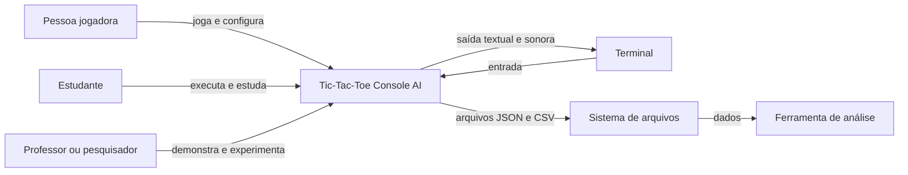
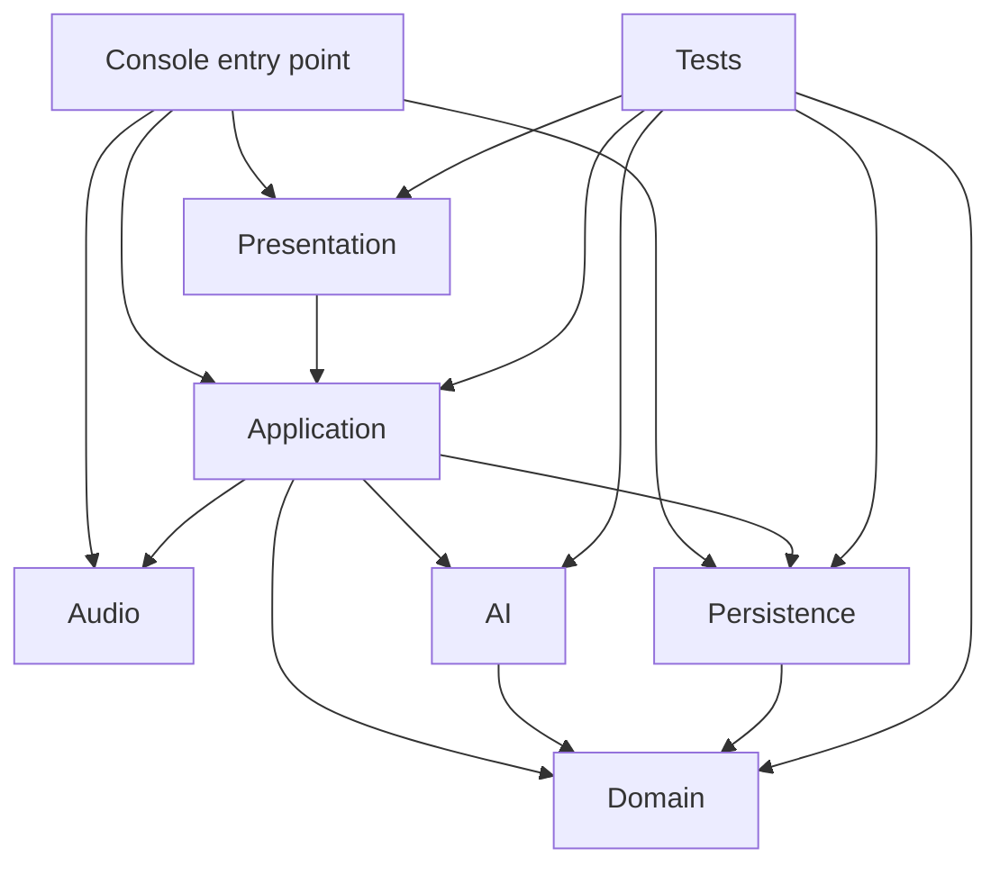
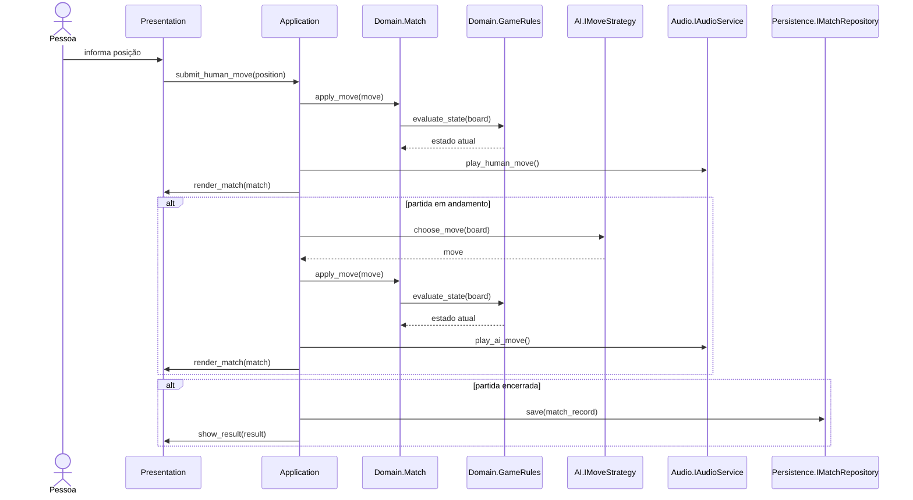
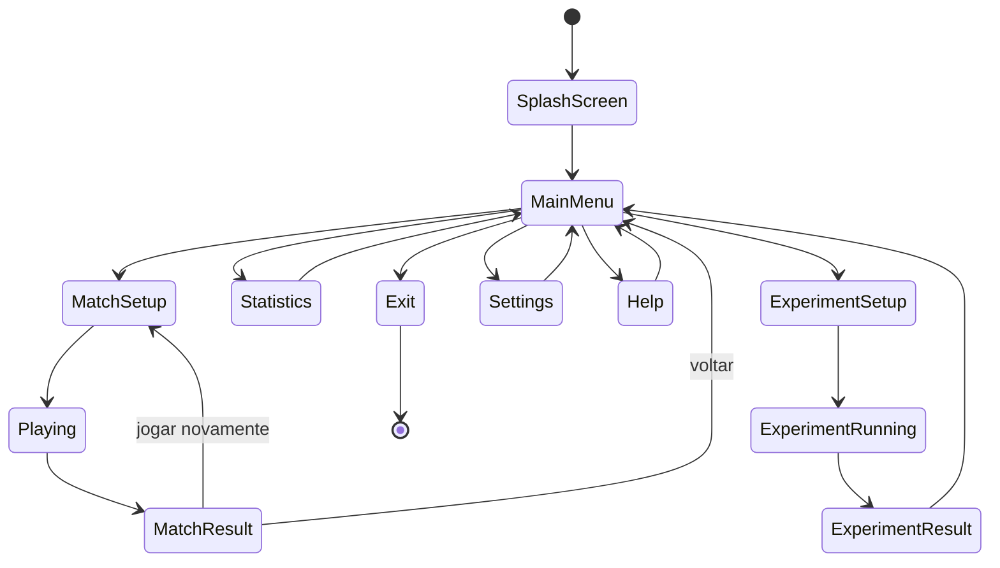

# Arquitetura inicial do Tic-Tac-Toe Console AI

## 1. Finalidade

Este documento define a arquitetura inicial planejada para a refatoração do **Tic-Tac-Toe Console AI**. A arquitetura será refinada progressivamente e deverá permanecer coerente com o código real.

O foco principal é separar as regras do jogo das tecnologias externas, permitindo testes automatizados, partidas interativas, execução entre agentes, persistência e experimentação sem duplicação de regras.

## 2. Princípios arquiteturais

A solução seguirá os seguintes princípios:

- domínio independente de interface, persistência e áudio;
- dependências dirigidas para o núcleo;
- responsabilidades explícitas;
- interfaces apenas em fronteiras substituíveis;
- injeção de dependência manual;
- uso preferencial da biblioteca padrão do .NET;
- ausência de dependências circulares;
- separação entre regras, coordenação e efeitos externos;
- testabilidade sem `Console` ou sistema de arquivos reais;
- evolução incremental a partir de componentes mínimos.

## 3. Visão de contexto

A arquitetura precisa atender pessoas jogadoras, estudantes e responsáveis por experimentos, utilizando terminal e sistema de arquivos como fronteiras.

O terminal não faz parte do domínio. A ferramenta de análise também não integra a aplicação: ela consome dados exportados. Essa separação permite trocar mecanismos externos sem alterar as regras centrais.

## 4. Camadas e módulos

A solução será organizada inicialmente nos seguintes módulos lógicos:

- **Domain:** regras e conceitos centrais;
- **Application:** casos de uso e coordenação;
- **AI:** estratégias de decisão;
- **Persistence:** JSON, CSV e acesso a arquivos;
- **Presentation:** entrada, telas e renderização;
- **Audio:** feedback sonoro e fallback;
- **Tests:** testes automatizados.

A primeira implementação poderá manter esses módulos como diretórios e namespaces dentro do projeto Console. A separação em projetos independentes deverá ocorrer apenas se trouxer benefício didático ou técnico claro.

## 5. Diagrama de componentes

O diagrama apresenta a direção permitida das dependências. As setas partem do componente dependente em direção ao componente utilizado.

O `Console entry point` atua como raiz de composição: instancia implementações concretas e conecta contratos. O domínio permanece no centro. O módulo AI utiliza o domínio para analisar estados, mas o domínio não conhece estratégias. A persistência pode transformar registros do domínio, porém nenhuma regra deve depender de JSON, CSV ou caminhos.

## 6. Regras de dependência

### 6.1 Dependências permitidas

| Origem | Destino permitido |
|---|---|
| Domain | biblioteca padrão do .NET sem efeitos externos |
| AI | Domain |
| Application | Domain, AI e contratos de fronteira |
| Presentation | Application e contratos de apresentação |
| Persistence | contratos e modelos necessários à persistência |
| Audio | contratos de áudio |
| Console entry point | todos os módulos concretos para composição |
| Tests | qualquer módulo sob teste |

### 6.2 Dependências proibidas

- Domain → Presentation;
- Domain → Persistence;
- Domain → Audio;
- Domain → `System.Console`;
- Domain → `System.IO`;
- Domain → `System.Text.Json`;
- AI → Presentation;
- AI → Persistence;
- Persistence → Presentation;
- Presentation → implementações concretas de persistência;
- dependências circulares;
- acesso direto a `Console` em controladores de aplicação;
- criação direta de serviços concretos dentro do domínio.

## 7. Responsabilidades por camada

### 7.1 Domain

Responsável por:

- `Board`;
- `Move`;
- `Match`;
- `Player`;
- `Symbol`;
- `GameState`;
- `GameResult`;
- `GameRules`;
- invariantes;
- histórico de jogadas;
- alternância de turnos;
- encerramento da partida.

Não deve:

- ler teclado;
- escrever no terminal;
- reproduzir som;
- salvar arquivos;
- serializar JSON;
- exportar CSV;
- medir animação.

### 7.2 Application

Responsável por:

- iniciar e coordenar casos de uso;
- configurar partidas;
- solicitar jogadas por contratos;
- escolher estratégias;
- executar partidas automáticas;
- concluir partidas;
- acionar persistência;
- atualizar estatísticas;
- coordenar experimentos;
- acionar feedback visual ou sonoro por contratos.

Não deve:

- reimplementar vitória ou empate;
- conhecer detalhes de `Console`;
- conhecer detalhes de JSON ou CSV;
- conter algoritmo Minimax.

### 7.3 AI

Responsável por:

- contrato `IMoveStrategy`;
- estratégia aleatória;
- estratégia heurística;
- estratégia Minimax;
- métricas de decisão;
- uso de semente pseudoaleatória.

Não deve:

- alterar permanentemente o tabuleiro recebido;
- escrever no terminal;
- salvar arquivos;
- controlar o fluxo completo da partida.

### 7.4 Presentation

Responsável por:

- entrada do terminal;
- renderização do tabuleiro;
- telas;
- menus;
- mensagens;
- ASCII art;
- cores;
- animações;
- validação sintática da entrada;
- navegação por estados.

Não deve:

- decidir vitória;
- decidir empate;
- modificar diretamente o estado interno do tabuleiro;
- implementar estratégias.

### 7.5 Persistence

Responsável por:

- configurações JSON;
- partidas JSON;
- estatísticas JSON;
- experimentos JSON;
- exportação CSV;
- diretórios;
- codificação UTF-8;
- escrita temporária;
- tratamento de arquivos inválidos.

Não deve:

- implementar regras;
- desenhar telas;
- reproduzir áudio;
- decidir estratégias.

### 7.6 Audio

Responsável por:

- contrato `IAudioService`;
- feedback por `Console.Beep` quando suportado;
- terminal bell quando apropriado;
- fallback silencioso;
- tratamento de falhas de plataforma.

Não deve:

- ser obrigatório para o funcionamento;
- interferir em testes;
- interferir em métricas experimentais.

### 7.7 Tests

Responsável por:

- testes de domínio;
- testes de estratégias;
- testes de aplicação;
- testes de persistência;
- testes de apresentação isolada;
- uso de implementações falsas;
- diretórios temporários;
- sementes determinísticas.

## 8. Contratos de fronteira previstos

Os contratos serão introduzidos apenas quando necessários. Entre os contratos previstos estão:

- `IMoveStrategy`;
- `IGameInput`;
- `IGameRenderer`;
- `IAudioService`;
- `ISettingsRepository`;
- `IMatchRepository`;
- `IStatisticsRepository`;
- `IExperimentRepository`;
- `IExperimentExporter`;
- `IDelayService`;
- `IRandomSource`.

Interfaces não deverão ser criadas apenas para aumentar a quantidade de abstrações. Cada contrato precisa representar uma fronteira substituível ou facilitar testes relevantes.

## 9. Fluxo de uma partida

O fluxo principal deverá coordenar entrada, domínio, estratégia, apresentação e persistência sem transferir regras para os serviços periféricos.

A aplicação coordena a sequência, enquanto `Match` e `GameRules` determinam a validade e o estado. Presentation, Audio e Persistence são acionados como efeitos externos e podem ser substituídos por implementações silenciosas ou falsas.

## 10. Estados de navegação

A apresentação utilizará estados explícitos para manter o fluxo compreensível.

A navegação poderá ser implementada inicialmente com `ApplicationState` e `ScreenManager`. O padrão State com classes independentes não será aplicado até que exista complexidade que justifique esse custo.

## 11. Composição da aplicação

O ponto de entrada deverá ser simples e atuar como raiz de composição. Ele poderá:

1. criar configurações;
2. criar repositórios;
3. criar renderizador e entrada;
4. selecionar serviço de áudio;
5. criar estratégias;
6. criar controladores;
7. iniciar o fluxo da aplicação.

O ponto de entrada não deverá implementar regras ou laços complexos. Dependências concretas não deverão ser criadas dentro de classes de domínio.

## 12. Persistência

A persistência utilizará inicialmente:

- `System.Text.Json`;
- `System.IO`;
- `StreamReader` e `StreamWriter`;
- codificação UTF-8;
- escrita CSV manual;
- arquivos temporários para gravação segura.

A biblioteca padrão do .NET é suficiente para o escopo previsto. Nenhuma biblioteca de serialização ou CSV será adicionada inicialmente.

## 13. Tratamento de erros

As exceções serão utilizadas para falhas excepcionais, não para fluxo normal de regras.

Diretrizes:

- entrada inválida será tratada por validação;
- posição ocupada será representada por resultado de domínio;
- arquivo ausente produzirá valor padrão;
- arquivo JSON inválido será tratado na fronteira;
- falha sonora ativará fallback silencioso;
- falha de persistência será registrada e comunicada sem corromper a partida;
- mensagens técnicas detalhadas não deverão substituir mensagens compreensíveis para a pessoa usuária.

## 14. Testabilidade

A arquitetura deverá permitir:

- criar `Board` sem terminal;
- executar `Match` sem terminal;
- executar estratégias com sementes fixas;
- simular entrada;
- capturar renderização;
- usar áudio silencioso;
- usar diretórios temporários;
- desativar atrasos;
- executar experimentos sem apresentação.

O uso de interfaces será direcionado a esses pontos de substituição.

## 15. Dependências externas

A aplicação de produção deverá utilizar preferencialmente apenas a biblioteca padrão do .NET.

Dependências externas somente serão aceitas quando:

1. a biblioteca padrão não atender adequadamente;
2. houver benefício técnico ou didático mensurável;
3. a licença for compatível;
4. a dependência for registrada no `NOTICE`, quando aplicável;
5. a decisão for documentada;
6. o custo de manutenção for considerado.

O xUnit permanece uma dependência exclusiva do projeto de testes.

## 16. Evolução arquitetural

A arquitetura será implementada incrementalmente:

1. objetos de valor;
2. `Board`;
3. `GameRules`;
4. `Match`;
5. Strategy e estratégia aleatória;
6. fluxo de aplicação;
7. estratégias heurística e Minimax;
8. apresentação;
9. áudio;
10. persistência;
11. experimentação;
12. revisão arquitetural.

Cada etapa deverá atualizar este documento quando o código real divergir da proposta.

## 17. Decisões iniciais

| Decisão | Justificativa |
|---|---|
| Aplicação Console | mantém compatibilidade com o legado e foco em arquitetura |
| .NET 9 | plataforma definida para a oferta de 2026 |
| Monorepositório simples | reduz complexidade operacional |
| Módulos inicialmente em diretórios | evita multiplicação precoce de projetos |
| Injeção manual | explicita dependências sem framework externo |
| `System.Text.Json` | biblioteca padrão suficiente |
| CSV manual | esquema simples e controlado |
| Strategy para IA | permite substituir algoritmos |
| Repository para persistência | isola formatos e arquivos |
| State simplificado | organiza telas sem excesso de classes |
| xUnit apenas em testes | separa infraestrutura de testes da aplicação |
| `legacy/` fora da compilação | preserva histórico sem contaminar o novo código |

## 18. Critérios para revisão da arquitetura

A arquitetura deverá ser revista quando ocorrer:

- dependência circular;
- acesso a `Console` fora de Presentation ou Audio;
- acesso a arquivos fora de Persistence;
- regra duplicada;
- classe com responsabilidades excessivas;
- necessidade recorrente de substituir uma implementação;
- teste que exija infraestrutura real sem necessidade;
- introdução de nova dependência externa;
- divergência entre diagrama e código;
- dificuldade para executar o modo experimental sem efeitos periféricos.

## 19. Correções arquiteturais após o Prompt 10

Em 2026-07-16, a etapa corretiva removeu a dependência de `Domain` para `AI`.
`ComputerPlayer` voltou a representar somente um participante computacional, e
a associação de estratégias passou para `Application` por meio de
`IComputerMoveStrategyResolver`.

O agregado `Match` mantém seu `Board` mutável como detalhe privado e expõe uma
instância de `IReadOnlyBoard` implementada por `BoardView`. Dessa forma,
consumidores não podem aplicar ou desfazer jogadas sem passar pelo agregado.

`MatchController` também restringe o tratamento de `InvalidOperationException`
à aplicação da jogada. Falhas de entrada, seleção ou saída não são convertidas
em mensagens de posição inválida.

Os detalhes e diagramas desta correção estão registrados em
`docs/09-correcao-fronteiras-arquiteturais.md`.
