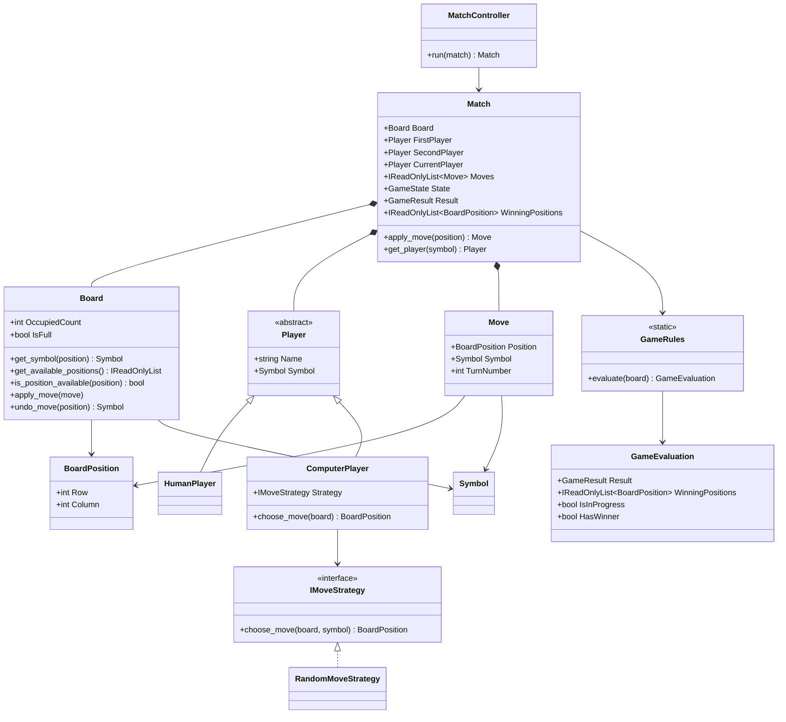

# Modelo conceitual do Tic-Tac-Toe Console AI

## 1. Finalidade

Este documento descreve o modelo conceitual implementado até 2026-07-16, após o
Prompt 10. O núcleo já contém tabuleiro, regras, participantes, agregado de
partida, Strategy aleatória e fluxo básico de aplicação.

## 2. Conceitos implementados

### 2.1 Domínio

- `Board`: encapsula as nove casas e controla aplicação e desfazimento;
- `BoardPosition`: objeto de valor para coordenadas entre zero e dois;
- `Move`: objeto de valor com posição, símbolo e número do turno;
- `Player`: abstração de participante;
- `HumanPlayer`: participante humano, sem dependência de entrada;
- `ComputerPlayer`: participante computacional associado a uma estratégia;
- `Match`: agregado que controla tabuleiro, turnos, histórico, estado e resultado;
- `GameRules`: serviço puro para vitória, empate e partida em andamento;
- `GameEvaluation`: resultado imutável da avaliação;
- `Symbol`, `GameState` e `GameResult`: enumerações do domínio.

### 2.2 Inteligência artificial

- `IMoveStrategy`: contrato do padrão Strategy;
- `RandomMoveStrategy`: linha de base aleatória;
- `IRandomSource`: abstração do gerador pseudoaleatório;
- `SystemRandomSource`: implementação com semente opcional.

### 2.3 Aplicação

- `MatchController`: coordena uma partida até seu encerramento;
- `IGameInput`: porta para jogadas humanas;
- `IGameOutput`: porta para apresentação;
- `IMoveSelector`: porta para seleção da próxima posição;
- `DefaultMoveSelector`: encaminha humanos à entrada e computadores à Strategy.

## 3. Diagrama conceitual atual

O diagrama apresenta os conceitos efetivamente existentes. Ele também torna
visível a dependência atual de `ComputerPlayer` para `IMoveStrategy`, registrada
como dívida arquitetural em `docs/03-arquitetura.md`.

`Match` é o limite de consistência da partida. O tabuleiro é exposto externamente
por `IReadOnlyBoard`, enquanto a instância mutável permanece encapsulada pelo
agregado. Strategies e adaptadores consultam o estado sem reabrir mutação pública.

## 4. Invariantes consolidadas

1. posições pertencem ao intervalo válido do tabuleiro;
2. jogadas usam `X` ou `O` e possuem turno positivo;
3. casas ocupadas não podem ser sobrescritas;
4. participantes da mesma partida possuem símbolos distintos;
5. somente jogadas válidas entram no histórico;
6. o turno alterna apenas após jogada válida;
7. vitória ou empate encerram a partida;
8. partidas encerradas não aceitam novas jogadas;
9. avaliações de vitória possuem exatamente três posições;
10. Strategy não modifica permanentemente o tabuleiro;
11. sementes iguais reproduzem a mesma sequência pseudoaleatória;
12. o controlador de aplicação não depende de Console.

## 5. Estado de implementação

| Conceito | Situação em `v1.8.0` |
|---|---|
| domínio, regras e agregado `Match` | Implementado |
| Strategies aleatória, heurística e Minimax | Implementadas |
| portas e fluxo da camada `Application` | Implementados |
| Console, temas e máquina de estados | Implementados |
| configurações e histórico JSON | Implementados |
| estatísticas JSON e exportadores CSV | Implementados |
| experimentação automatizada | Planejada para `v1.9.0` |

## 6. Testabilidade

A suíte cobre objetos de valor, tabuleiro, regras, agregado, Strategy,
reprodutibilidade e fluxo de aplicação com portas falsas. Os testes podem ser
executados sem teclado, terminal, áudio ou arquivos.
