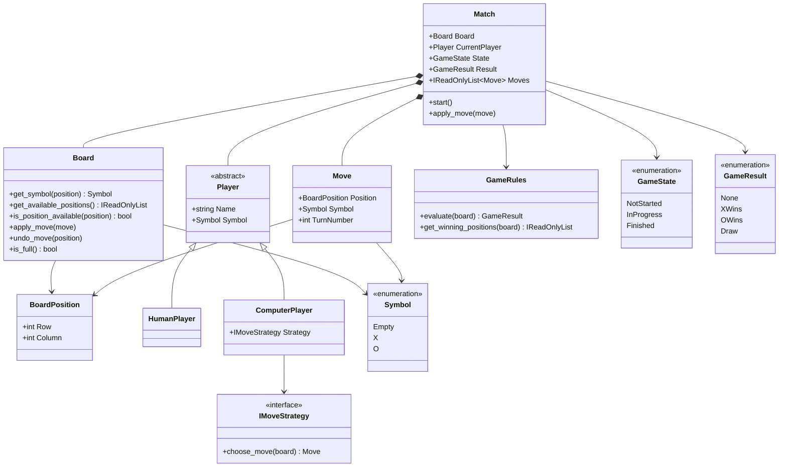

# Modelo conceitual do Tic-Tac-Toe Console AI

## 1. Finalidade

Este documento descreve o modelo conceitual inicial do domínio do **Tic-Tac-Toe Console AI**. O modelo identifica entidades, objetos de valor, enumerações e serviços de domínio sem antecipar detalhes completos de implementação.

Nesta etapa, somente as enumerações `Symbol`, `GameState` e `GameResult`, além dos objetos de valor `BoardPosition` e `Move`, são implementados. Os demais conceitos serão materializados nos prompts posteriores.

## 2. Conceitos centrais

### 2.1 `Board`

Representa o tabuleiro 3 × 3 e é responsável por preservar suas invariantes.

Responsabilidades previstas:

- armazenar o conteúdo das nove casas;
- consultar símbolos por posição;
- informar posições disponíveis;
- verificar se uma posição está livre;
- aplicar uma jogada válida;
- desfazer uma jogada para simulações;
- indicar se o tabuleiro está completo;
- impedir exposição mutável de seu armazenamento interno.

`Board` não deverá decidir sozinho o resultado global da partida nem executar entrada e saída.

### 2.2 `BoardPosition`

Objeto de valor que representa uma coordenada válida do tabuleiro.

As coordenadas utilizam índices de zero a dois:

- linha `0`, `1` ou `2`;
- coluna `0`, `1` ou `2`.

A validação ocorre no construtor, impedindo a criação de posições inválidas. A igualdade é determinada pelos valores de linha e coluna.

### 2.3 `Move`

Objeto de valor imutável que registra:

- posição;
- símbolo;
- número do turno.

Uma jogada não pode utilizar `Symbol.Empty`, e sua numeração começa em um. Informações experimentais, como tempo de decisão e estados avaliados, deverão ser registradas em modelos específicos de telemetria, não no objeto básico `Move`.

### 2.4 `Match`

Agregado que representa uma partida completa.

Responsabilidades previstas:

- possuir um `Board`;
- associar dois participantes;
- controlar o participante atual;
- manter o histórico de `Move`;
- controlar `GameState`;
- consolidar `GameResult`;
- aceitar jogadas válidas;
- alternar turnos;
- impedir jogadas após o encerramento.

`Match` será o limite principal de consistência do domínio.

### 2.5 `Player`

Abstração conceitual de um participante.

Propriedades previstas:

- nome;
- símbolo;
- tipo de participante.

O participante não armazenará um booleano redundante de turno. A responsabilidade de determinar o participante atual pertence a `Match`.

### 2.6 `HumanPlayer`

Especialização de `Player` que representa uma pessoa. A obtenção da entrada não deverá ocorrer dentro dessa classe; a camada de apresentação fornecerá a jogada selecionada.

### 2.7 `ComputerPlayer`

Especialização de `Player` que representa um agente computacional. A escolha da jogada será delegada a um contrato de estratégia, posteriormente denominado `IMoveStrategy`.

### 2.8 `Symbol`

Enumeração que representa:

- `Empty`;
- `X`;
- `O`.

O valor padrão é `Empty`, reduzindo o risco de uma casa recém-criada assumir implicitamente um símbolo jogável.

### 2.9 `GameState`

Enumeração que representa o ciclo de vida:

- `NotStarted`;
- `InProgress`;
- `Finished`.

O estado indica a fase da partida, enquanto `GameResult` descreve seu desfecho.

### 2.10 `GameResult`

Enumeração que representa:

- `None`;
- `XWins`;
- `OWins`;
- `Draw`.

`None` é utilizado enquanto não existe resultado consolidado.

### 2.11 `GameRules`

Serviço de domínio responsável por avaliar um estado de tabuleiro.

Responsabilidades previstas:

- detectar vitória de `X`;
- detectar vitória de `O`;
- detectar empate;
- indicar partida em andamento;
- retornar as posições da sequência vencedora.

`GameRules` não deverá modificar o tabuleiro.

## 3. Diagrama conceitual

O diagrama apresenta as relações planejadas entre os conceitos centrais. As operações listadas possuem caráter conceitual e poderão ser refinadas quando as classes forem implementadas.

`Match` agrega o tabuleiro, os participantes e o histórico. `BoardPosition` e `Move` são objetos de valor. `GameRules` avalia o tabuleiro sem modificá-lo. A decisão de um participante computacional fica fora de `Match` e é delegada à estratégia.

## 4. Classificação dos conceitos

| Conceito | Classificação | Implementação nesta etapa |
|---|---|---|
| `Board` | Entidade de domínio | Não |
| `BoardPosition` | Objeto de valor | Sim |
| `Move` | Objeto de valor | Sim |
| `Match` | Agregado e entidade | Não |
| `Player` | Entidade abstrata | Não |
| `HumanPlayer` | Entidade especializada | Não |
| `ComputerPlayer` | Entidade especializada | Não |
| `Symbol` | Enumeração | Sim |
| `GameState` | Enumeração | Sim |
| `GameResult` | Enumeração | Sim |
| `GameRules` | Serviço de domínio | Não |
| `IMoveStrategy` | Contrato de estratégia | Não |

## 5. Invariantes iniciais

As invariantes implementadas nesta etapa são:

1. uma posição deve estar dentro do tabuleiro 3 × 3;
2. uma jogada deve utilizar `X` ou `O`;
3. a numeração do turno deve ser maior ou igual a um;
4. objetos de valor equivalentes devem possuir igualdade por valor;
5. o valor padrão de `Symbol` deve ser `Empty`;
6. o valor padrão de `GameState` deve ser `NotStarted`;
7. o valor padrão de `GameResult` deve ser `None`.

## 6. Decisões de modelagem

### 6.1 Coordenadas iniciadas em zero

O domínio utiliza coordenadas de zero a dois, alinhadas à indexação de estruturas em C#. A apresentação poderá converter números de um a nove para coordenadas sem transferir essa convenção ao núcleo.

### 6.2 Imutabilidade dos objetos de valor

`BoardPosition` e `Move` são `readonly record struct`. Essa escolha oferece:

- semântica de valor;
- imutabilidade;
- igualdade estrutural;
- baixo custo para objetos pequenos;
- ausência de dependência externa.

### 6.3 Separação entre estado e resultado

`GameState` representa o ciclo de vida, enquanto `GameResult` representa o desfecho. Uma partida pode estar `InProgress` com resultado `None`, ou `Finished` com vitória ou empate.

### 6.4 Ausência de classes prematuras

`Board`, `Match`, `Player` e `GameRules` não são implementados nesta etapa. Antecipar essas classes antes dos requisitos específicos poderia produzir APIs especulativas e aumentar o retrabalho.

## 7. Testes básicos

Os testes desta etapa verificam:

- aceitação de coordenadas válidas;
- rejeição de coordenadas inválidas;
- igualdade de posições;
- criação de jogadas válidas;
- rejeição de símbolo vazio;
- rejeição de turno zero;
- igualdade de jogadas;
- valores padrão das enumerações.

Os testes não verificam regras de vitória, ocupação do tabuleiro ou alternância de turnos, pois essas responsabilidades pertencem aos próximos prompts.
