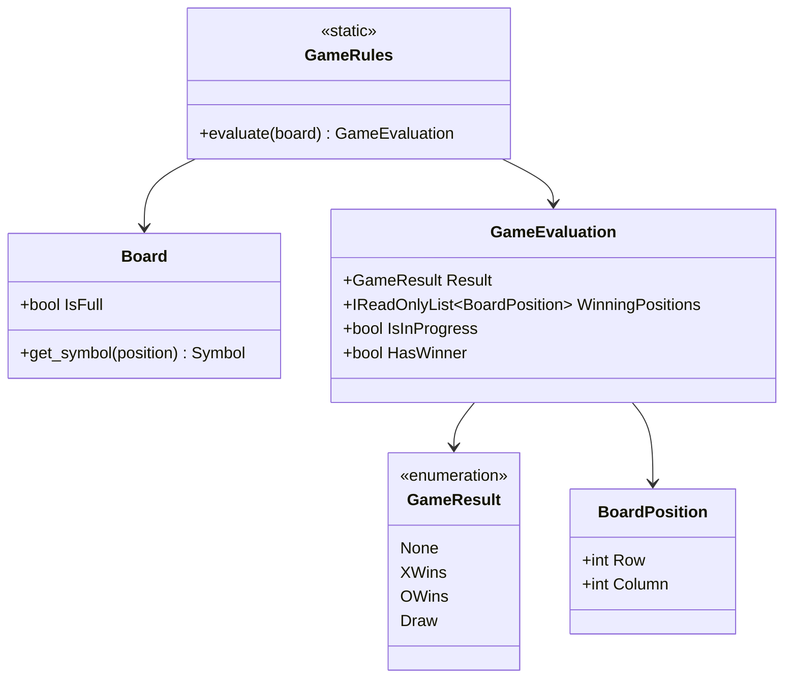
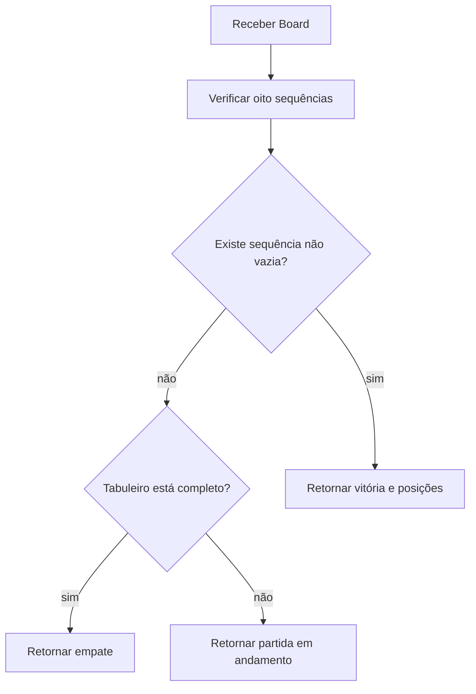

# Regras de domínio

## 1. Finalidade

Este documento registra a implementação de `GameRules` e `GameEvaluation`. A avaliação é independente de Console, inteligência artificial, persistência e áudio.

## 2. Responsabilidades

`GameRules` recebe um `Board` e produz uma avaliação sem modificar o tabuleiro. São verificadas oito sequências possíveis:

- três linhas;
- três colunas;
- diagonal principal;
- diagonal secundária.

A avaliação segue a precedência: vitória, empate e partida em andamento.

## 3. Modelo

O diagrama apresenta a relação entre tabuleiro, serviço de regras e resultado da avaliação.

`GameRules` apenas consulta o tabuleiro. `GameEvaluation` garante que vitórias tenham exatamente três posições e que empate ou partida em andamento não possuam sequência vencedora.

## 4. Fluxo de avaliação

O diagrama descreve a ordem usada para classificar um tabuleiro.

A verificação de vitória ocorre antes do teste de tabuleiro completo. Assim, uma jogada que preenche a última casa e também completa uma sequência é classificada como vitória, não como empate.

## 5. Critérios testados

A suíte cobre:

- todas as linhas;
- todas as colunas;
- ambas as diagonais;
- vitória de `X`;
- vitória de `O`;
- empate;
- tabuleiro vazio;
- tabuleiro parcial;
- sequências incompletas;
- sequências com símbolos mistos;
- linhas vazias;
- preservação do tabuleiro;
- rejeição de referência nula;
- invariantes de `GameEvaluation`.
