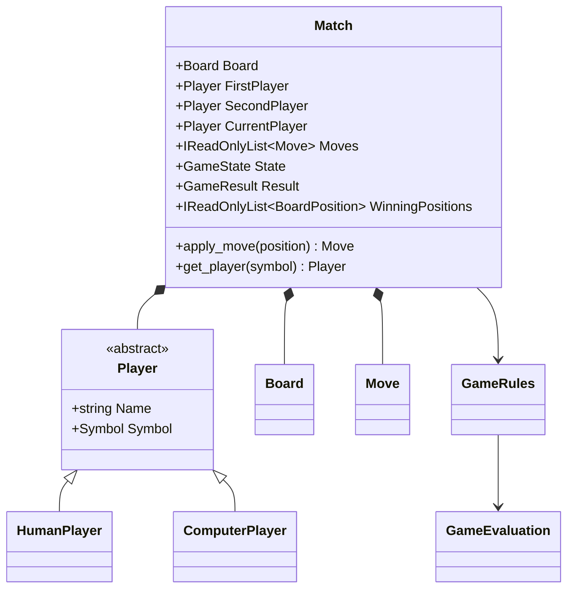
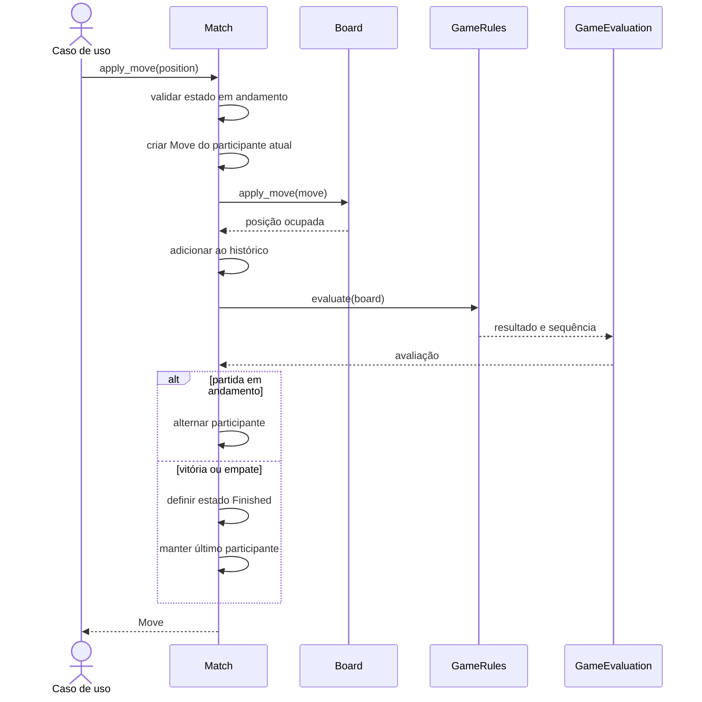

# Agregado Match e controle de turnos

## 1. Finalidade

Este documento descreve o agregado `Match`, responsável por controlar uma partida completa sem depender de Console, inteligência artificial, persistência ou áudio.

## 2. Invariantes

O agregado preserva as seguintes invariantes:

1. existem exatamente dois participantes;
2. os participantes controlam símbolos diferentes;
3. a partida inicia com o primeiro participante;
4. somente o participante atual fornece o símbolo da próxima jogada;
5. o histórico é cronológico e iniciado no turno um;
6. o turno alterna somente após uma jogada válida;
7. vitória ou empate encerram a partida;
8. o turno não alterna após a jogada final;
9. nenhuma jogada é aceita após o encerramento;
10. o resultado e a sequência vencedora derivam de `GameRules`.

## 3. Relações do agregado

O diagrama apresenta `Match` como limite de consistência sobre tabuleiro, participantes e histórico.

A aplicação externa informa apenas uma posição. O agregado cria a jogada com o símbolo do participante atual e o número correto do turno, reduzindo a possibilidade de estados inconsistentes.

## 4. Sequência de uma jogada

O diagrama descreve o fluxo interno de uma jogada válida.

Uma jogada inválida é rejeitada por `Board` antes de entrar no histórico. Consequentemente, turno, resultado e participante atual permanecem inalterados.

## 5. Encerramento

Ao receber uma avaliação de vitória ou empate, `Match` altera `State` para `Finished`. O `CurrentPlayer` permanece como o autor da última jogada, o que permite identificar diretamente quem encerrou a partida.

## 6. Evolução após a versão 1.2.0

Na versão `1.3.0`, `ComputerPlayer` passou a possuir uma `IMoveStrategy`, e a
estratégia aleatória foi implementada. Após o Prompt 10, `DefaultMoveSelector`
resolve a origem da posição: participantes humanos usam `IGameInput` e
participantes computacionais delegam à Strategy.

`Match` permanece independente da origem da jogada e continua recebendo apenas
uma `BoardPosition`. Essa decisão mantém as regras de turno e histórico no
agregado.
