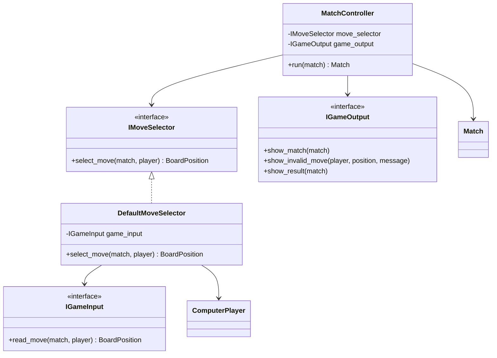
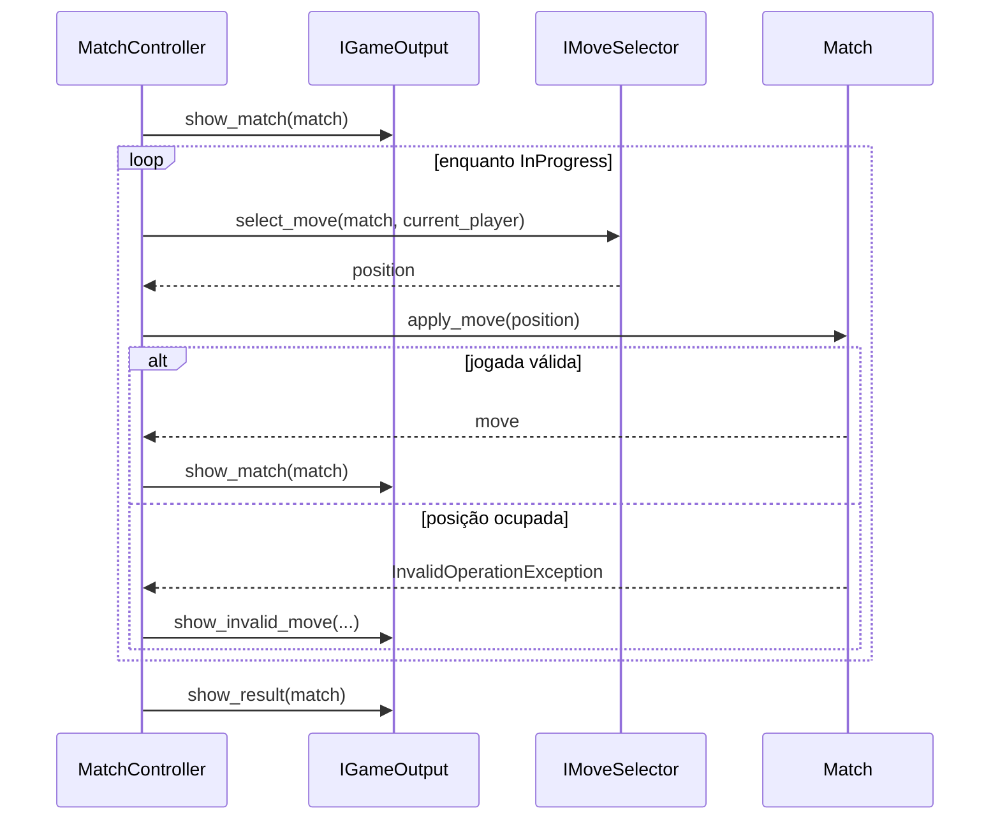

# Fluxo básico de aplicação

## 1. Finalidade

Este documento descreve o primeiro caso de uso executável da aplicação. O fluxo coordena uma partida completa sem acoplar o domínio ao Console ou exigir interação humana nos testes.

## 2. Portas

A camada de aplicação define três portas:

- `IGameInput`: obtém posições de participantes humanos;
- `IGameOutput`: apresenta estados, erros e resultado;
- `IMoveSelector`: resolve a origem da próxima jogada.

`DefaultMoveSelector` encaminha `HumanPlayer` para `IGameInput` e `ComputerPlayer` para a estratégia associada.

O diagrama apresenta as dependências da camada.

As interfaces pertencem à camada de aplicação. Implementações futuras de Console dependerão dessas portas, e não o contrário.

## 3. Fluxo coordenado

O controlador apresenta o estado inicial, solicita posições até o encerramento e apresenta o resultado final.

O controlador não interpreta vitória, empate ou alternância. Essas decisões continuam encapsuladas por `Match`.

## 4. Testabilidade

Os testes substituem as portas por objetos em memória:

- fila de posições;
- saída que registra chamadas;
- entrada que retorna posição predefinida;
- entrada que falha caso seja utilizada;
- estratégias determinísticas.

Assim, o fluxo completo pode ser executado sem `Console.ReadLine`, temporizadores, áudio ou entrada humana.

## 5. Tratamento de jogadas inválidas

Uma posição ocupada gera `InvalidOperationException` em `Board`, propagada por `Match`. O controlador captura essa falha específica, comunica a saída e solicita outra posição ao mesmo participante.

Falhas inesperadas das portas não são ocultadas. Essa distinção evita transformar erros de programação ou infraestrutura em tentativas de jogada inválida.
