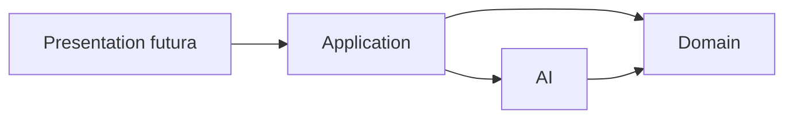
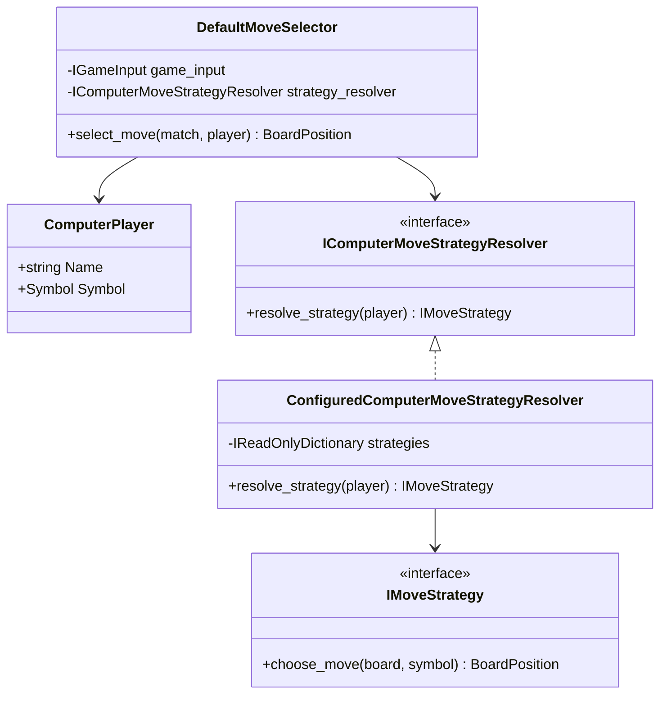
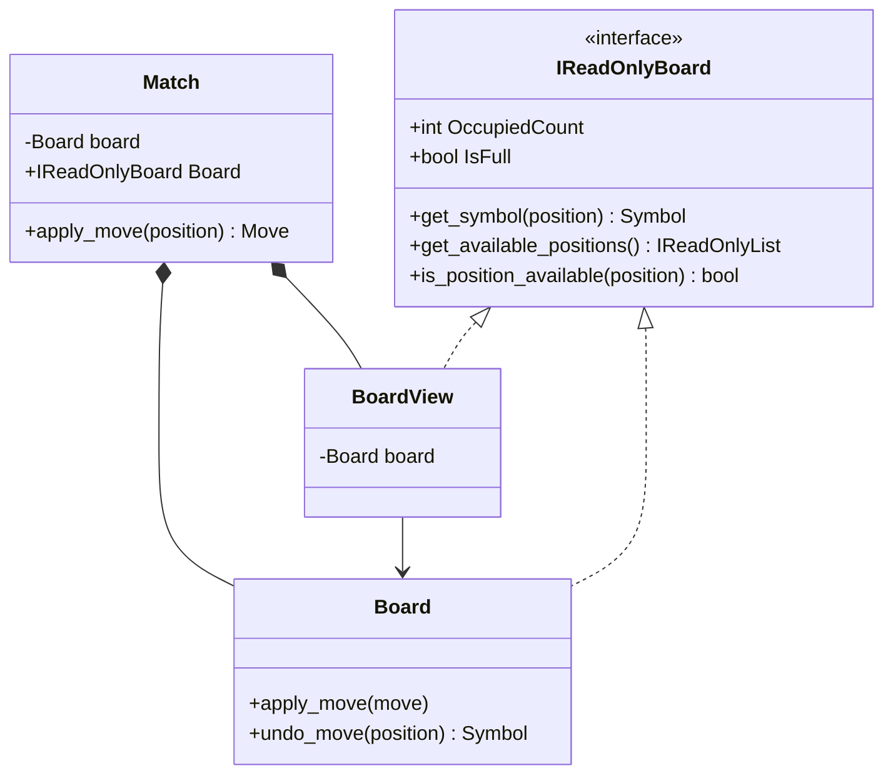
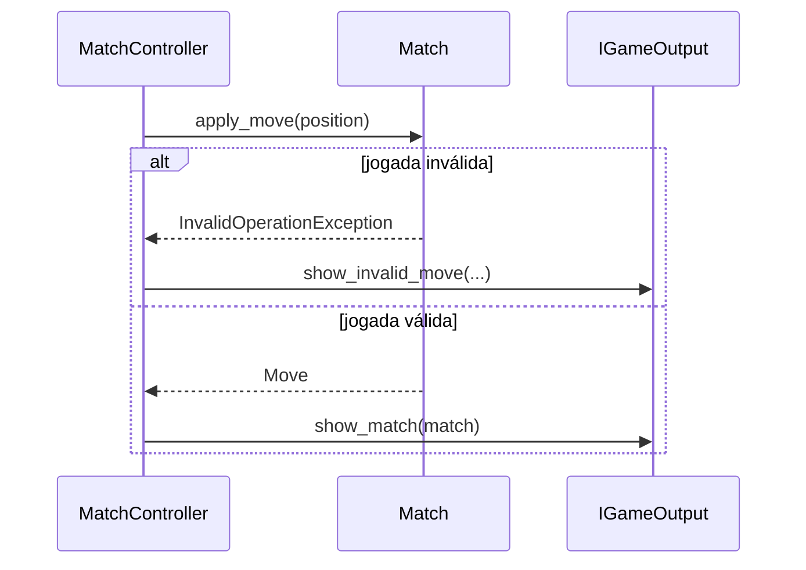

# Correção das fronteiras arquiteturais

## 1. Finalidade

Esta etapa corretiva foi realizada após a revisão do Prompt 10. Seu objetivo é
restabelecer a direção das dependências, proteger o limite do agregado `Match` e
distinguir falhas de domínio de falhas de saída.

A versão permanece `1.3.0`; as alterações ficam em `Unreleased`.

## 2. Dependências entre camadas

Antes da correção, `ComputerPlayer` armazenava uma `IMoveStrategy`. Como
`IMoveStrategy` pertence a `AI` e depende de tipos de `Domain`, existia um ciclo
conceitual entre os módulos.

O diagrama apresenta a direção corrigida.

`Domain` não referencia `AI`. `ComputerPlayer` representa apenas um participante
computacional. A camada `Application` resolve a Strategy por meio de
`IComputerMoveStrategyResolver`.

## 3. Associação de estratégias

O resolvedor associa participantes computacionais a estratégias sem modificar a
entidade do domínio.

A configuração por símbolo é suficiente para a partida atual, pois `Match`
impede que os dois participantes controlem o mesmo símbolo.

## 4. Tabuleiro somente para leitura

`Match` mantém um `Board` mutável privado, mas expõe somente `IReadOnlyBoard`.
Uma instância interna de `BoardView` encaminha consultas e não fornece operações
de aplicação ou desfazimento.

Consumidores de `Match` não podem converter a visão pública para `Board`, pois o
objeto exposto é um `BoardView`. Estratégias também recebem `IReadOnlyBoard`.

## 5. Tratamento de exceções no controlador

O controlador captura `InvalidOperationException` apenas ao aplicar uma jogada.
A apresentação do novo estado ocorre fora do bloco.

Uma falha de `IGameOutput` agora se propaga ao chamador, em vez de ser
classificada como erro de posição.

## 6. Testes adicionados

A etapa acrescenta testes para:

- visão pública de tabuleiro não conversível para `Board`;
- atualização da visão após jogadas válidas;
- resolução de Strategy por símbolo;
- ausência de configuração de Strategy;
- propagação de falhas da saída;
- delegação do seletor à Strategy resolvida.
