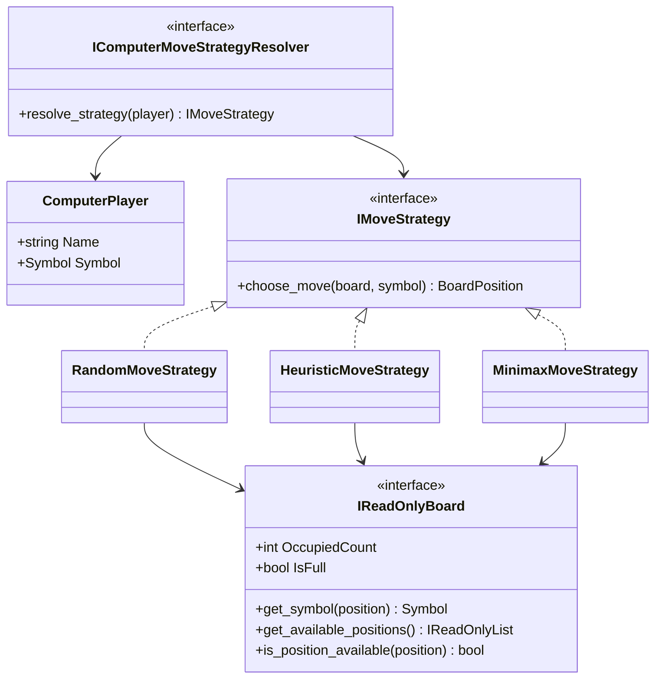
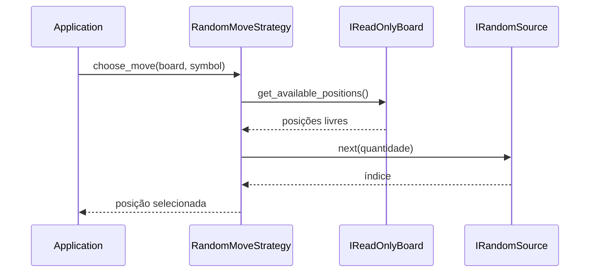
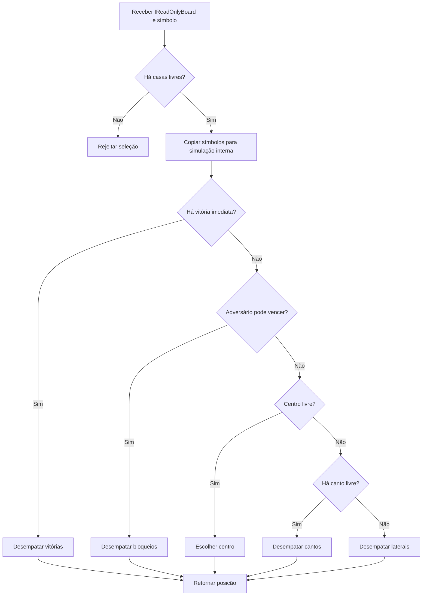
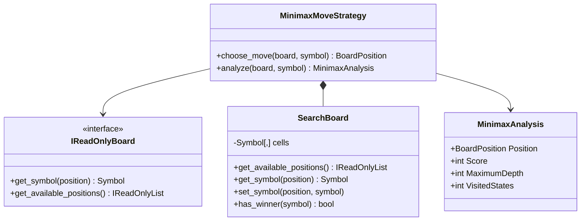
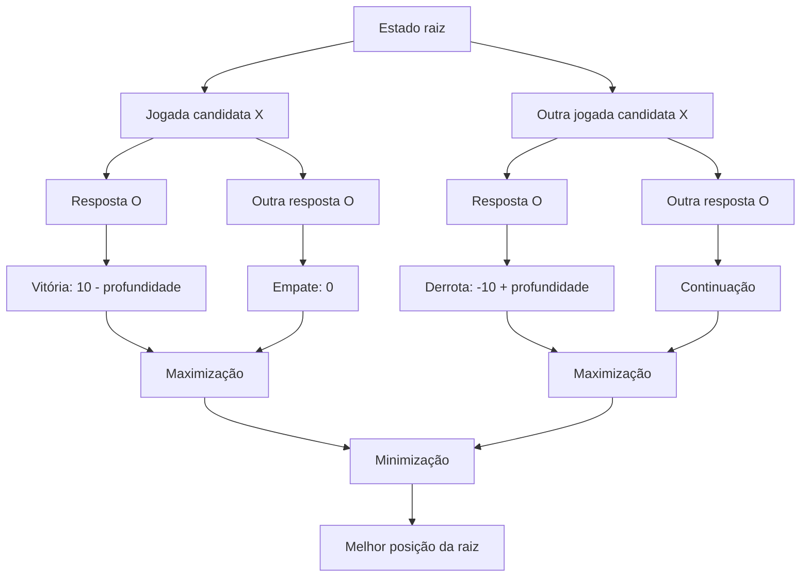

# Inteligência artificial e padrão Strategy

## 1. Finalidade

Este documento descreve a infraestrutura de inteligência artificial do **Tic-Tac-Toe Console AI** até a versão `1.5.0`.

O módulo contém estratégias aleatória, heurística e Minimax. Todas implementam `IMoveStrategy`, recebem `IReadOnlyBoard` e não modificam o estado pertencente ao agregado `Match`.

## 2. Fronteiras arquiteturais

O padrão Strategy permite trocar o algoritmo de decisão sem alterar o domínio ou o fluxo da partida. Depois da revisão arquitetural posterior ao Prompt 10, `ComputerPlayer` não armazena uma Strategy. A associação entre participante computacional e algoritmo é resolvida na camada `Application`.

O diagrama apresenta as relações atuais entre aplicação, estratégias e domínio.



A direção das dependências permanece `Application → AI → Domain`. O módulo `Domain` não conhece estratégias, e o tabuleiro exposto por `Match` é somente para leitura.

## 3. Contrato de estratégia

A interface recebe o estado consultável do tabuleiro e o símbolo controlado:

```csharp
public interface IMoveStrategy
{
    BoardPosition choose_move(
        IReadOnlyBoard board,
        Symbol symbol);
}
```

Ela retorna apenas uma `BoardPosition`. A criação de `Move`, a numeração do turno, a aplicação no tabuleiro, a alternância e o encerramento continuam sob responsabilidade de `Match`.

## 4. Aleatoriedade injetável

As estratégias que precisam desempatar alternativas dependem de `IRandomSource`, em vez de utilizar `Random` diretamente. Essa decisão permite:

- sementes controláveis;
- reprodução de experimentos;
- testes determinísticos;
- injeção de índices conhecidos;
- substituição do gerador sem alterar o algoritmo.

As estratégias aleatória e heurística oferecem construção sem parâmetros, com semente e com fonte injetada:

```csharp
new RandomMoveStrategy();
new RandomMoveStrategy(2026);
new RandomMoveStrategy(random_source);

new HeuristicMoveStrategy();
new HeuristicMoveStrategy(2026);
new HeuristicMoveStrategy(random_source);
```

O construtor sem parâmetros é adequado ao uso interativo. Em testes e experimentos, deve-se registrar a semente ou injetar a fonte explicitamente.

## 5. Estratégia aleatória

`RandomMoveStrategy` consulta as casas disponíveis e seleciona uma delas pelo índice fornecido por `IRandomSource`.

O fluxo da estratégia aleatória é apresentado a seguir.



A estratégia não considera vitória, bloqueio ou qualidade posicional. Por isso, ela funciona como linha de base experimental.

## 6. Estratégia heurística

`HeuristicMoveStrategy` avalia as categorias na seguinte ordem:

1. vitória imediata;
2. bloqueio de vitória imediata do adversário;
3. centro;
4. cantos;
5. laterais.

Quando uma categoria possui mais de uma alternativa equivalente, a escolha usa `IRandomSource`. Não há desempate aleatório entre categorias diferentes: a prioridade superior sempre prevalece.

### 6.1 Pseudocódigo

O pseudocódigo resume a decisão sem detalhes de implementação.

```text
função escolher_jogada(tabuleiro, símbolo):
    livres ← obter_casas_livres(tabuleiro)
    simulação ← copiar_tabuleiro(tabuleiro)

    vitórias ← casas que vencem para símbolo
    se vitórias não estiver vazia:
        retornar desempatar(vitórias)

    adversário ← símbolo oposto
    bloqueios ← casas que vencem para adversário
    se bloqueios não estiver vazia:
        retornar desempatar(bloqueios)

    se centro estiver livre:
        retornar centro

    cantos ← cantos livres
    se cantos não estiver vazio:
        retornar desempatar(cantos)

    laterais ← laterais livres
    retornar desempatar(laterais)
```

A busca por vitória e bloqueio simula cada casa livre em uma cópia interna. Depois de cada hipótese, a célula simulada volta a `Empty`. Nenhuma operação mutável é chamada no `IReadOnlyBoard` original.

### 6.2 Diagrama de decisão

O diagrama mostra a precedência estrita das categorias avaliadas.



A decisão é determinística quando existe uma única alternativa na categoria de maior prioridade. O gerador é consultado somente quando há duas ou mais alternativas equivalentes.

## 7. Representação de simulação

A estratégia heurística contém uma representação interna de nove células. O construtor dessa representação copia cada símbolo por meio de `IReadOnlyBoard.get_symbol`.

A simulação permite:

- inserir temporariamente `X` ou `O`;
- verificar as oito sequências vencedoras;
- desfazer a hipótese somente na cópia;
- preservar integralmente o tabuleiro original.

Essa representação é privada à estratégia. Ela não amplia a superfície pública de mutação e não permite contornar o agregado `Match`.

## 8. Complexidade

Para um tabuleiro de tamanho fixo `3 × 3`, o custo prático é constante. Em termos do número `n` de casas livres:

- cópia do tabuleiro: `O(9)`;
- avaliação de vitórias do agente: até `n` hipóteses;
- avaliação de bloqueios: até `n` hipóteses;
- cada hipótese verifica oito linhas de três posições;
- filtragem de cantos e laterais: custo constante.

De forma generalizada para este algoritmo, o tempo é `O(n)` porque o número e o tamanho das sequências vencedoras são fixos. O espaço adicional é `O(1)` para o tabuleiro `3 × 3`.

## 9. Invariantes

As estratégias preservam as seguintes invariantes:

1. o tabuleiro não pode ser nulo;
2. o símbolo não pode ser `Empty`;
3. deve existir pelo menos uma casa livre;
4. a posição retornada deve estar disponível;
5. o tabuleiro recebido não é modificado;
6. o índice pseudoaleatório deve pertencer ao intervalo solicitado;
7. sementes iguais reproduzem os mesmos desempates para estados equivalentes;
8. vitória imediata precede bloqueio;
9. bloqueio precede preferências posicionais;
10. centro precede cantos, e cantos precedem laterais.

## 10. Limitações

A estratégia heurística não realiza busca em profundidade. Consequentemente, ela:

- não prevê armadilhas com duas ameaças simultâneas;
- não procura criar bifurcações deliberadamente;
- não garante jogo perfeito;
- não atribui pontuações graduais a estados futuros;
- pode perder contra sequências que exigem planejamento além de um turno.

Essas limitações motivaram a inclusão de `MinimaxMoveStrategy` na versão
`1.5.0`. A estratégia Minimax usa um estado de busca independente e preserva o
`IReadOnlyBoard` original.

## 11. Estratégia Minimax

`MinimaxMoveStrategy` realiza busca completa nos estados alcançáveis a partir do
tabuleiro recebido. O símbolo do agente representa o nível de maximização, e o
símbolo adversário representa o nível de minimização.

A API mantém o contrato de Strategy e oferece uma análise detalhada:

```csharp
BoardPosition choose_move(
    IReadOnlyBoard board,
    Symbol symbol);

MinimaxAnalysis analyze(
    IReadOnlyBoard board,
    Symbol symbol);
```

`choose_move` retorna apenas a posição exigida por `IMoveStrategy`. `analyze`
retorna um objeto separado de `Move`, contendo posição, pontuação, maior
profundidade e quantidade de estados visitados.

### 11.1 Estado de busca independente

A busca não utiliza o `Board` mutável pertencente a `Match`. O diagrama mostra a
cópia inicial e as mutações restritas ao módulo de inteligência artificial.



`SearchBoard` copia os nove símbolos na construção. Aplicações e reversões de
hipóteses ocorrem exclusivamente nessa cópia, sem conversão do
`IReadOnlyBoard` original para `Board`.

### 11.2 Pseudocódigo

O pseudocódigo explicita a alternância entre maximização e minimização.

```text
função analisar(tabuleiro, símbolo_max):
    estado ← copiar_para_search_board(tabuleiro)
    símbolo_min ← símbolo_oposto(símbolo_max)

    para cada posição livre em ordem linha-coluna:
        aplicar símbolo_max na cópia
        pontuação ← minimax(
            estado,
            símbolo_atual = símbolo_min,
            profundidade = 1)
        desfazer na cópia

        se pontuação for maior que a melhor:
            guardar posição e pontuação

    retornar posição, pontuação, profundidade e estados visitados

função minimax(estado, símbolo_atual, profundidade):
    registrar estado e profundidade

    se símbolo_max venceu:
        retornar 10 - profundidade

    se símbolo_min venceu:
        retornar -10 + profundidade

    se não houver casas livres:
        retornar 0

    se símbolo_atual for símbolo_max:
        retornar máximo das continuações
    senão:
        retornar mínimo das continuações
```

A profundidade diferencia resultados equivalentes: uma vitória em menos turnos
recebe pontuação maior, enquanto uma derrota mais distante recebe pontuação
menos negativa.

### 11.3 Árvore de busca

O diagrama representa a estrutura alternada da árvore. Cada aresta corresponde a
uma jogada hipotética aplicada e desfeita em `SearchBoard`.



Níveis do agente maximizam a pontuação; níveis do adversário minimizam. O valor
propagado até a raiz representa o resultado garantido quando ambos jogam
otimamente.

### 11.4 Avaliação terminal

A função utiliza três categorias:

| Estado terminal | Pontuação |
|---|---:|
| vitória do agente | `10 - profundidade` |
| vitória do adversário | `-10 + profundidade` |
| empate | `0` |

A pontuação depende apenas de estados terminais. Não há função heurística para
interromper a busca antes do fim, pois o espaço de estados do jogo da velha é
pequeno.

### 11.5 Desempate determinístico

As posições livres são enumeradas em ordem de linha e coluna. Quando duas
candidatas possuem a mesma pontuação, a primeira é mantida. Portanto:

- a mesma entrada produz a mesma decisão;
- não há consumo de `IRandomSource`;
- resultados experimentais são reproduzíveis sem semente;
- a ordem de enumeração faz parte do comportamento observável.

### 11.6 Métricas

`MinimaxAnalysis` registra:

- `Position`: melhor posição encontrada;
- `Score`: valor Minimax da posição;
- `MaximumDepth`: maior profundidade visitada;
- `VisitedStates`: quantidade de chamadas recursivas avaliadas.

A contagem é reiniciada em cada chamada de `analyze` e não pertence à entidade
`Move`.

## 12. Complexidade do Minimax

Para `b` jogadas possíveis por estado e profundidade `d`, a busca sem poda
possui complexidade temporal aproximada `O(b^d)` e complexidade espacial
`O(d)` para a pilha recursiva, além da cópia fixa de nove células.

No jogo da velha, `b` diminui a cada nível e `d` é no máximo nove. A busca
completa é viável, mas estados simétricos e transposições são recalculados.

## 13. Limitações e possíveis otimizações

A implementação inicial privilegia clareza didática e determinismo. Ela ainda
não utiliza:

- poda alfa-beta;
- tabela de transposição;
- memoização;
- redução por simetria;
- ordenação estratégica de jogadas;
- paralelização;
- limite configurável de profundidade.

A poda alfa-beta seria a primeira otimização recomendada, pois preserva o
resultado do Minimax e reduz a quantidade de estados visitados quando a ordem
das jogadas favorece cortes. Memoização e normalização por simetrias também
reduziriam avaliações repetidas.
