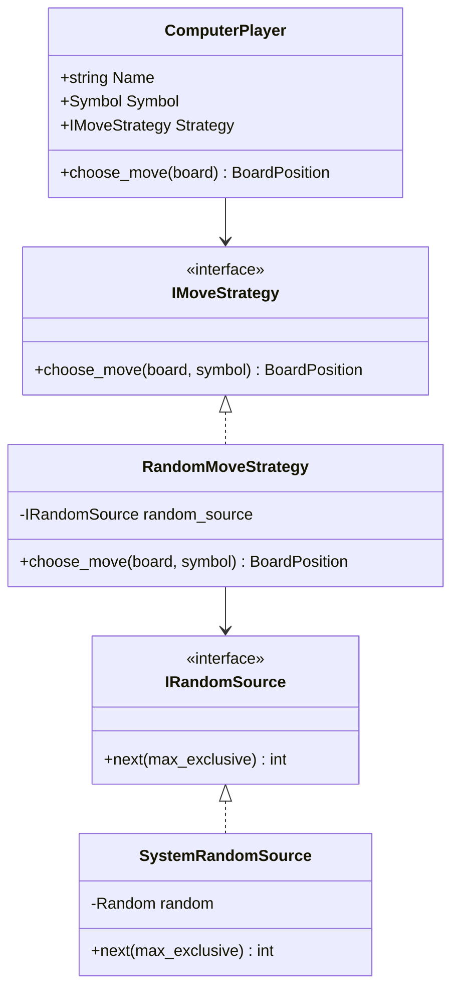
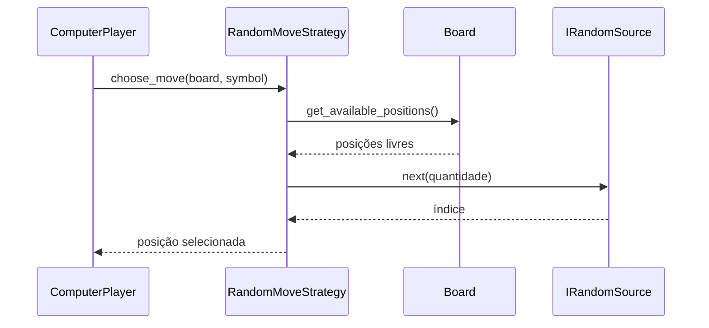

# Inteligência artificial e padrão Strategy

## 1. Finalidade

Este documento descreve a infraestrutura inicial de inteligência artificial do **Tic-Tac-Toe Console AI**, introduzida na versão `1.3.0`.

A primeira estratégia implementada seleciona jogadas aleatórias válidas. A arquitetura foi organizada para permitir a inclusão posterior das estratégias heurística e Minimax sem modificar o agregado `Match` nem as regras do jogo.

## 2. Padrão Strategy

O padrão Strategy encapsula algoritmos intercambiáveis atrás de um contrato comum. Neste projeto, `IMoveStrategy` define a operação de seleção de uma posição.

O diagrama apresenta a relação entre o participante computacional, o contrato de estratégia e a implementação aleatória.



`ComputerPlayer` funciona como contexto do padrão: ele não conhece o algoritmo utilizado, apenas delega a escolha. `RandomMoveStrategy` conhece o tabuleiro somente para consultar casas disponíveis e não aplica jogadas.

## 3. Contrato de estratégia

A interface recebe:

- o tabuleiro atual;
- o símbolo controlado pelo agente.

Ela retorna uma `BoardPosition`. O contrato não retorna `Move`, pois a numeração de turno e a aplicação pertencem ao agregado `Match`.

Essa separação impede que uma estratégia:

- altere diretamente o histórico;
- escolha um número de turno;
- encerre a partida;
- alterne participantes;
- persista resultados.

## 4. Aleatoriedade injetável

A estratégia não utiliza `Random` diretamente. Ela depende de `IRandomSource`, o que permite:

- controlar sementes;
- reproduzir experimentos;
- injetar valores conhecidos em testes;
- detectar geradores que violem o intervalo esperado;
- substituir o mecanismo pseudoaleatório sem alterar a estratégia.

O fluxo de uma decisão aleatória é apresentado a seguir.



A estratégia seleciona um índice dentro da lista ordenada de casas livres. Com o mesmo estado de tabuleiro e a mesma sequência pseudoaleatória, o resultado é reproduzível.

## 5. Sementes

Há três formas de construção:

```csharp
new RandomMoveStrategy();
new RandomMoveStrategy(seed);
new RandomMoveStrategy(random_source);
```

O construtor sem parâmetros é adequado ao uso interativo. O construtor com semente deve ser utilizado em testes e experimentos. A injeção direta de `IRandomSource` permite testes determinísticos de casos específicos.

## 6. Invariantes

A implementação preserva as seguintes invariantes:

1. o tabuleiro não pode ser nulo;
2. o símbolo não pode ser `Empty`;
3. deve existir pelo menos uma casa livre;
4. a posição retornada deve estar disponível;
5. a estratégia não modifica o tabuleiro;
6. o índice produzido pelo gerador deve pertencer ao intervalo solicitado;
7. `ComputerPlayer` deve possuir uma estratégia não nula.

## 7. Limitações

A estratégia aleatória:

- não procura vitórias imediatas;
- não bloqueia o adversário;
- não avalia estados futuros;
- não garante desempenho competitivo;
- serve como linha de base experimental.

Essas limitações justificam as próximas implementações heurística e Minimax.
