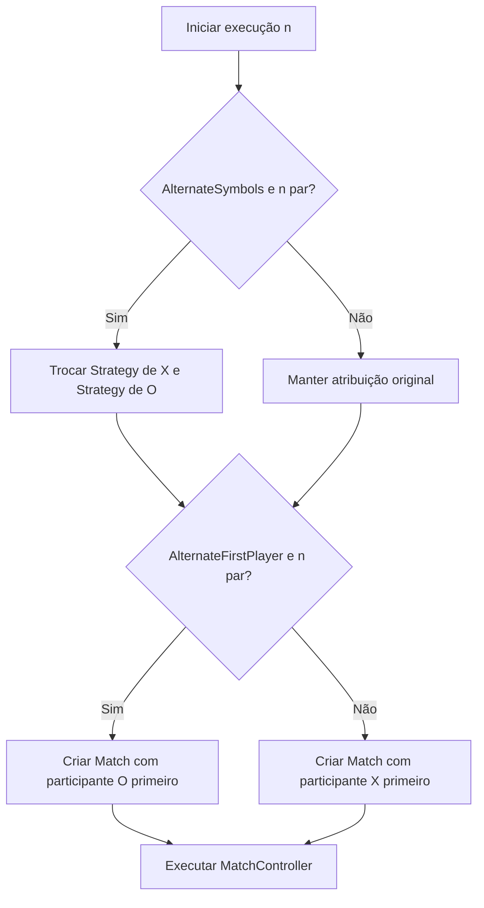
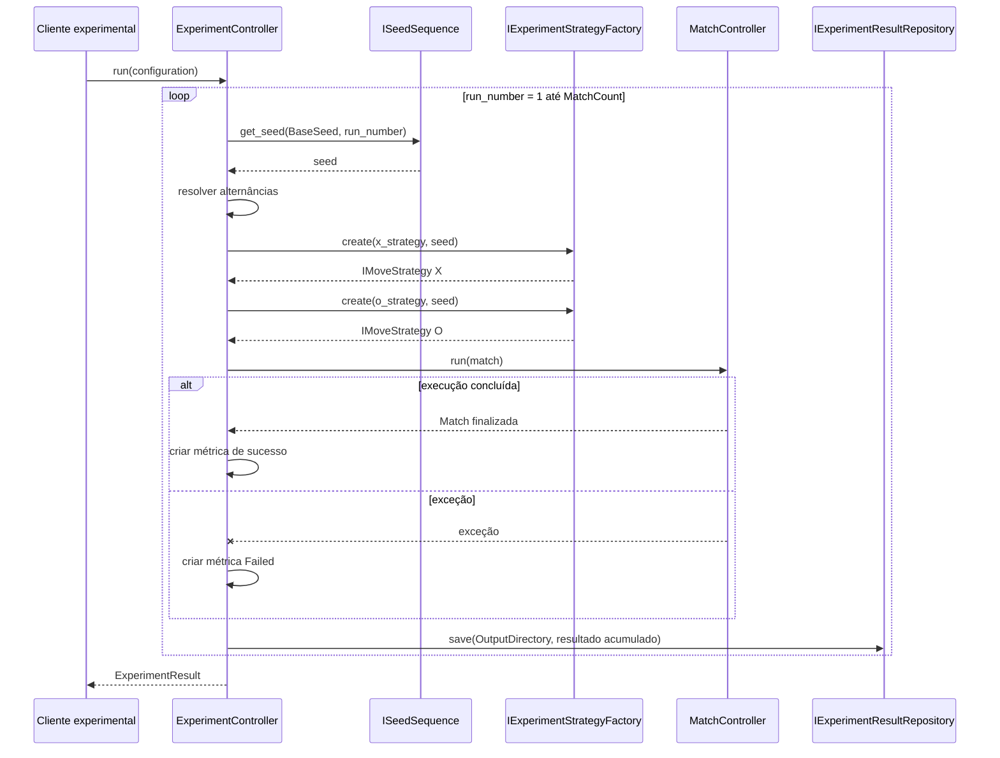
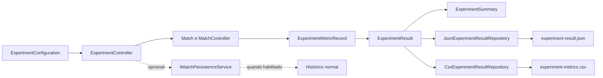

# Plano de experimentação

## 1. Finalidade

Este documento define o protocolo para avaliar, de forma reproduzível, as
Strategies `Random`, `Heuristic` e `Minimax` implementadas no projeto. O plano
reflete diretamente os contratos `ExperimentController`,
`ExperimentConfiguration`, `ExperimentMetricRecord`, `ExperimentResult` e
`ExperimentSummary`.

O modo experimental executa confrontos em lote sem renderização, animações,
áudio, atrasos ou navegação por `ScreenManager`. Por padrão, seus resultados
também permanecem separados do histórico normal de partidas.

## 2. Pergunta de pesquisa

A pergunta principal é:

> Como as Strategies `Random`, `Heuristic` e `Minimax` diferem quanto ao
> resultado das partidas, quantidade de jogadas, duração de execução e esforço
> de busca em confrontos controlados de jogo da velha?

A análise deve considerar separadamente o símbolo ocupado e a ordem de início,
pois ambos podem influenciar o resultado mesmo quando as Strategies permanecem
as mesmas.

## 3. Hipóteses

As hipóteses orientam a análise, mas não substituem a observação dos dados.

### H1 — Desempenho competitivo

`Minimax` deverá apresentar menor proporção de derrotas do que `Random` e
`Heuristic`, pois realiza busca completa sobre os estados alcançáveis.

### H2 — Custo computacional

Execuções que utilizem uma Strategy capaz de fornecer métricas de busca deverão
apresentar mais estados avaliados e, em condições equivalentes, maior duração
do que execuções baseadas exclusivamente em decisões locais ou
pseudoaleatórias.

### H3 — Efeito do símbolo e da iniciativa

A distribuição de resultados poderá mudar quando as Strategies alternarem os
símbolos X e O ou quando o primeiro participante for alternado.

### H4 — Reprodutibilidade

Com a mesma configuração, mesma versão da aplicação e mesma semente base, as
Strategies pseudoaleatórias deverão produzir a mesma sequência de decisões e,
consequentemente, resultados reproduzíveis.

## 4. Unidade experimental

A unidade experimental é uma execução completa de `MatchController.run`, desde
a criação de uma nova `Match` até um resultado terminal ou uma falha capturada.

Cada unidade gera exatamente um `ExperimentMetricRecord`.

Uma execução com falha também constitui uma unidade experimental registrada,
mas não participa das médias de jogadas e duração calculadas em
`ExperimentSummary`.

## 5. Variáveis independentes

As variáveis independentes são configuradas por `ExperimentConfiguration`.

| Variável | Propriedade | Valores ou interpretação |
|---|---|---|
| Strategy originalmente atribuída a X | `XStrategy` | `Random`, `Heuristic` ou `Minimax` |
| Strategy originalmente atribuída a O | `OStrategy` | `Random`, `Heuristic` ou `Minimax` |
| quantidade máxima de execuções | `MatchCount` | inteiro maior que zero |
| alternância de símbolos | `AlternateSymbols` | troca as Strategies entre X e O nas execuções pares |
| alternância do primeiro participante | `AlternateFirstPlayer` | O inicia as execuções pares |
| semente base | `BaseSeed` | inteiro opcional |
| política diante de falha | `ContinueOnFailure` | continua ou encerra o lote após registrar a falha |
| persistência no histórico normal | `PersistMatchesToHistory` | desativada por padrão |
| versão da aplicação | `ApplicationVersion` | identificador textual persistido em cada métrica |
| diretório de saída | `OutputDirectory` | destino dos arquivos experimentais |

`AlternateSymbols` e `AlternateFirstPlayer` são independentes. Portanto, trocar
as Strategies entre X e O não implica necessariamente trocar quem realiza a
primeira jogada.

## 6. Variáveis dependentes

As variáveis dependentes são extraídas de `ExperimentMetricRecord`.

| Variável | Campo | Interpretação |
|---|---|---|
| resultado | `Result` | `XWins`, `OWins`, `Draw` ou `Failed` |
| quantidade de jogadas | `MoveCount` | número de jogadas concluídas |
| duração | `DurationMilliseconds` | tempo medido pelo temporizador experimental |
| estados avaliados | `EvaluatedStates` | soma opcional das métricas fornecidas pelas Strategies |
| ocorrência de falha | `Failed` | `true` ou `false` |
| mensagem de falha | `FailureMessage` | descrição opcional da exceção capturada |

As médias agregadas incluem apenas execuções para as quais `Failed` é `false`.

## 7. Variáveis controladas

Para permitir comparação válida, devem permanecer constantes dentro de um
mesmo experimento:

- versão da aplicação;
- implementação das Strategies;
- regras de domínio;
- política de sementes;
- ambiente de execução;
- configuração de compilação;
- quantidade planejada de execuções;
- política de alternância;
- ausência de renderização, áudio, animações e atrasos;
- formato dos arquivos;
- critérios de captura de falha.

Em análises de duração, também devem ser registrados o runtime .NET, sistema
operacional e hardware, pois esses fatores não são controlados pelo
`ExperimentController`.

## 8. Cenários

O plano admite todas as combinações ordenadas entre as três Strategies.

| Cenário | Strategy A | Strategy B |
|---|---|---|
| C1 | Random | Random |
| C2 | Random | Heuristic |
| C3 | Random | Minimax |
| C4 | Heuristic | Random |
| C5 | Heuristic | Heuristic |
| C6 | Heuristic | Minimax |
| C7 | Minimax | Random |
| C8 | Minimax | Heuristic |
| C9 | Minimax | Minimax |

Quando `AlternateSymbols` estiver habilitado, um único lote já alterna a
atribuição das duas Strategies entre X e O. Nesse caso, cenários simétricos
podem ser analisados em conjunto, desde que a identificação de cada execução
seja preservada.

## 9. Quantidade de execuções

A quantidade é definida por `ExperimentConfiguration.MatchCount` e deve ser
maior que zero.

O código não fixa um número universal de repetições. Para o experimento de
referência, a quantidade deverá ser justificada antes da execução considerando:

- variabilidade das Strategies pseudoaleatórias;
- precisão desejada para proporções de vitória e empate;
- custo computacional;
- equilíbrio entre execuções ímpares e pares;
- tempo total disponível.

Quando houver alternância, recomenda-se uma quantidade par para que cada
condição apareça o mesmo número de vezes.

## 10. Alternância de símbolos e primeiro participante

O controlador resolve a atribuição das Strategies antes de cada execução.

O fluxo abaixo mostra as duas decisões independentes.



Assim, quatro combinações podem ser observadas: atribuição original com X
iniciando, atribuição original com O iniciando, Strategies trocadas com X
iniciando e Strategies trocadas com O iniciando. A combinação efetivamente
obtida depende das duas opções e da paridade da execução.

## 11. Política de sementes

`SequentialSeedSequence` implementa a política determinística:

```text
semente_efetiva = semente_base + número_da_execução - 1
```

Se `BaseSeed` for nula, `Seed` também será nula em todas as execuções.

Exemplo com `BaseSeed = 100`:

| Execução | Semente efetiva |
|---:|---:|
| 1 | 100 |
| 2 | 101 |
| 3 | 102 |
| 4 | 103 |

A mesma semente efetiva é fornecida às duas Strategies da execução. Strategies
determinísticas podem ignorá-la, mas o valor continua sendo registrado para
permitir reprodução e comparação.

O incremento usa aritmética verificada. Um estouro de inteiro é tratado como
falha da execução correspondente.

## 12. Métricas

### 12.1 Métricas por execução

Cada `ExperimentMetricRecord` contém:

- `ExperimentId`;
- `RunNumber`;
- `XStrategy`;
- `OStrategy`;
- `Seed`;
- `Result`;
- `MoveCount`;
- `DurationMilliseconds`;
- `EvaluatedStates`;
- `Failed`;
- `FailureMessage`;
- `ApplicationVersion`.

### 12.2 Estados avaliados

A métrica de busca é opcional. O controlador não depende de
`MinimaxMoveStrategy`; ele consulta o contrato `ISearchMetricsProvider`.

`ExperimentMoveSelector` acumula `LastEvaluatedStates` após cada decisão. Se
nenhuma Strategy fornecer valor positivo, `EvaluatedStates` permanece nulo.

### 12.3 Métricas agregadas

`ExperimentSummary` contém:

| Campo | Cálculo |
|---|---|
| `TotalRuns` | quantidade de métricas registradas |
| `SuccessfulRuns` | execuções com `Failed == false` |
| `FailedRuns` | execuções com `Failed == true` |
| `XWins` | sucessos com `Result == "XWins"` |
| `OWins` | sucessos com `Result == "OWins"` |
| `Draws` | sucessos com `Result == "Draw"` |
| `AverageMoves` | média de `MoveCount` entre sucessos |
| `AverageDurationMilliseconds` | média de duração entre sucessos |

Quando não há execução bem-sucedida, as duas médias são zero.

## 13. Tratamento de falhas

Cada execução é protegida individualmente.

Uma falha produz uma métrica com:

```text
Result = Failed
MoveCount = 0
DurationMilliseconds = 0
EvaluatedStates = null
Failed = true
FailureMessage = mensagem da exceção
```

O progresso acumulado é salvo imediatamente após o registro da falha.

Com `ContinueOnFailure = true`, o lote continua. Com
`ContinueOnFailure = false`, o lote termina após salvar a execução que falhou.

Falhas de um repositório durante `save_progress` não são convertidas em
métricas de execução. Elas são enviadas a
`IExperimentInfrastructureReporter`, e os demais repositórios ainda são
executados. Assim, uma falha de JSON não impede a tentativa de exportação CSV,
ou vice-versa.

## 14. Procedimento experimental

O diagrama de sequência representa o comportamento efetivo do controlador.



O salvamento é progressivo: depois de cada tentativa, o resultado completo
acumulado até aquele momento é enviado a todos os repositórios configurados.

### Passos operacionais

1. registrar versão da aplicação e ambiente;
2. escolher Strategies;
3. definir `MatchCount`;
4. definir alternâncias;
5. definir semente base;
6. definir política de continuidade;
7. escolher diretório vazio ou identificado;
8. compor repositórios JSON e CSV;
9. executar `ExperimentController.run`;
10. validar os dois arquivos;
11. preservar configuração e ambiente junto aos resultados;
12. analisar apenas depois da conclusão e validação do lote.

## 15. Fluxo de dados e exportação

O fluxo de dados mantém as entidades do domínio separadas dos formatos de
persistência.



`ExperimentMetricRecord` é o formato comum entre execução e exportação. O JSON
preserva configuração, métricas e resumo; o CSV contém uma linha por execução.
O histórico normal só é alterado quando `PersistMatchesToHistory` é verdadeiro
e um serviço correspondente foi injetado.

## 16. Formato JSON

`JsonExperimentResultRepository` grava:

```text
experiment-result.json
```

O documento representa `ExperimentResult` e contém três blocos principais:

- `experimentId`;
- `configuration`;
- `metrics`;
- `summary`.

As propriedades usam camelCase. A gravação utiliza arquivo temporário seguido
de substituição.

Estrutura ilustrativa:

```json
{
  "experimentId": "00000000-0000-0000-0000-000000000000",
  "configuration": {
    "xStrategy": "Random",
    "oStrategy": "Minimax",
    "matchCount": 100,
    "alternateSymbols": true,
    "alternateFirstPlayer": true,
    "baseSeed": 1000,
    "applicationVersion": "1.8.0",
    "outputDirectory": "exports/reference",
    "continueOnFailure": true,
    "persistMatchesToHistory": false
  },
  "metrics": [],
  "summary": {
    "totalRuns": 0,
    "successfulRuns": 0,
    "failedRuns": 0,
    "xWins": 0,
    "oWins": 0,
    "draws": 0,
    "averageMoves": 0,
    "averageDurationMilliseconds": 0
  }
}
```

O exemplo demonstra o esquema, não um resultado real.

## 17. Formato CSV

`CsvExperimentResultRepository` grava:

```text
experiment-metrics.csv
```

O cabeçalho real, na ordem definida por `ExperimentMetricsCsvExporter`, é:

```text
experiment_id;run_number;x_strategy;o_strategy;seed;result;move_count;duration_ms;evaluated_states;failed;failure_message;application_version
```

### Definição das colunas

| Coluna | Origem | Descrição |
|---|---|---|
| `experiment_id` | `ExperimentId` | UUID comum ao lote |
| `run_number` | `RunNumber` | número da execução, iniciado em 1 |
| `x_strategy` | `XStrategy` | Strategy efetivamente associada a X |
| `o_strategy` | `OStrategy` | Strategy efetivamente associada a O |
| `seed` | `Seed` | semente efetiva ou campo vazio |
| `result` | `Result` | `XWins`, `OWins`, `Draw` ou `Failed` |
| `move_count` | `MoveCount` | quantidade de jogadas |
| `duration_ms` | `DurationMilliseconds` | duração em milissegundos |
| `evaluated_states` | `EvaluatedStates` | estados avaliados ou campo vazio |
| `failed` | `Failed` | `true` ou `false` |
| `failure_message` | `FailureMessage` | mensagem escapada ou campo vazio |
| `application_version` | `ApplicationVersion` | versão registrada |

O CSV utiliza UTF-8 sem BOM, ponto e vírgula, cabeçalho, cultura invariável e
escape de separadores, aspas e quebras de linha.

## 18. Plano de análise

A análise deve ser realizada sobre os dados validados.

### 18.1 Preparação

1. confirmar que todas as linhas possuem o mesmo `experiment_id`;
2. conferir sequência de `run_number`;
3. conferir a política de sementes;
4. separar sucessos e falhas;
5. verificar equilíbrio das alternâncias;
6. conferir versão da aplicação;
7. comparar o total CSV com `summary.totalRuns`.

### 18.2 Resultados competitivos

Calcular por par de Strategies e condição:

- frequência absoluta de `XWins`, `OWins` e `Draw`;
- proporção de vitória por Strategy, independentemente do símbolo;
- proporção de derrota;
- proporção de empate;
- diferenças entre símbolos;
- diferenças entre primeiro e segundo participante.

Como o CSV registra apenas a Strategy associada ao símbolo, a ordem de início
deve ser reconstruída a partir de `run_number` e da configuração
`alternateFirstPlayer`.

### 18.3 Eficiência

Calcular:

- média, mediana e dispersão de `move_count`;
- média, mediana e dispersão de `duration_ms`;
- média, mediana e dispersão de `evaluated_states` quando disponível;
- comparação de duração por Strategy e condição;
- relação entre estados avaliados e duração.

A duração deve ser interpretada com cautela, pois depende do ambiente e pode
ser pequena no jogo da velha.

### 18.4 Falhas

Relatar:

- quantidade e proporção de falhas;
- execução e semente associadas;
- Strategy de X e O;
- agrupamento por mensagem;
- impacto da política `ContinueOnFailure`.

Falhas não devem ser removidas silenciosamente.

## 19. Gráficos previstos

Os seguintes gráficos são adequados ao experimento de referência:

1. barras empilhadas de vitórias, derrotas e empates por confronto;
2. barras agrupadas por Strategy e símbolo;
3. distribuição da quantidade de jogadas;
4. distribuição da duração por combinação;
5. distribuição de estados avaliados;
6. dispersão entre estados avaliados e duração;
7. linha acumulada de falhas por número de execução;
8. heatmap de resultados entre pares de Strategies.

Cada gráfico deverá informar:

- número de observações;
- versão da aplicação;
- tratamento de falhas;
- unidade dos eixos;
- condição de alternância;
- política de sementes.

## 20. Ameaças à validade

### 20.1 Validade interna

- alternância incorreta pode confundir efeito de símbolo e iniciativa;
- uso da mesma semente nas duas Strategies pode induzir dependência entre
  decisões pseudoaleatórias;
- erros na instrumentação de estados avaliados podem distorcer custo;
- duração inclui overhead do controlador e do runtime.

### 20.2 Validade de construção

- estados avaliados não representam necessariamente a mesma operação entre
  Strategies diferentes;
- duração em milissegundos pode ter resolução insuficiente;
- resultado agregado por símbolo não equivale diretamente a desempenho por
  Strategy quando há alternância.

### 20.3 Validade externa

- jogo da velha possui espaço de estados pequeno;
- resultados não generalizam automaticamente para outros jogos;
- desempenho temporal depende de hardware, sistema e runtime;
- apenas três Strategies estão disponíveis.

### 20.4 Validade de conclusão

- número baixo de execuções pode produzir proporções instáveis;
- execuções pseudoaleatórias sem semente impedem reprodução;
- análise sem estratificar alternâncias pode ocultar efeitos;
- falhas descartadas podem enviesar resultados.

### 20.5 Reprodutibilidade

- versões diferentes podem mudar decisões;
- arquivos podem ser sobrescritos se o mesmo diretório for reutilizado;
- o código atual gera um novo UUID a cada lote;
- o ambiente não é persistido automaticamente no resultado.

## 21. Instruções de reprodução

O modo experimental ainda é um serviço de aplicação e não possui tela própria.
Ele deve ser composto por código, teste de integração ou futuro comando
dedicado.

Exemplo de composição:

```csharp
using TicTacToe.Application;
using TicTacToe.Persistence;
using TicTacToe.Persistence.Csv;

ExperimentConfiguration configuration = new(
    ExperimentStrategy.Random,
    ExperimentStrategy.Minimax,
    MatchCount: 100,
    AlternateSymbols: true,
    AlternateFirstPlayer: true,
    BaseSeed: 1000,
    ApplicationVersion: "1.8.0",
    OutputDirectory: "exports/reference",
    ContinueOnFailure: true,
    PersistMatchesToHistory: false);

IExperimentResultRepository[] repositories =
[
    new JsonExperimentResultRepository(),
    new CsvExperimentResultRepository(new CsvWriter())
];

ExperimentController controller = new(
    new ExperimentStrategyFactory(),
    new SequentialSeedSequence(),
    new StopwatchExperimentTimerFactory(),
    repositories);

ExperimentResult result = controller.run(configuration);
```

Antes da execução:

```powershell
dotnet build TicTacToe.sln --configuration Release
dotnet test TicTacToe.sln --configuration Release
```

Depois:

```powershell
Get-Content .\exports\reference\experiment-result.json
Get-Content .\exports\reference\experiment-metrics.csv
```

Para reprodução estrita, registrar junto aos arquivos:

- tag ou commit;
- versão da aplicação;
- configuração completa;
- sistema operacional;
- runtime .NET;
- hardware;
- data e hora;
- comandos utilizados.

## 22. Critérios de validade do lote

Um lote está pronto para análise quando:

- o JSON é desserializável;
- o CSV possui o cabeçalho documentado;
- `summary.totalRuns` coincide com o número de métricas;
- `successfulRuns + failedRuns == totalRuns`;
- a sequência de sementes corresponde à política;
- todas as linhas usam a versão esperada;
- as alternâncias correspondem à configuração;
- falhas estão explicitamente registradas;
- nenhum recurso de apresentação foi utilizado;
- os arquivos foram preservados com identificação suficiente para reprodução.
