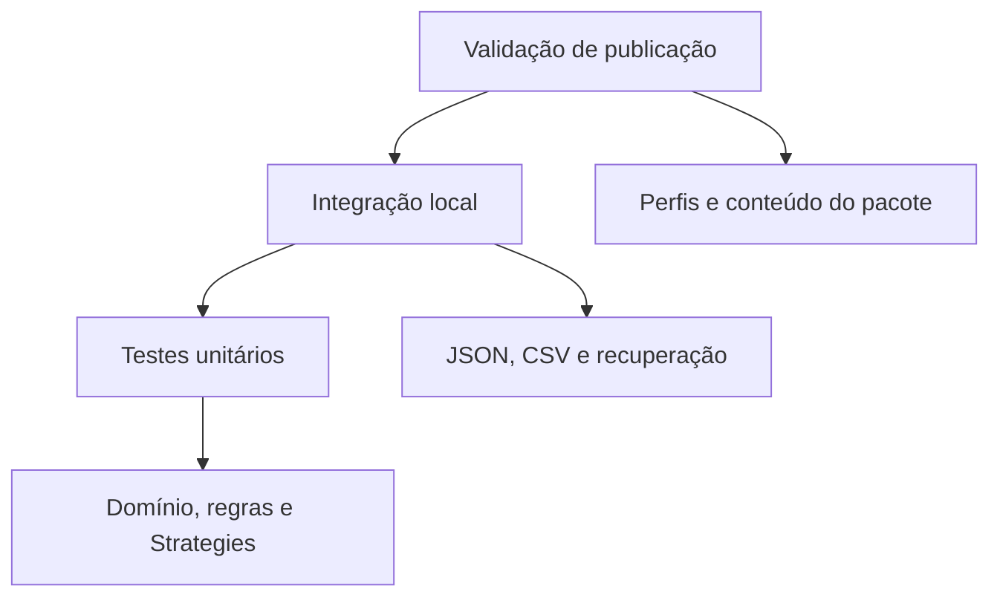
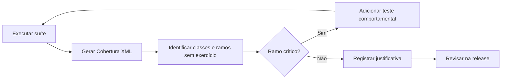

# Estratégia de testes e cobertura

## 1. Objetivo

A estratégia de testes prioriza invariantes, ramos críticos e fronteiras
externas. Cobertura de linhas e ramos é usada como instrumento diagnóstico, não
como meta isolada.

Uma porcentagem elevada não comprova correção quando casos relevantes,
alternâncias ou falhas permanecem sem exercício.

## 2. Pirâmide aplicada

A suíte combina três classes.



A base unitária é maior e rápida. Integrações locais exercitam arquivos reais
somente em diretórios temporários. Validações de publicação verificam perfis e
pacotes sem versionar binários.

## 3. Classificação

### Unitários

Incluem:

- objetos de valor e enumerações;
- `Board`, `GameRules`, `GameEvaluation` e `Match`;
- Strategies e resolução de Strategy;
- `MatchController`;
- serviços de apresentação com `TextReader` e `TextWriter`;
- áudio com serviços simulados;
- compatibilidade com detectores injetáveis;
- modo automático com atraso imediato;
- experimentação com temporizador e repositórios em memória.

### Integração local

Incluem:

- configurações JSON;
- histórico e estatísticas;
- quarentena de arquivos corrompidos;
- recuperação entre histórico e estatísticas;
- exportação CSV;
- repositórios experimentais JSON e CSV;
- validação de codificação e substituição por arquivo temporário.

Esses testes usam `Path.GetTempPath()` e removem os dados ao final.

### Validação de publicação

Incluem:

- quatro arquivos `.pubxml`;
- RID e modo autocontido;
- ausência de single-file, trimming e ReadyToRun;
- conteúdo obrigatório do `.csproj`;
- `PublishPackageVerifier`;
- scripts de inspeção dos pacotes.

## 4. Matriz de cobertura funcional

| Área | Evidência principal |
|---|---|
| domínio | `BoardTests`, `BoardPositionTests`, `MoveTests` |
| regras | `GameRulesTests`, `GameEvaluationTests` |
| agregado | `MatchTests`, `MatchBoardBoundaryTests` |
| Strategies | testes Random, Heuristic e Minimax |
| resolução | `ComputerMoveStrategyResolverTests` |
| aplicação | `MatchControllerTests`, `DefaultMoveSelectorTests` |
| apresentação | entrada, saída, renderer, telas e navegação |
| configuração reativa | áudio, animação e `SettingsScreenTests` |
| persistência | repositórios, mapper, calculadora e serviço |
| corrupção | `JsonCorruptionQuarantineTests` |
| CSV | `CsvWriterTests` e `CsvExportersTests` |
| automático | setup, runner, cancelamento e retorno |
| experimento | sementes, alternância, falhas e métricas |
| falhas externas | reporters, rollback e isolamento |
| compatibilidade | capacidades, modo compatível e áudio |
| publicação | `PublishProfileTests` e verificador de pacote |

## 5. Cobertura observada

O ambiente usado para gerar este patch não dispõe do SDK .NET. Portanto, nenhum
percentual foi registrado como se tivesse sido observado.

Para produzir a evidência real:

```powershell
.\scripts\test-coverage.ps1
```

ou:

```bash
./scripts/test-coverage.sh
```

O resultado Cobertura fica em:

```text
artifacts/coverage/**/coverage.cobertura.xml
```

Após a execução, registrar no relatório de release:

- linhas cobertas e válidas;
- ramos cobertos e válidos;
- classes com ramos críticos não exercitados;
- testes acrescentados em resposta às lacunas;
- limitações do coletor.

## 6. Processo de revisão da cobertura

O fluxo abaixo evita otimização cega de percentual.



Prioridade é dada a falhas de persistência, invariantes do agregado,
alternâncias experimentais, recuperação e compatibilidade.

## 7. Lacunas tratadas nesta etapa

Foram adicionados testes para:

- quarentena de `statistics.json`;
- encerramento do lote após falha quando `ContinueOnFailure` é falso;
- retorno seguro do modo automático após falha de persistência;
- diretórios ausentes ou vazios nas configurações;
- estrutura dos quatro perfis de publicação;
- conteúdo obrigatório do projeto publicado.

## 8. Restrições de qualidade

A suíte evita:

- `Thread.Sleep` e tempo real;
- leitura do Console físico;
- dispositivos de áudio;
- estado global compartilhado;
- arquivos permanentes;
- caminhos absolutos de uma máquina específica;
- aleatoriedade sem semente;
- formatação dependente da cultura corrente;
- snapshots extensos.

Quando texto exato é testado, ele representa um contrato pequeno, como cabeçalho
CSV ou fallback de interface.

## 9. Limitações

- cobertura não detecta assertivas fracas;
- reflexão em testes arquiteturais não substitui análise estática completa;
- testes temporários não reproduzem todos os sistemas de arquivos;
- publicação real ainda deve ser executada em Windows e Linux;
- Console, beep e terminal bell exigem validação manual;
- relatórios podem variar conforme SDK e coletor.
