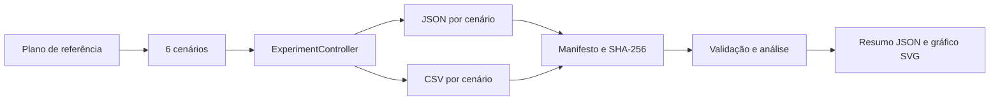

# Experimento de referência

## 1. Situação da execução

O protocolo e a automação estão versionados, mas os resultados numéricos não
foram fabricados neste documento. O ambiente de geração do patch não possui o
SDK .NET; portanto, tabelas e gráficos observados devem ser atualizados após a
execução local descrita na Seção 9.

## 2. Protocolo

São executados seis cenários não redundantes: Random × Random, Random ×
Heuristic, Random × Minimax, Heuristic × Heuristic, Heuristic × Minimax e
Minimax × Minimax. A alternância de símbolos cobre também as combinações
ordenadas inversas.

Cada cenário possui 100 execuções. Esse número equilibra variabilidade das
Strategies pseudoaleatórias, paridade necessária às alternâncias e tamanho
moderado de 600 observações no total.

A semente base é `20260720`. A execução `n` usa:

```text
semente = 20260720 + n - 1
```

Símbolos e primeiro participante alternam nas execuções pares. O histórico
normal permanece desativado.

## 3. Fluxo executável

O fluxo usa somente `ExperimentController`, sem apresentação, áudio, animação
ou atraso.



A validação ocorre antes da análise: cabeçalho CSV, quantidade de linhas,
resumo JSON e hashes precisam ser consistentes.

## 4. Ambiente

O arquivo `reference-manifest.json` registra versão da aplicação, commit ou
tag, sistema operacional, runtime .NET, arquitetura, processador quando
disponível, início, fim e duração total.

## 5. Tabelas e gráficos

Após a execução, `scripts/analyze-reference-experiment.py` gera:

- `reference-summary.json`;
- `reference-results.svg`.

Os valores observados devem ser inseridos nesta seção na preparação da release.
Até essa execução, qualquer valor numérico além do protocolo seria especulativo.

## 6. Métricas

Por partida são registrados Strategy de X e O, semente, resultado, jogadas,
duração, estados avaliados quando disponíveis, falha, mensagem e versão.

A análise agregada deve apresentar vitórias, derrotas e empates por Strategy,
efeito de símbolo, efeito da iniciativa, jogadas, duração, estados avaliados e
falhas.

## 7. Limitações e ameaças à validade

- o jogo da velha possui espaço de estados pequeno;
- duração depende de hardware, runtime e carga do sistema;
- a mesma semente é fornecida às duas Strategies;
- estados avaliados não são comparáveis a Strategies que não oferecem métrica;
- 100 repetições não constituem uma garantia estatística universal;
- execução em uma única máquina limita validade externa.

## 8. Política de versionamento dos resultados

Pertencem ao repositório:

- `experiments/reference/reference-plan.json`;
- documentação;
- scripts de execução e análise;
- resumo JSON pequeno e gráfico SVG, depois de validados.

Devem ser anexados à release:

- todos os CSV completos;
- todos os JSON completos por cenário;
- `reference-manifest.json` com hashes;
- pacote compactado dos resultados brutos.

## 9. Reprodução

```powershell
$commit = git rev-parse HEAD

dotnet run `
    --project .\src\TicTacToe.Console\TicTacToe.Console.csproj `
    --configuration Release `
    -- `
    --reference-experiment `
    --commit $commit `
    --output .\artifacts\experiments\reference

python .\scripts\analyze-reference-experiment.py `
    .\artifacts\experiments\reference
```

## 10. Identificação dos arquivos

O manifesto contém SHA-256 de cada JSON e CSV. O próprio manifesto deve ter o
hash calculado durante a preparação da release:

```powershell
Get-FileHash `
    .\artifacts\experiments\reference\reference-manifest.json `
    -Algorithm SHA256
```


## Garantia de consistência final

O modo experimental comum tolera falhas isoladas de um repositório para que um
lote não seja perdido integralmente. O protocolo de referência acrescenta uma
regra mais estrita: ao final de cada cenário, o resultado completo em memória é
gravado novamente em todos os repositórios.

A gravação final admite até três tentativas para falhas operacionais
transitórias. Somente depois são comparadas as contagens do resultado em
memória, do JSON e do CSV. O manifesto e os hashes não são produzidos quando
essas contagens divergem.

## 11. Diretório recomendado no Windows

Diretórios sincronizados pelo Dropbox podem bloquear temporariamente arquivos
durante substituições atômicas frequentes. Para o experimento de referência,
recomenda-se escrever primeiro em `%LOCALAPPDATA%` e copiar apenas os artefatos
finais validados para o repositório ou para a release.

```powershell
$output = Join-Path `
    $env:LOCALAPPDATA `
    "TicTacToe\experiments\reference"

Remove-Item `
    $output `
    -Recurse `
    -Force `
    -ErrorAction SilentlyContinue

$commit = git rev-parse HEAD

dotnet run `
    --project .\src\TicTacToe.Console\TicTacToe.Console.csproj `
    --configuration Release `
    -- `
    --reference-experiment `
    --commit $commit `
    --output $output

python .\scripts\analyze-reference-experiment.py $output
```

O diretório pode ser localizado e aberto com:

```powershell
Test-Path $output
Get-ChildItem $output -Recurse
explorer.exe $output
```

Depois da validação, copie somente o resumo e o gráfico pequenos:

```powershell
Copy-Item `
    (Join-Path $output "reference-summary.json") `
    .\experiments\reference\reference-summary.json

Copy-Item `
    (Join-Path $output "reference-results.svg") `
    .\experiments\reference\reference-results.svg
```

Os resultados brutos podem ser compactados para uma release:

```powershell
Compress-Archive `
    -Path (Join-Path $output "*") `
    -DestinationPath `
        .\artifacts\experiments\tictactoe-reference-results.zip `
    -Force
```

Esse fluxo reduz bloqueios de sincronização e evita versionar dados volumosos.


## 12. Validação da candidata v1.9.0

A candidata usa um experimento curto separado do protocolo de referência:

```powershell
dotnet run `
    --project .\src\TicTacToe.Console\TicTacToe.Console.csproj `
    --configuration Release `
    --no-build `
    -- `
    --reference-experiment `
    --commit (git rev-parse HEAD) `
    --output $output `
    --repetitions 2 `
    --base-seed 1900
```

As opções `--repetitions` e `--base-seed` permitem validar rapidamente o
pipeline sem alterar o plano versionado de 100 repetições por cenário.
