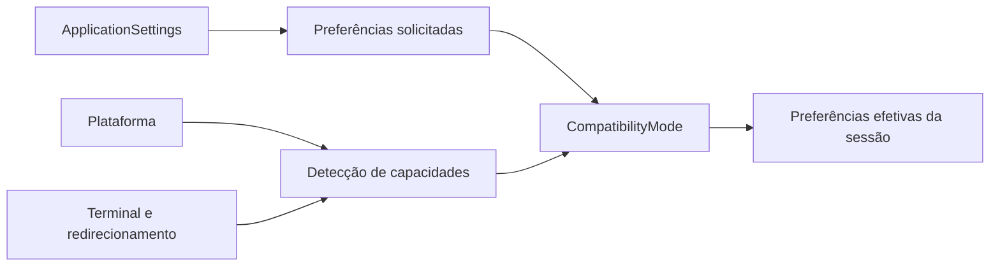
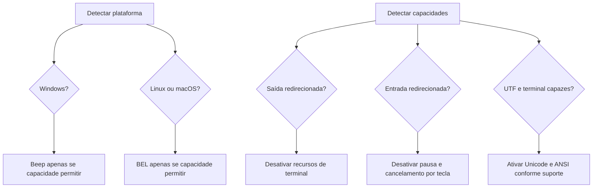

# Compatibilidade e limitações multiplataforma

## 1. Escopo

A aplicação tem como alvos principais Windows e sistemas Unix-like suportados
pelo .NET 9. O comportamento do terminal não é inferido apenas pelo sistema
operacional: plataforma e capacidade são detectadas separadamente.

`SystemPlatformDetector` identifica a família do sistema.
`SystemConsoleCapabilityDetector` observa redirecionamento, codificação,
variáveis de ambiente e interatividade.

## 2. Modo de compatibilidade

O modo de compatibilidade recebe preferências solicitadas e produz preferências
efetivas apenas para a sessão atual.



As configurações persistidas não são sobrescritas. Assim, um recurso
temporariamente indisponível em uma execução redirecionada pode voltar a ser
usado em um terminal compatível.

## 3. Recursos adaptados

| Recurso | Condição para permanecer ativo |
|---|---|
| Unicode | codificação de saída compatível com Unicode |
| ANSI | saída interativa, terminal não `dumb` e ausência de `NO_COLOR` |
| limpeza de tela | saída interativa com capacidade terminal |
| efeitos visuais | saída não redirecionada |
| atraso | efeitos visuais efetivamente ativos |
| `Console.Beep` | Windows e saída interativa |
| terminal bell | Unix-like ou plataforma desconhecida com saída interativa |
| pausa e cancelamento | entrada interativa |

Quando a saída é redirecionada, artes progressivas, cores, limpeza e áudio são
desativados. O conteúdo textual essencial continua sendo escrito.

## 4. Plataforma e capacidade

O diagrama separa decisões que não devem ser confundidas.



Estar no Windows não garante `Console.Beep`, assim como estar em Unix-like não
garante que BEL, ANSI ou limpeza de tela produzam efeito observável.

## 5. Redirecionamento e execução não interativa

Com entrada redirecionada, `ConsoleAutomaticModeControl` não consulta
`Console.KeyAvailable` e não chama `Console.ReadKey`. A demonstração continua
sem pausa ou cancelamento por tecla.

Com saída redirecionada:

- o texto permanece disponível;
- Unicode depende da codificação;
- ANSI é desativado;
- limpeza é desativada;
- animações e atrasos são desativados;
- áudio é silencioso.

## 6. Caminhos e permissões

Caminhos são construídos com `Path.Combine`. Os diretórios configurados devem
ser relativos, conforme `SettingsValidator`.

Falhas de permissão são convertidas em `InfrastructureOperationException` e
apresentadas com identificador diagnóstico. JSON inválido é colocado em
quarentena antes da recuperação.

## 7. UTF-8 e separadores

JSON e CSV são gravados em UTF-8 sem BOM. CSV usa ponto e vírgula,
independentemente da cultura do sistema.

Separadores de diretório não são concatenados manualmente. Os nomes de arquivos
persistidos permanecem estáveis entre Windows e Unix-like.

## 8. CITATION.cff e publicação

O projeto copia `CITATION.cff` para o diretório de saída. A validação pode ser
executada após build ou publish:

```powershell
Test-Path .\src\TicTacToe.Console\bin\Release\net9.0\CITATION.cff
```

Em Unix-like:

```bash
test -f src/TicTacToe.Console/bin/Release/net9.0/CITATION.cff
```

`RuntimeArtifactVerifier` também permite validar esse requisito em testes.

## 9. Publicação autocontida

A configuração formal de perfis de publicação pertence ao Prompt 26. Nesta
etapa, a compatibilidade deve ser validada com comandos diretos:

```powershell
dotnet publish .\src\TicTacToe.Console\TicTacToe.Console.csproj `
    -c Release -r win-x64 --self-contained true `
    -o .\artifacts\publish\win-x64-self-contained
```

```bash
dotnet publish src/TicTacToe.Console/TicTacToe.Console.csproj     -c Release -r linux-x64 --self-contained true     -o artifacts/publish/linux-x64-self-contained
```

Os diretórios de publicação permanecem ignorados pelo Git.

## 10. Matriz de validação

| Verificação | Windows | Unix-like |
|---|---|---|
| build Release | obrigatório | obrigatório |
| testes | obrigatório | obrigatório |
| Unicode | terminal UTF | terminal UTF |
| ANSI | conforme capacidade | conforme capacidade |
| áudio | beep ou silencioso | BEL ou silencioso |
| redirecionamento | validar arquivo de saída | validar arquivo de saída |
| permissões | diretório somente leitura | diretório sem escrita |
| cancelamento | Esc em terminal interativo | Esc em terminal interativo |
| publicação autocontida | `win-x64` | `linux-x64` |
| `CITATION.cff` | presente | presente |

## 11. Limitações conhecidas

- a detecção de ANSI é conservadora e não consulta bancos externos de terminais;
- `NO_COLOR` desativa cores, mas não Unicode;
- em entrada redirecionada não há cancelamento por tecla;
- sinais sonoros podem ser ignorados pelo emulador de terminal;
- permissões e políticas corporativas podem impedir escrita;
- publicação autocontida aumenta significativamente o tamanho;
- validação real em dois sistemas continua necessária, pois testes simulados
  não substituem execução no ambiente final.

## Estado na versão 2.0.0

As limitações descritas neste documento são restrições conhecidas e decisões de
escopo da versão consolidada, não pendências funcionais obrigatórias para a
release. Expansões como interface gráfica, rede, novos tabuleiros ou agentes
podem iniciar uma nova linha de evolução sem invalidar a arquitetura entregue.
