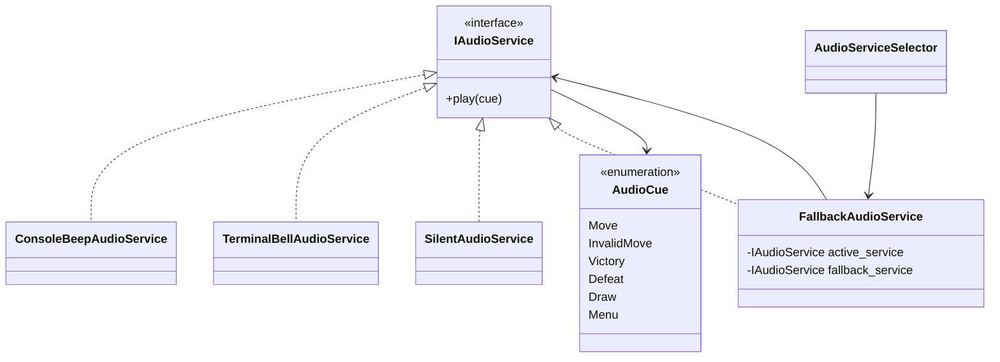
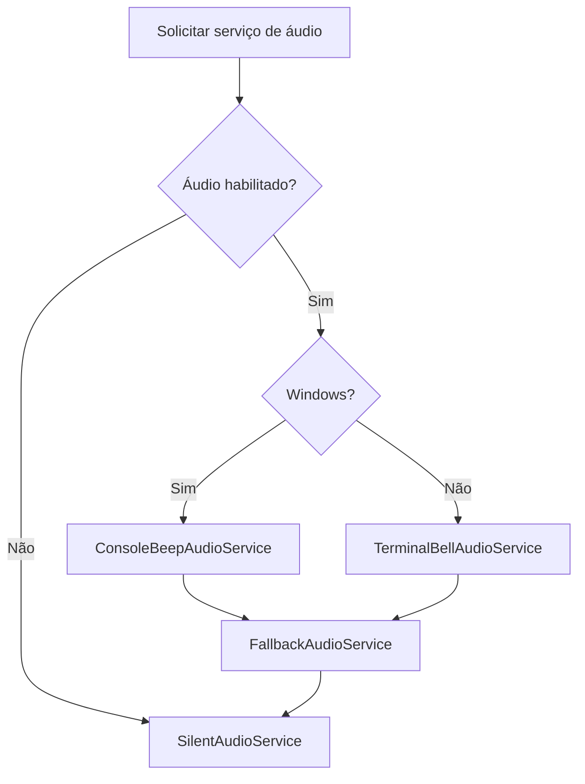

# Serviços de áudio e fallback

## 1. Finalidade

A versão `1.7.0` adiciona sinais sonoros opcionais sem introduzir dependências
de plataforma em `Domain`, `AI` ou `Application`. Todo o código de reprodução
permanece no módulo `Audio` e é composto pela apresentação.

Falhas de áudio são recuperáveis: a aplicação troca para um serviço silencioso
e continua executando a partida.

## 2. Arquitetura

O contrato comum recebe eventos sem expor frequência, duração ou tecnologia.

A camada de apresentação solicita apenas um `AudioCue`. A implementação
selecionada decide como representar esse evento.

## 3. Capacidades por plataforma

### Windows

`ConsoleBeepAudioService` utiliza `Console.Beep`. Ele permite frequências e
durações distintas para jogada, erro, vitória, derrota e empate.

O suporte pode variar em terminais modernos, sessões remotas, máquinas virtuais
e sistemas sem dispositivo de áudio configurado.

### Sistemas Unix-like

`TerminalBellAudioService` escreve o caractere BEL (`\a`) no fluxo do terminal.
O resultado depende da configuração do emulador: ele pode produzir som, alerta
visual ou nenhum efeito.

### Execução silenciosa

`SilentAudioService` não produz saída nem acessa dispositivos. Ele é usado
quando o áudio está desabilitado e como fallback final.

## 4. Seleção e fallback

`AudioServiceSelector` considera a configuração e a plataforma.

O serviço primário é envolvido por `FallbackAudioService`. Após uma falha
recuperável, o serviço ativo passa a ser o fallback silencioso, evitando novas
tentativas no dispositivo defeituoso.

## 5. Configuração

`PresentationPreferences.AudioEnabled` controla a seleção inicial. A tela de
configurações oferece a opção `Áudio: ativado/desativado`.

A configuração atual vale para a composição da execução. Persistência e
recomposição dinâmica serão tratadas na etapa de configurações JSON.

## 6. Integração com a partida

Os eventos atualmente emitidos são:

- jogada aplicada;
- jogada inválida;
- vitória humana;
- derrota humana;
- empate.

A saída textual e visual continua sendo apresentada mesmo quando o áudio está
desativado ou falha.

## 7. Limitações

A implementação inicial não oferece:

- arquivos WAV, MP3 ou outros recursos externos;
- controle de volume;
- reprodução assíncrona;
- mistura de sons;
- detecção confiável de dispositivo;
- garantia de que BEL produzirá som;
- alteração imediata do serviço após mudar a configuração durante uma sessão.

Essas limitações preservam dependências mínimas e compatibilidade
multiplataforma.

## 8. Testes sem dispositivo de áudio

A suíte não chama `Console.Beep`. Os testes utilizam:

- serviços simulados que registram eventos;
- serviço primário que lança falha controlada;
- `StringWriter` para verificar o caractere BEL;
- `SilentAudioService`;
- fábricas injetáveis no seletor.

Assim, seleção, fallback e ausência de encerramento inesperado são verificadas
sem depender de hardware.
