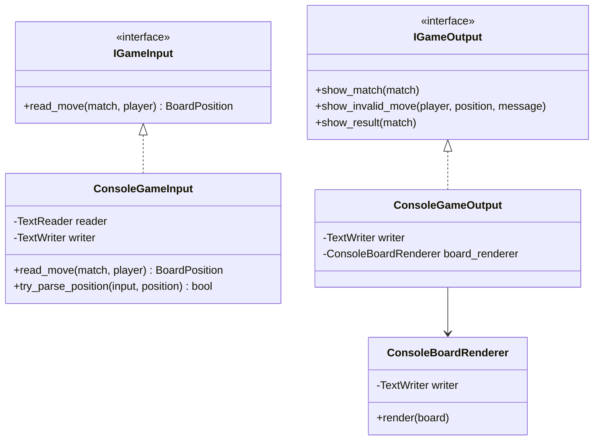
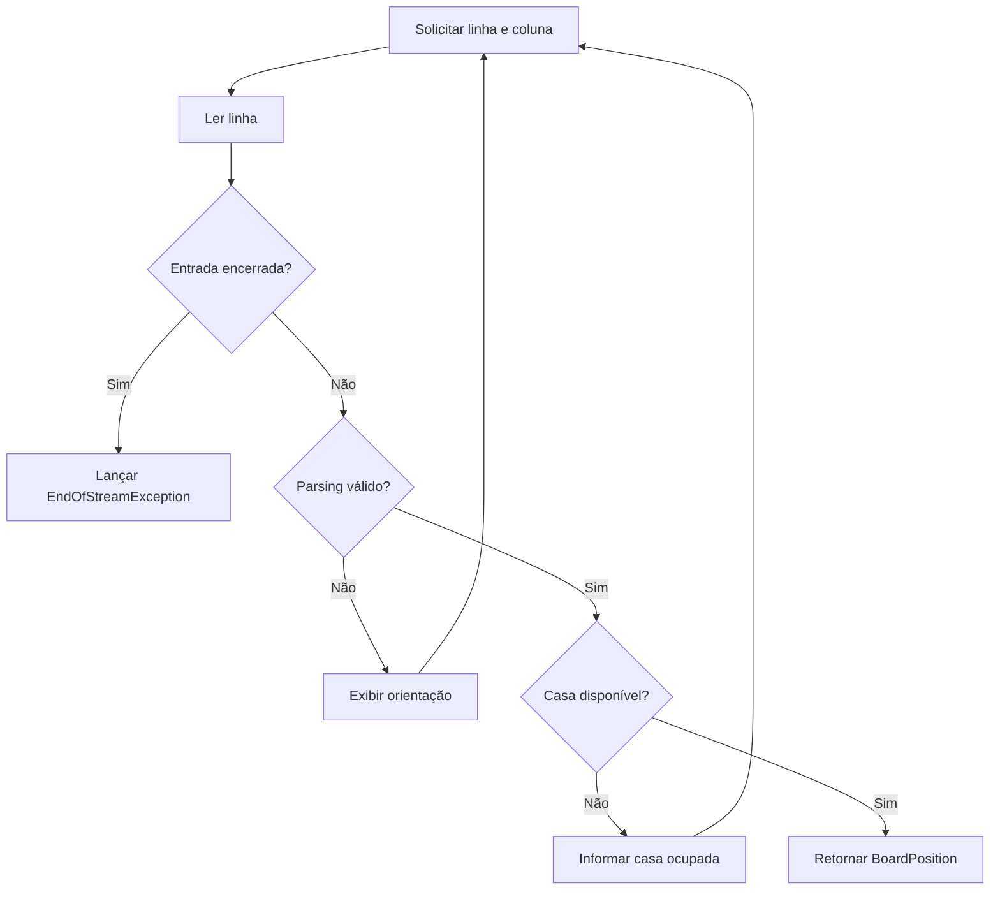
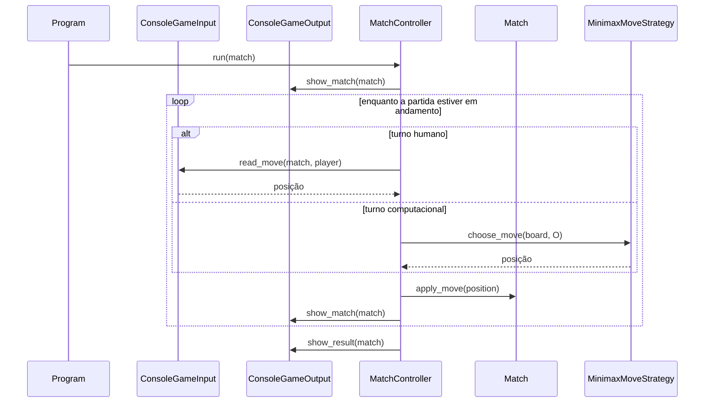

# Implementações de Console

## 1. Finalidade

Este documento descreve os adaptadores concretos introduzidos após a versão
`1.5.0`. Eles conectam as portas da camada `Application` aos fluxos textuais do
.NET sem adicionar regras ao domínio.

A etapa fornece uma partida mínima jogável entre uma pessoa, usando `X`, e uma
estratégia Minimax, usando `O`.

## 2. Adaptadores

A apresentação concreta contém:

- `ConsoleGameInput`, que implementa `IGameInput`;
- `ConsoleGameOutput`, que implementa `IGameOutput`;
- `ConsoleBoardRenderer`, que renderiza `IReadOnlyBoard`;
- `Program`, que compõe as dependências.

O diagrama apresenta a direção das dependências.

Os adaptadores dependem das portas de aplicação e dos contratos somente para
leitura do domínio. Nenhuma interface existente foi recriada.

## 3. Entrada

As coordenadas são apresentadas ao usuário no intervalo de `1` a `3` e
convertidas internamente para índices entre `0` e `2`.

São aceitos espaço, tabulação, vírgula ou ponto e vírgula como separadores. A
conversão utiliza `int.TryParse`, de modo que texto inválido e valores fora do
intervalo não dependem de exceções para o fluxo normal.

O diagrama mostra a repetição da leitura.

Somente o encerramento inesperado do fluxo é tratado como exceção. Erros
corrigíveis de digitação ou ocupação geram mensagem e nova tentativa.

## 4. Saída e tabuleiro

A renderização inicial utiliza somente caracteres ASCII. Ela apresenta:

- coordenadas;
- símbolos `X` e `O`;
- separadores;
- jogador atual;
- jogada inválida;
- vitória ou empate.

Unicode, cores ANSI, limpeza de tela, temas e artes serão adicionados em etapas
posteriores.

## 5. Composição mínima

`Program.Main` funciona como composition root. Ele instancia leitores,
escritores, adaptadores, resolvedor de Strategy, controlador e participantes.

O fluxo completo é apresentado a seguir.

A composição não implementa menu ou configuração interativa. Essas
responsabilidades pertencem às próximas etapas de apresentação.

## 6. Testabilidade

`TextReader` e `TextWriter` são injetados nos adaptadores. Os testes utilizam
`StringReader` e `StringWriter`, sem acesso ao Console físico.

A suíte cobre:

- parsing válido;
- separadores aceitos;
- entradas inválidas;
- repetição após erro;
- repetição após casa ocupada;
- renderização ASCII;
- jogador atual;
- resultado;
- mensagem de jogada inválida.
