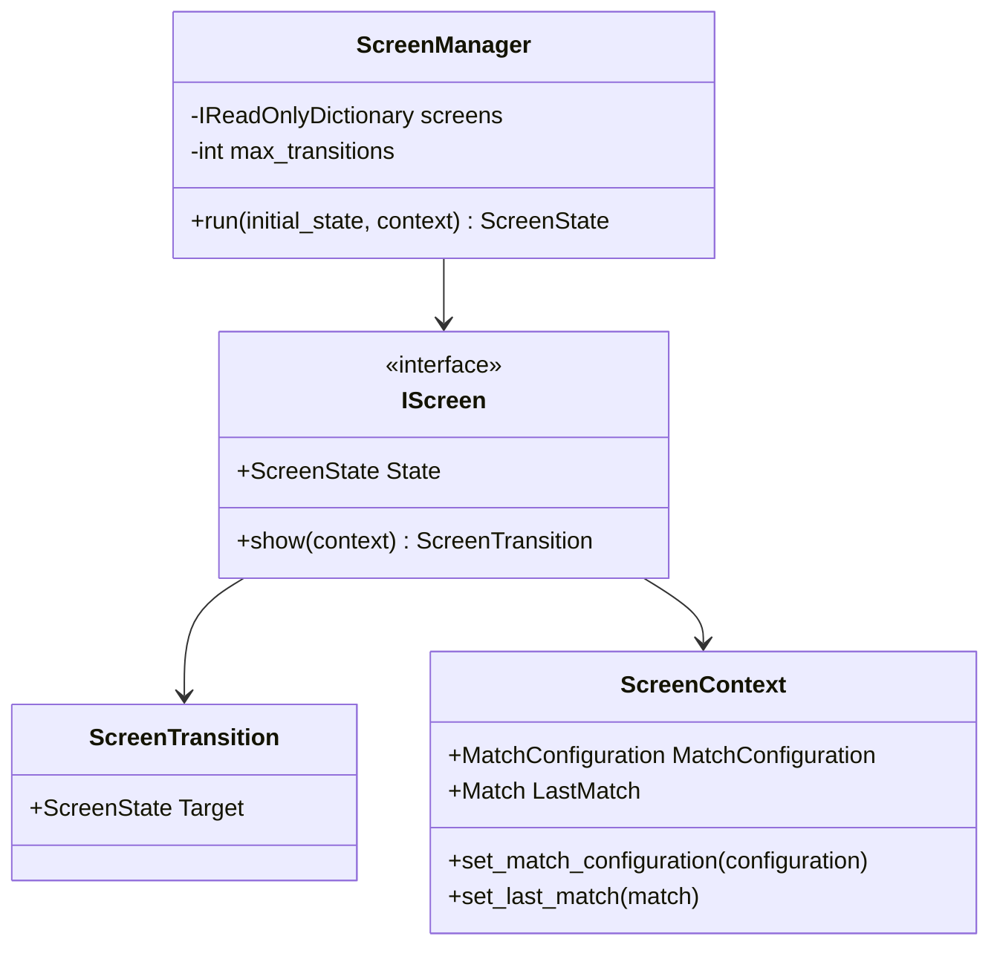
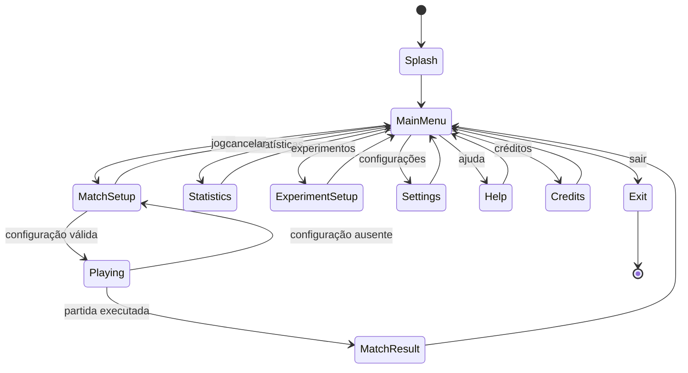
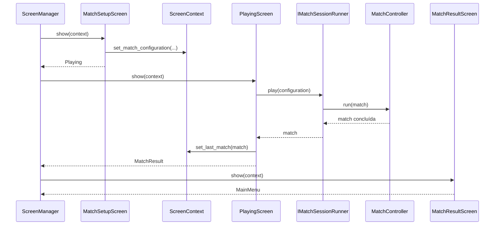

# ScreenManager e estados de navegação

## 1. Finalidade

A versão `1.6.0` introduz uma máquina de estados para centralizar a navegação da
aplicação. Cada tela executa uma responsabilidade de apresentação e retorna
somente o próximo estado desejado.

As telas não aplicam regras de vitória, não alternam jogadores e não modificam
diretamente o tabuleiro. A execução de partidas permanece delegada à camada
`Application`.

## 2. Contratos

A navegação utiliza:

- `ScreenState`, enumeração dos estados;
- `ScreenTransition`, resultado de uma tela;
- `IScreen`, contrato mínimo de execução;
- `ScreenContext`, dados compartilhados;
- `ScreenManager`, coordenador central.

O diagrama apresenta essas relações.

As telas não mantêm referências diretas umas às outras. Elas conhecem apenas o
estado de destino; `ScreenManager` resolve a implementação correspondente.

## 3. Estados

A máquina contém os estados solicitados:

- `Splash`;
- `MainMenu`;
- `MatchSetup`;
- `Playing`;
- `MatchResult`;
- `Statistics`;
- `ExperimentSetup`;
- `Settings`;
- `Help`;
- `Credits`;
- `Exit`.

O diagrama registra as transições implementadas.

`Statistics`, `ExperimentSetup` e `Settings` são estados reais, porém ainda
apresentam conteúdo provisório. A estrutura já evita que esses recursos futuros
sejam adicionados diretamente ao menu principal.

## 4. Configuração e execução de partida

`MatchSetupScreen` coleta nome e Strategy. `PlayingScreen` não cria regras nem
executa jogadas; ela delega a `IMatchSessionRunner`.

O fluxo é apresentado a seguir.

A Strategy selecionada é associada ao participante computacional no executor de
sessão, por meio de `IComputerMoveStrategyResolver`.

## 5. Segurança contra ciclos

`ScreenManager` recebe um limite máximo de transições. O valor padrão é alto o
suficiente para uso interativo, mas impede que telas simuladas ou defeituosas
mantenham um ciclo infinito silencioso.

Ao exceder o limite, o gerenciador lança `InvalidOperationException` com uma
mensagem que indica possível ciclo de navegação.

## 6. Testabilidade

Os testes substituem telas por implementações que registram a ordem de execução
e retornam transições predeterminadas. Isso permite verificar:

- transições válidas;
- retorno ao menu;
- encerramento em `Exit`;
- limite contra ciclos;
- armazenamento da configuração;
- cancelamento da configuração;
- delegação da partida;
- armazenamento do último resultado.

Nenhum desses testes depende do Console físico ou de interação humana.
