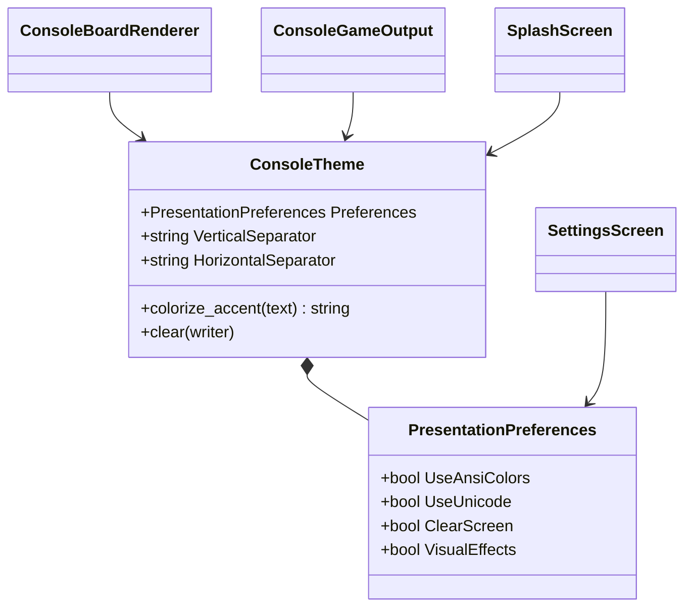
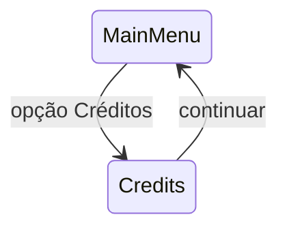

# ASCII art, Unicode, temas e créditos

## 1. Finalidade

Esta etapa amplia exclusivamente a camada de apresentação. Preferências visuais,
artes textuais e capacidades do terminal não são conhecidas pelo domínio, pela
inteligência artificial ou pelo controlador de partidas.

Também foi incluída uma tela de créditos disponível no menu principal. Seus
dados são derivados dos campos relevantes de `CITATION.cff`, com fallback
seguro quando o arquivo não está disponível no diretório de execução.

## 2. Configuração visual

`PresentationPreferences` contém quatro opções independentes:

- cores ANSI;
- caracteres Unicode;
- limpeza de tela;
- efeitos visuais.

O diagrama apresenta como a configuração chega aos adaptadores.



O mesmo objeto de preferências é fornecido ao tema e ao `ScreenContext`.
Alterações realizadas em `SettingsScreen` passam a valer nas renderizações
posteriores sem alterar entidades de domínio.

## 3. Renderização ASCII e Unicode

O tabuleiro possui dois modos. O modo ASCII usa `|`, `-` e `+`; o modo Unicode
usa `│`, `─` e `┼`.

```text
ASCII                 Unicode

X |   |               X │   │
--+---+--              ──┼───┼──
  | O |                  │ O │
```

Os testes comparam a saída textual integral, incluindo espaços e quebras de
linha. Isso protege o fallback ASCII e a variante Unicode contra alterações
acidentais.

## 4. Artes e cores

`AsciiArtCatalog` fornece:

- logotipo;
- vitória;
- derrota;
- empate.

Quando efeitos visuais estão desativados, as artes são omitidas. Quando cores
ANSI estão desativadas, nenhuma sequência de escape é emitida.

A limpeza de tela também é opcional. Ela usa sequências ANSI somente quando
explicitamente habilitada.

## 5. Créditos

A tela de créditos é alcançada pelo menu principal e retorna ao menu após a
leitura.



`CitationMetadataLoader` lê título, versão, autor, licença e repositório de
`CITATION.cff`. Os perfis oficiais copiam esse arquivo para build e publicação.
A apresentação mantém fallback para leitura inválida, pacote manual incompleto
ou falha operacional de acesso.

## 6. Limitações e fallback

Nem todo terminal oferece suporte uniforme a Unicode ou ANSI. As principais
limitações são:

- fontes sem glifos Unicode podem exibir quadrados;
- terminais antigos podem imprimir códigos ANSI literalmente;
- saída redirecionada não deve receber limpeza de tela;
- largura de caracteres pode variar conforme fonte e locale;
- pacotes montados manualmente podem omitir ou corromper `CITATION.cff`.

O fallback recomendado é desativar Unicode, cores, limpeza e efeitos visuais.
Nesse modo, a aplicação permanece funcional com texto e caracteres ASCII
básicos.

## 7. Integração com feedback visual

A partir do Prompt 16, `ConsoleTheme` também é utilizado por
`AnimationService` e `VisualFeedbackService`. As mesmas preferências controlam
texto progressivo, indicador de análise, artes e realces do tabuleiro.

Os detalhes temporais e os testes sem espera real estão documentados em
`docs/19-feedback-visual-e-animacoes.md`.
