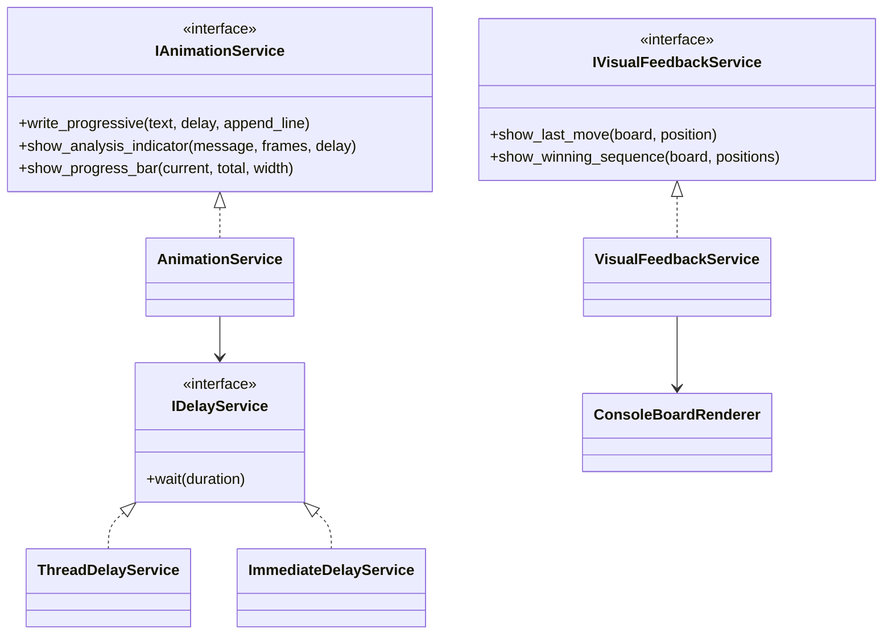
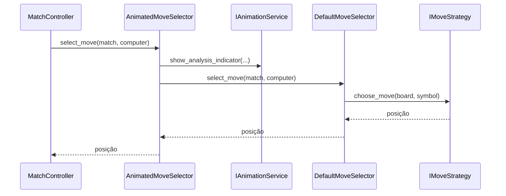

# Feedback visual e animações

## 1. Finalidade

Esta etapa adiciona animações e realces exclusivamente à camada de
apresentação. Nenhum atraso foi introduzido em `Domain`, `AI`,
`Application.MatchController` ou nas estratégias.

Todas as esperas são abstraídas por `IDelayService`, o que permite substituir
atrasos reais por execução imediata nos testes.

## 2. Serviços

A arquitetura separa animação temporal de realce do tabuleiro.



`ThreadDelayService` é usado na aplicação interativa.
`ImmediateDelayService` e implementações simuladas eliminam esperas reais nos
testes.

## 3. Texto progressivo

`AnimationService.write_progressive` escreve cada caractere e solicita um
atraso após a escrita. Quando efeitos visuais estão desativados, o texto é
escrito integralmente sem atraso.

O Splash utiliza esse recurso para apresentar o logotipo sem adicionar lógica
temporal à tela ou ao domínio.

## 4. Indicador de análise

A análise da IA é apresentada por um decorador de `IMoveSelector`.



O controlador continua conhecendo apenas `IMoveSelector`. A animação permanece
fora da camada de aplicação.

## 5. Realces do tabuleiro

`VisualFeedbackService` reutiliza `ConsoleBoardRenderer` com parâmetros
opcionais para:

- última jogada;
- sequência vencedora.

Quando cores ANSI estão habilitadas, os símbolos recebem códigos de cor.
Quando estão desabilitadas, o tabuleiro continua legível sem sequências de
escape.

## 6. Barra de progresso

`show_progress_bar` recebe valor atual, total e largura. O preenchimento usa
`#` e a parte pendente usa `-`, permitindo saída compatível com terminais
ASCII.

Exemplo:

```text
[######--] 75%
```

O recurso será reutilizado pelos modos automático e experimental.

## 7. Testabilidade

Os testes não utilizam `Thread.Sleep`. Eles injetam:

- `ImmediateDelayService`;
- serviços de atraso que apenas registram chamadas;
- implementações simuladas de `IAnimationService`;
- `StringWriter`.

A suíte verifica texto progressivo, quantidade de quadros, indicador da IA,
barra de progresso e realce da sequência vencedora sem modificar o tabuleiro.
