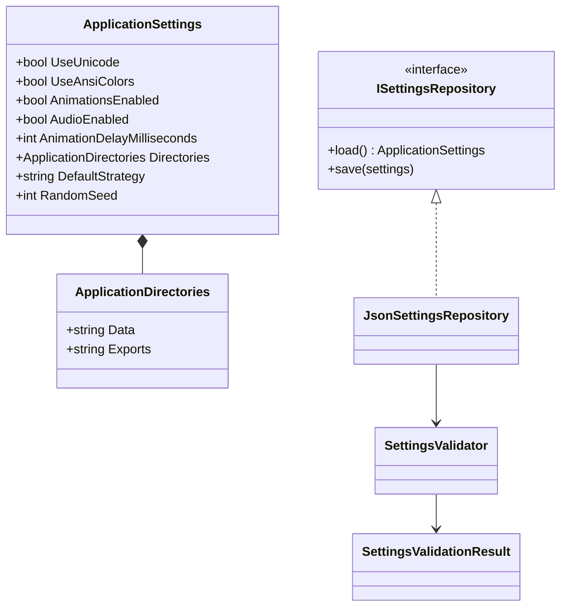
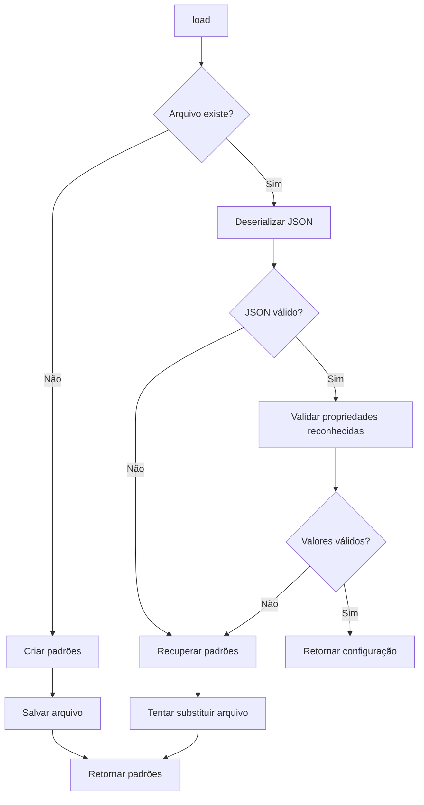
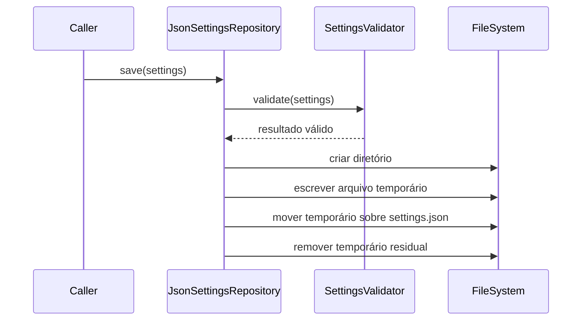

# Configurações JSON

## 1. Finalidade

Esta etapa introduz persistência de configurações sem adicionar dependências ao
domínio. `ApplicationSettings` pertence à fronteira de configuração e é
convertido para `PresentationPreferences` no ponto de composição.

Quando o arquivo está ausente ou inválido, a aplicação recupera valores padrão
seguros e continua a execução.

## 2. Modelo e repositório

A estrutura separa modelo, validação e persistência.

O repositório usa apenas `System.Text.Json`, preservando a política de
dependências mínimas do projeto.

## 3. Valores padrão

Os padrões iniciais são:

| Configuração | Valor |
|---|---|
| Unicode | habilitado |
| cores ANSI | desabilitadas |
| animações | habilitadas |
| áudio | habilitado |
| atraso-base | 40 ms |
| dados | `data` |
| exportações | `exports` |
| Strategy padrão | `Minimax` |
| semente | ausente |

Os diretórios configurados são relativos ao diretório da aplicação. Caminhos
absolutos são rejeitados pelo validador.

## 4. Leitura e recuperação

O fluxo de leitura diferencia ausência, JSON inválido e valores inválidos.

Propriedades desconhecidas são ignoradas. Essa escolha permite que versões
mais antigas leiam arquivos produzidos por versões futuras sem falhar apenas
pela presença de novos campos.

## 5. Gravação temporária e substituição

`save` cria o diretório pai, serializa em um arquivo temporário único e depois
usa substituição com sobrescrita.

O arquivo anterior somente é substituído depois que o conteúdo novo foi
completamente escrito.

## 6. Configurações reconhecidas

O validador verifica:

- atraso entre `0` e `5000` milissegundos;
- diretórios não vazios e relativos;
- Strategy entre `Random`, `Heuristic` e `Minimax`;
- presença do objeto de diretórios.

A semente é opcional e aceita qualquer valor de `int`.

## 7. Integração

`Program.Main` carrega `data/settings.json` antes de compor tema, animação e
áudio. `PresentationPreferences.from_settings` converte os campos relevantes.

O atraso configurado passa a ser utilizado pelo texto progressivo e pelo
indicador de análise da IA.

## 8. Testes

Os testes criam diretórios únicos sob o diretório temporário do sistema e os
removem ao final. Eles verificam:

- criação de diretório e arquivo ausente;
- valores padrão;
- JSON sintaticamente inválido;
- valores reconhecidos inválidos;
- propriedades desconhecidas;
- substituição do arquivo existente;
- remoção de temporários;
- validação independente.
