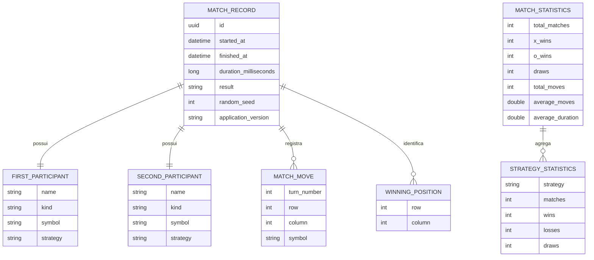
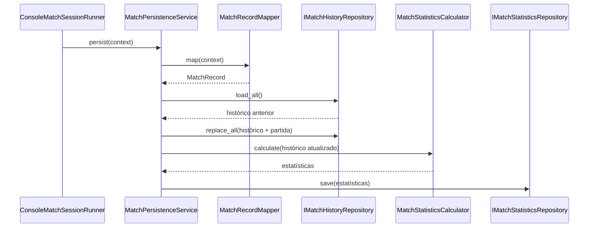

# Partidas e estatísticas em JSON

## 1. Finalidade

Esta etapa persiste partidas concluídas e estatísticas agregadas sem adicionar
dependências de JSON ao domínio. A conversão ocorre em `MatchRecordMapper`, na
camada `Persistence`.

Cada registro contém participantes, Strategies, jogadas, resultado, sequência
vencedora, duração, semente e versão da aplicação.

## 2. Modelo persistente

Os registros são imutáveis e representam somente dados serializáveis.

O diagrama entidade-relacionamento apresenta a estrutura lógica dos arquivos.



O histórico é armazenado como coleção de `MatchRecord`. As estatísticas são
recalculadas a partir do histórico atualizado, evitando incrementos acumulados
com regras divergentes.

## 3. Conversão fora do domínio

`MatchRecordMapper` recebe `MatchPersistenceContext`. Esse contexto combina a
partida concluída com dados externos que não pertencem ao agregado:

- instante inicial;
- instante final;
- Strategy associada a cada participante;
- semente;
- versão da aplicação.

O domínio não conhece `MatchRecord`, repositórios ou caminhos de arquivo.

## 4. Repositórios JSON

As interfaces são:

- `IMatchHistoryRepository`;
- `IMatchStatisticsRepository`.

As implementações concretas utilizam `System.Text.Json`, propriedades em
camelCase, UTF-8 sem BOM e substituição por arquivo temporário.

O fluxo de salvamento é apresentado a seguir.



Caso a atualização das estatísticas falhe, o serviço tenta restaurar o histórico
anterior antes de propagar a falha. Em armazenamento local normal, isso evita
que uma partida permaneça registrada sem a estatística correspondente.

## 5. Integração com a execução

`ConsoleMatchSessionRunner` mede a duração com `Stopwatch`, executa
`MatchController` e persiste somente após o encerramento.

A versão é obtida do assembly em execução. A semente vem da configuração da
partida e pode ser nula.

Os arquivos padrão são:

```text
data/matches.json
data/statistics.json
```

O diretório-base respeita `ApplicationSettings.Directories.Data`.

## 6. Recuperação e arquivos temporários

Arquivos ausentes ou JSON inválido retornam histórico vazio ou estatísticas
zeradas. A próxima gravação substitui o conteúdo por JSON válido.

Cada escrita utiliza:

1. criação do diretório;
2. arquivo `*.tmp-<guid>`;
3. serialização completa;
4. movimento com substituição;
5. remoção de temporário residual.

## 7. Testes

Os testes usam diretórios temporários e verificam:

- criação de diretórios;
- round-trip do histórico;
- round-trip das estatísticas;
- recuperação de JSON inválido;
- ausência de temporários;
- mapeamento completo;
- agregação por resultado e Strategy;
- persistência coordenada;
- rollback quando a estatística falha.
