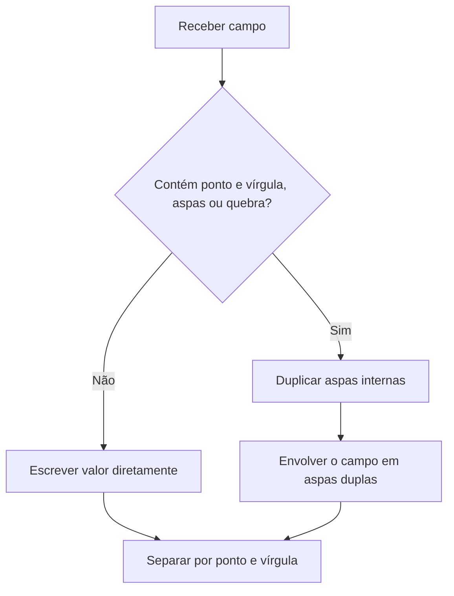
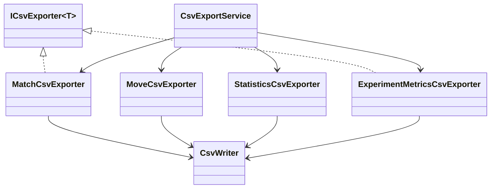

# Exportação CSV

## 1. Finalidade

A versão `1.8.0` introduz exportadores CSV sem biblioteca externa. Os arquivos
utilizam UTF-8 sem BOM, ponto e vírgula como separador, cabeçalho obrigatório e
representações independentes da cultura local.

A infraestrutura exporta partidas, jogadas, estatísticas gerais, estatísticas
por Strategy e métricas experimentais.

## 2. Regras de serialização

`CsvWriter` aplica as seguintes regras:

- separador `;`;
- aspas duplas em campos com separador, aspas ou quebra de linha;
- duplicação de aspas internas;
- datas em ISO 8601 e UTC;
- números com cultura invariável e ponto decimal;
- valores nulos como campos vazios;
- UTF-8 sem marcador BOM;
- gravação temporária seguida de substituição.

O fluxo de escape é apresentado a seguir.



Esse procedimento preserva conteúdo textual arbitrário, inclusive mensagens de
falha com múltiplas linhas.

## 3. Arquivos gerados

`CsvExportService` gera:

```text
matches.csv
moves.csv
statistics.csv
strategy-statistics.csv
experiment-metrics.csv
```

As quatro primeiras saídas usam os registros JSON já definidos. A última usa
`ExperimentMetricRecord`, que será preenchido pelo modo experimental.

## 4. Colunas de partidas

| Coluna | Descrição |
|---|---|
| `match_id` | UUID da partida |
| `started_at_utc` | início em ISO 8601 UTC |
| `finished_at_utc` | término em ISO 8601 UTC |
| `duration_ms` | duração em milissegundos |
| `first_name` | nome do primeiro participante |
| `first_kind` | `Human` ou `Computer` |
| `first_symbol` | símbolo do primeiro participante |
| `first_strategy` | Strategy, quando computacional |
| `second_name` | nome do segundo participante |
| `second_kind` | tipo do segundo participante |
| `second_symbol` | símbolo do segundo participante |
| `second_strategy` | Strategy do segundo participante |
| `result` | resultado consolidado |
| `move_count` | quantidade de jogadas |
| `winning_sequence` | posições separadas por `|` |
| `random_seed` | semente opcional |
| `application_version` | versão da aplicação |

## 5. Colunas de jogadas

| Coluna | Descrição |
|---|---|
| `match_id` | vínculo com a partida |
| `turn_number` | ordem da jogada |
| `row` | linha interna de zero a dois |
| `column` | coluna interna de zero a dois |
| `symbol` | símbolo aplicado |

Uma partida produz uma linha em `matches.csv` e várias linhas em `moves.csv`.

## 6. Colunas de estatísticas

`statistics.csv` contém:

| Coluna | Descrição |
|---|---|
| `total_matches` | total de partidas |
| `x_wins` | vitórias de X |
| `o_wins` | vitórias de O |
| `draws` | empates |
| `total_moves` | total de jogadas |
| `average_moves` | média de jogadas |
| `average_duration_ms` | duração média |

`strategy-statistics.csv` contém:

| Coluna | Descrição |
|---|---|
| `strategy` | nome da Strategy |
| `matches` | participações |
| `wins` | vitórias |
| `losses` | derrotas |
| `draws` | empates |

## 7. Colunas experimentais

| Coluna | Descrição |
|---|---|
| `experiment_id` | UUID do experimento |
| `run_number` | número da execução |
| `x_strategy` | Strategy de X |
| `o_strategy` | Strategy de O |
| `seed` | semente usada |
| `result` | resultado ou estado final |
| `move_count` | jogadas executadas |
| `duration_ms` | duração |
| `evaluated_states` | estados avaliados, quando disponíveis |
| `failed` | indicador de falha |
| `failure_message` | mensagem opcional |
| `application_version` | versão executada |

O esquema é definido antes do modo experimental para permitir que o Prompt 22
produza dados sem alterar o formato de intercâmbio.

## 8. Componentes



Os exportadores não conhecem entidades mutáveis do domínio. Eles consomem
somente registros persistentes.

## 9. Testes

A suíte verifica:

- esquema e ordem do cabeçalho;
- quantidade de linhas por jogada;
- ponto decimal invariável;
- datas ISO 8601;
- escape de ponto e vírgula;
- duplicação de aspas;
- quebra de linha em campo;
- UTF-8 sem BOM;
- criação de diretórios;
- ausência de arquivos temporários residuais.
