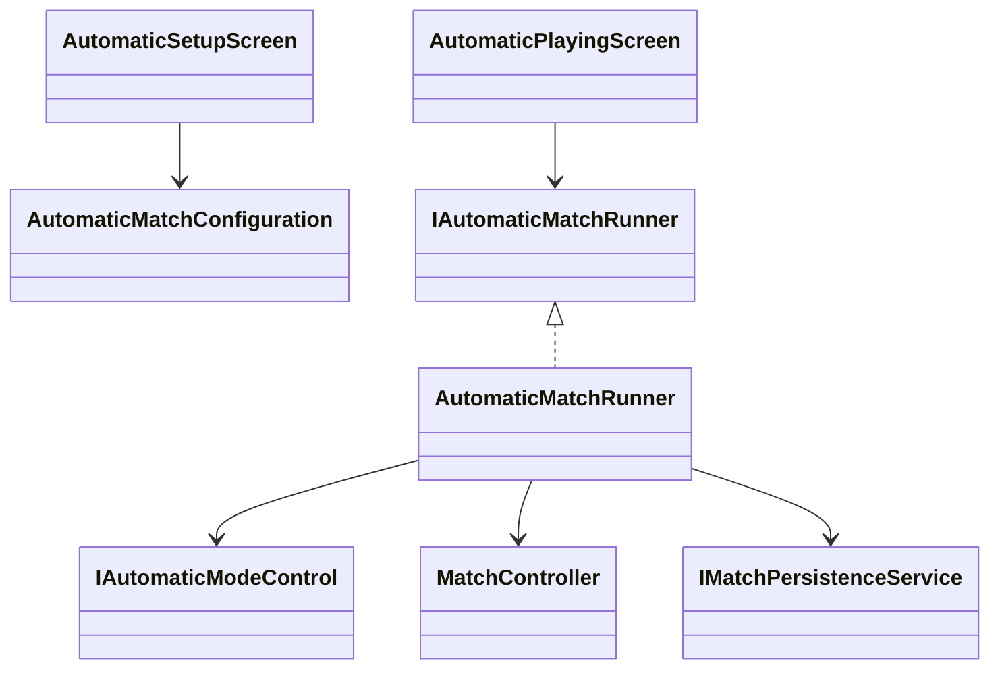
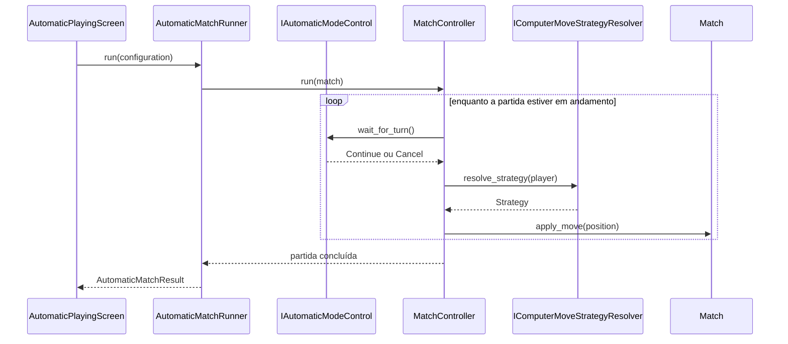

# Modo automático demonstrativo

## 1. Finalidade

O modo automático executa uma partida entre duas Strategies existentes sem
criar regras paralelas. `MatchController` continua coordenando o agregado
`Match`, enquanto a apresentação acrescenta renderização, atraso e controle de
pausa ou cancelamento.

## 2. Configuração

A tela `AutomaticSetupScreen` permite escolher Strategy de X e O, informar uma
semente e decidir se a partida concluída deve entrar no histórico. Campos em
branco utilizam `ApplicationSettings.DefaultStrategy` e
`ApplicationSettings.RandomSeed`.

O diagrama mostra a separação entre configuração, execução e persistência.

As telas não conhecem regras de vitória ou seleção de jogadas. Elas apenas
coletam opções e acionam o runner.

## 3. Fluxo da demonstração

`AutomaticMatchRunner` cria dois `ComputerPlayer`, usa `MoveStrategyFactory` e associa uma Strategy a cada
símbolo por `IComputerMoveStrategyResolver` e executa o controlador existente.

O cancelamento é representado por uma exceção interna e controlada, capturada
pelo runner. O `ScreenManager` recebe uma transição normal de retorno ao menu.

## 4. Pausa, cancelamento e atraso

No terminal, Espaço pausa ou retoma e Esc cancela. O contrato
`IAutomaticModeControl` permite substituir o teclado por implementações
simuladas. O atraso usa `IDelayService`, portanto os testes utilizam
`ImmediateDelayService` e não aguardam tempo real.

## 5. Persistência e configurações

A partida automática só é persistida quando a opção correspondente é marcada e
a partida chega a um estado final. Demonstrações canceladas nunca entram no
histórico.

`SettingsScreen` agora copia as preferências de apresentação para
`ApplicationSettings` e chama `ISettingsRepository.save`. O áudio é envolvido
por `PreferenceAwareAudioService`, que consulta `AudioEnabled` a cada evento;
assim, a mudança é observável durante a mesma sessão.

## 6. Testes

A suíte cobre:

- Strategy e semente padrão;
- Strategies distintas para X e O;
- execução sem espera real;
- cancelamento antes da primeira jogada;
- persistência opcional;
- retorno ao menu;
- gravação das configurações;
- áudio reativo sem dispositivo físico.
