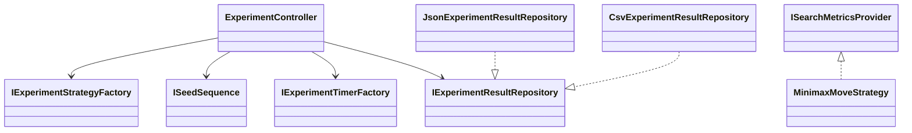
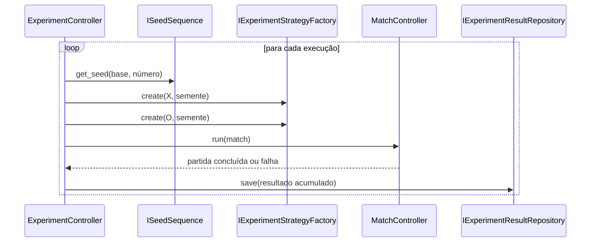

# Modo experimental

## 1. Finalidade

O modo experimental executa confrontos IA contra IA em lote sem renderização,
animações, áudio, atrasos ou navegação. Ele reutiliza `Match`,
`MatchController`, `IComputerMoveStrategyResolver` e as Strategies existentes.

## 2. Componentes

O controlador recebe todos os mecanismos externos por contrato.



Essa separação permite testes determinísticos e impede acoplamento com
`MinimaxMoveStrategy` concreto ou com a camada de apresentação.

## 3. Execução do lote

Cada execução obtém uma semente pela política sequencial, cria Strategies
independentes e executa o controlador normal com `NullGameOutput`.



O resultado acumulado é salvo após cada tentativa. Uma falha individual gera
uma métrica com `failed=true` e não elimina observações anteriores.

## 4. Alternâncias

`AlternateSymbols` troca as Strategies associadas a X e O nas execuções pares.
`AlternateFirstPlayer` altera qual símbolo ocupa a primeira posição no
construtor de `Match`. As opções são independentes.

## 5. Sementes

`SequentialSeedSequence` produz `base_seed + run_number - 1`. Sem semente base,
o valor permanece nulo. A semente efetiva é registrada em JSON e CSV.

## 6. Métricas de busca

Strategies podem implementar `ISearchMetricsProvider`. O seletor acumula
`LastEvaluatedStates` após cada jogada. Strategies sem o contrato produzem
`evaluated_states` vazio.

## 7. Persistência

Os arquivos padrão são:

```text
experiment-result.json
experiment-metrics.csv
```

JSON e CSV usam arquivo temporário seguido de substituição. O histórico normal
não é alterado, exceto quando `PersistMatchesToHistory` é explicitamente
habilitado.

## 8. Testabilidade

Os testes usam temporizadores simulados, diretórios temporários, sementes
controladas, Strategies com falha e métricas simuladas. Nenhum teste depende de
Console, ScreenManager, áudio, animação ou tempo real.
