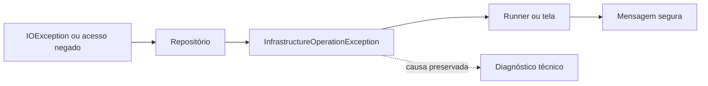
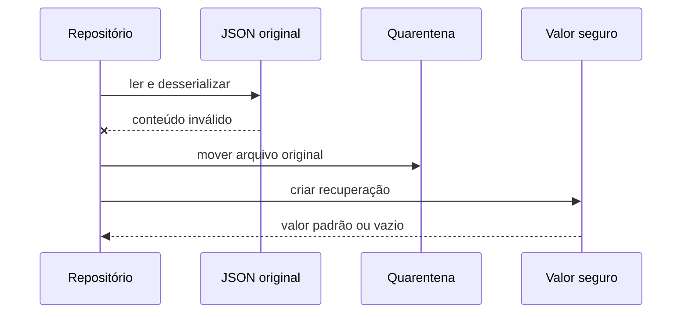
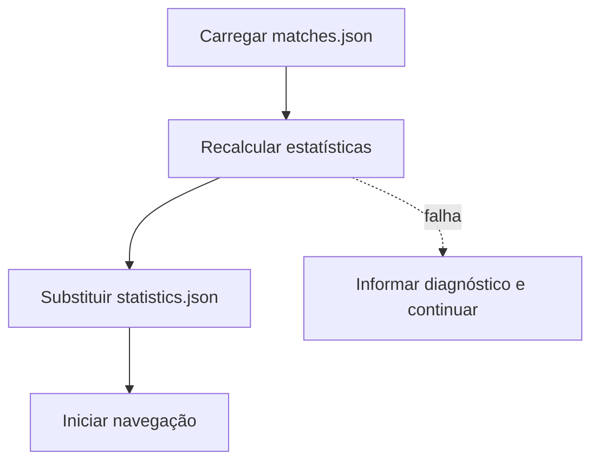

# Robustez das fronteiras externas

## 1. Objetivo

Esta etapa fortalece arquivos, configurações, persistência, áudio, créditos,
navegação e experimentação sem transferir regras de infraestrutura para o
domínio.

As mensagens públicas usam um identificador diagnóstico e não exibem caminhos,
conteúdo de arquivos ou dados pessoais.

## 2. Classificação de falhas

`InfrastructureOperationException` representa falhas operacionais de leitura,
gravação, permissão e substituição.

A causa permanece em `InnerException`, enquanto a apresentação mostra apenas a
mensagem pública e o `DiagnosticId`.

## 3. Quarentena JSON

JSON inválido é movido antes da recuperação.

O padrão é `arquivo.json.corrupt-data-guid`. Configurações recebem valores
padrão; histórico e estatísticas retornam estruturas seguras.

## 4. Consistência de partidas e estatísticas

O histórico é a fonte autoritativa. No início da aplicação,
`MatchPersistenceRecoveryService` recalcula `statistics.json`.

Isso recupera divergências causadas por interrupção entre as duas gravações.

## 5. Navegação e persistência

Os runners capturam apenas falhas de infraestrutura da persistência. A partida
concluída permanece disponível e a navegação continua.

A aplicação real não possui limite global de transições. Testes podem usar
`TransitionLimitCycleDetector` ou o construtor com `max_transitions`.

## 6. Resultados experimentais

Cada repositório experimental é isolado. Uma falha no JSON não impede a
tentativa de CSV. A falha é enviada a
`IExperimentInfrastructureReporter` e não altera a métrica da partida.

## 7. Áudio, CSV e créditos

`FallbackAudioService` captura somente `IOException`,
`UnauthorizedAccessException`, `PlatformNotSupportedException` e
`ObjectDisposedException`. Falhas inesperadas de programação são propagadas.

CSV converte falhas de escrita em `InfrastructureOperationException`.
`CitationMetadataLoader` usa fallback também quando o arquivo existe, mas não
pode ser lido.

## 8. Testes

A suíte cobre quarentena, recuperação de estatísticas, isolamento experimental,
mensagens sem dados sensíveis, áudio operacional e inesperado e detecção
explícita de ciclos.
