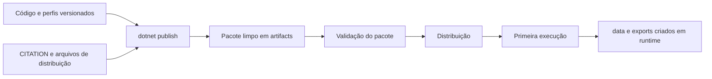
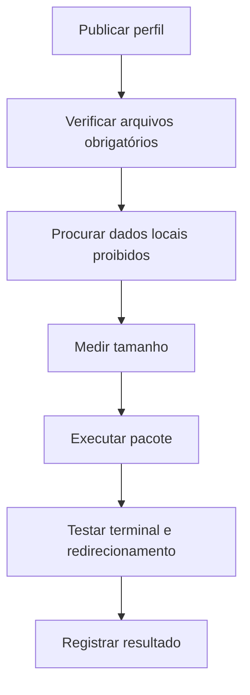

# Publicação

## 1. Objetivo

O projeto oferece quatro perfis de publicação para Windows e Linux, em modos
dependente do framework e autocontido.

| Perfil | RID | Runtime incluído |
|---|---|---|
| `win-x64-framework-dependent` | `win-x64` | não |
| `win-x64-self-contained` | `win-x64` | sim |
| `linux-x64-framework-dependent` | `linux-x64` | não |
| `linux-x64-self-contained` | `linux-x64` | sim |

## 2. Requisitos

Para compilar e publicar:

- SDK .NET 9;
- acesso aos pacotes NuGet necessários;
- espaço para artefatos;
- permissões de escrita em `artifacts/`.

Pacotes dependentes do framework exigem .NET Runtime 9 na máquina de destino.
Pacotes autocontidos não exigem instalação prévia do runtime.

## 3. Comandos

```powershell
dotnet publish .\src\TicTacToe.Console\TicTacToe.Console.csproj `
    /p:PublishProfile=win-x64-framework-dependent

dotnet publish .\src\TicTacToe.Console\TicTacToe.Console.csproj `
    /p:PublishProfile=win-x64-self-contained

dotnet publish .\src\TicTacToe.Console\TicTacToe.Console.csproj `
    /p:PublishProfile=linux-x64-framework-dependent

dotnet publish .\src\TicTacToe.Console\TicTacToe.Console.csproj `
    /p:PublishProfile=linux-x64-self-contained
```

Os comandos são equivalentes em Bash, retirando a continuação por acento grave.

## 4. Diretórios

Os resultados são gravados em:

```text
artifacts/publish/
├── win-x64-framework-dependent/
├── win-x64-self-contained/
├── linux-x64-framework-dependent/
└── linux-x64-self-contained/
```

`artifacts/` é ignorado pelo Git.

Cada pacote deve conter:

- aplicação e dependências;
- `CITATION.cff`;
- `README-PUBLISH.md`;
- `settings.example.json`.

Não deve conter:

- `data/`;
- `exports/`;
- `settings.json`;
- `matches.json`;
- `statistics.json`;
- resultados experimentais.

## 5. Fluxo de empacotamento

O fluxo abaixo separa conteúdo versionado, artefatos e dados criados em runtime.



Dados do usuário só surgem depois da execução. Atualizar o executável não exige
substituir `data/` ou `exports/`.

## 6. Execução

No Windows:

```powershell
.\TicTacToe.Console.exe
```

No Linux:

```bash
chmod +x TicTacToe.Console
./TicTacToe.Console
```

Em pacotes dependentes do framework:

```bash
dotnet TicTacToe.Console.dll
```

## 7. Tamanho medido

O tamanho deve ser medido depois de cada publicação, sem estimativas
fabricadas.

PowerShell:

```powershell
.\scripts\validate-publish.ps1 `
    .\artifacts\publish\win-x64-framework-dependent
```

Bash:

```bash
./scripts/validate-publish.sh   artifacts/publish/linux-x64-framework-dependent
```

Os scripts exibem `SizeBytes` e `SizeMiB`. Registre os valores efetivamente
obtidos na preparação da release.

Em termos relativos:

- dependente do framework tende a ser menor;
- autocontido tende a ser maior por incluir o runtime;
- tamanhos podem mudar entre versões do SDK.

## 8. Localização e permissões de dados

A aplicação resolve `data` e `exports` em relação ao diretório do executável,
conforme a configuração.

O usuário precisa de permissão de escrita nesse local. Em instalações
protegidas, como `Program Files`, recomenda-se copiar o pacote para um diretório
do usuário ou ajustar os diretórios configurados.

No Windows, uma alternativa operacional é `%LOCALAPPDATA%`:

```powershell
$app_directory = Join-Path $env:LOCALAPPDATA "TicTacToe"
New-Item -ItemType Directory -Path $app_directory -Force
Copy-Item .\artifacts\publish\win-x64-self-contained\* `
    $app_directory `
    -Recurse `
    -Force
```

Pastas sincronizadas pelo Dropbox podem bloquear arquivos durante atualização,
quarentena ou gravação atômica. Para publicação e experimentos, prefira gerar
artefatos fora da pasta sincronizada e copiar o resultado concluído depois.

## 9. Atualização sem perda de dados

Para atualizar:

1. preservar `data/` e `exports/`;
2. substituir somente os arquivos da aplicação;
3. não copiar `settings.example.json` sobre `data/settings.json`;
4. iniciar a nova versão;
5. conferir mensagens de recuperação e quarentena.

O pacote distribuído não contém dados locais, reduzindo o risco de substituição
acidental.

## 10. Single-file, trimming e ReadyToRun

Os quatro perfis mantêm:

```text
PublishSingleFile = false
PublishTrimmed = false
PublishReadyToRun = false
```

### Single-file

Pode simplificar a distribuição, mas ainda pode extrair arquivos, alterar
carregamento de conteúdo e dificultar inspeção. Não é habilitado nesta etapa.

### Trimming

Pode remover código acessado por serialização ou reflexão. Como o projeto usa
JSON e metadados em runtime, trimming exige validação específica antes de ser
ativado.

### ReadyToRun

Pode reduzir tempo de inicialização em alguns ambientes, mas aumenta o pacote e
é sensível ao RID. O jogo tem inicialização pequena; não há evidência atual que
justifique o custo.

## 11. Validação

O diagrama representa as verificações mínimas.



Use os scripts de `scripts/` e execute pelo menos um pacote Windows e um Linux
no sistema correspondente.

## 12. Limitações

- o SDK não permite executar binários Linux nativamente no Windows;
- testes simulados não substituem execução real;
- autocontido aumenta o tamanho;
- permissões variam conforme o diretório;
- o tamanho final deve ser registrado após publicação real;
- assinatura de código e instaladores não fazem parte desta etapa.

## 13. Operações de arquivo no PowerShell

Comandos úteis para diagnóstico e atualização:

```powershell
Test-Path .\data
Get-ChildItem .\data -Recurse -Force
Copy-Item .\data .\backup\data -Recurse -Force
Move-Item .\data\settings.json .\data\settings.backup.json
Remove-Item .\artifacts\publish -Recurse -Force
Get-FileHash .\CITATION.cff -Algorithm SHA256
```

Para localizar arquivos gerados em um diretório desconhecido:

```powershell
Get-ChildItem `
    . `
    $env:LOCALAPPDATA `
    -Recurse `
    -File `
    -Filter "reference-manifest.json" `
    -ErrorAction SilentlyContinue
```

`Remove-Item -Recurse -Force` é destrutivo. Antes de usá-lo em dados locais,
confirme o caminho com `Resolve-Path`, `Test-Path` e `Get-ChildItem`.


## 14. Publicações da candidata v1.9.0 — registro histórico

A validação integrada é executada por:

```powershell
powershell.exe `
    -NoProfile `
    -ExecutionPolicy Bypass `
    -File .\scripts
alidate-release-v1.9.0.ps1
```

O script publica e inspeciona os quatro perfis. A tag só pode ser criada depois
que todos os pacotes forem validados e o relatório da candidata for aprovado.

## 15. Publicação da versão v2.0.0

A versão final usa os mesmos quatro perfis de publicação documentados, agora
identificados como `2.0.0`. Execute o validador final:

```powershell
powershell.exe `
    -NoProfile `
    -ExecutionPolicy Bypass `
    -File .\scripts\validate-release-v2.0.0.ps1
```

As instruções de checksums, tag e GitHub Release estão em
[`34-release-v2.0.0.md`](34-release-v2.0.0.md).
