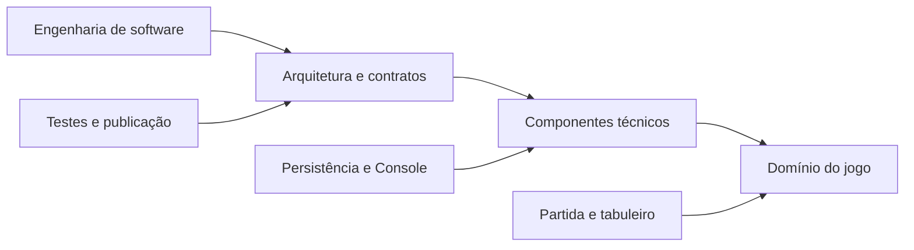

# Glossário

## 1. Finalidade

Este glossário reúne termos gerais de engenharia de software, termos técnicos
da implementação e conceitos do domínio do jogo da velha. As definições são
específicas ao contexto deste projeto.

## 2. Termos gerais

| Termo | Definição no projeto |
|---|---|
| aplicação | conjunto executável que coordena domínio, IA, persistência e apresentação |
| arquitetura | organização dos módulos, responsabilidades e dependências permitidas |
| contrato | interface ou comportamento público esperado entre componentes |
| fallback | comportamento alternativo seguro quando um recurso não está disponível |
| infraestrutura | código de arquivos, Console, áudio, temporização e ambiente operacional |
| reprodutibilidade | capacidade de repetir uma execução com configuração e sementes registradas |
| refatoração | modificação estrutural que preserva ou melhora o comportamento observável |
| release | versão preparada, validada e distribuída |
| Strategy | padrão que encapsula algoritmos intercambiáveis de escolha de jogada |
| teste de integração local | teste que combina componentes usando recursos temporários da máquina |

## 3. Termos técnicos

| Termo | Definição no projeto |
|---|---|
| ANSI | sequências de controle usadas para cores e limpeza em terminais compatíveis |
| autocontido | pacote que inclui o runtime .NET necessário |
| dependente do framework | pacote que exige .NET Runtime instalado |
| composition root | ponto em que dependências concretas são construídas |
| CSV | formato tabular UTF-8, separado por ponto e vírgula |
| JSON | formato textual usado para configurações e persistência |
| LF | caractere de fim de linha adotado nos arquivos do repositório |
| Minimax | algoritmo de busca adversarial usado como Strategy |
| publish profile | arquivo MSBuild que registra opções de publicação |
| ReadyToRun | compilação antecipada parcial para acelerar inicialização em alguns cenários |
| redirecionamento | uso de arquivo ou pipe no lugar do terminal interativo |
| RID | identificador de runtime, como `win-x64` ou `linux-x64` |
| single-file | publicação que agrega arquivos em um executável principal |
| trimming | remoção de código considerado não utilizado durante a publicação |
| UTF-8 sem BOM | codificação usada nos arquivos persistidos e exportados |

## 4. Termos do domínio

| Termo | Definição no projeto |
|---|---|
| tabuleiro | grade 3 × 3 que armazena símbolos |
| posição | coordenada válida de linha e coluna |
| símbolo | marca X ou O |
| jogada | associação entre posição, símbolo e momento da partida |
| participante | pessoa ou computador associado a um símbolo |
| partida | agregado que controla turnos, jogadas e resultado |
| vitória | resultado em que três símbolos iguais formam uma linha válida |
| empate | término sem vencedor e sem casas livres |
| sequência vencedora | três posições que comprovam a vitória |
| partida demonstrativa | confronto IA contra IA com apresentação |
| execução experimental | confronto IA contra IA sem recursos de apresentação |
| semente | valor usado para tornar decisões pseudoaleatórias reproduzíveis |

## 5. Relação entre os grupos

O diagrama apresenta como vocabulário geral, técnico e de domínio se encontram
na aplicação.

Os termos gerais descrevem decisões de construção; os técnicos identificam
mecanismos concretos; os termos de domínio descrevem o problema modelado.
