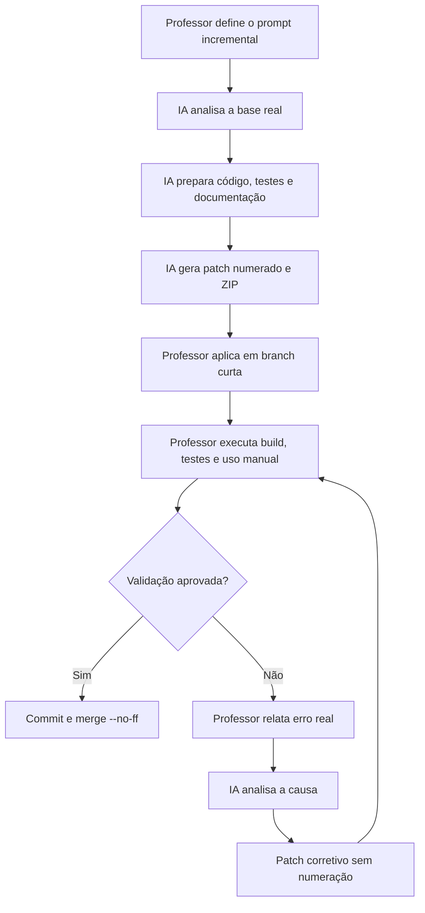
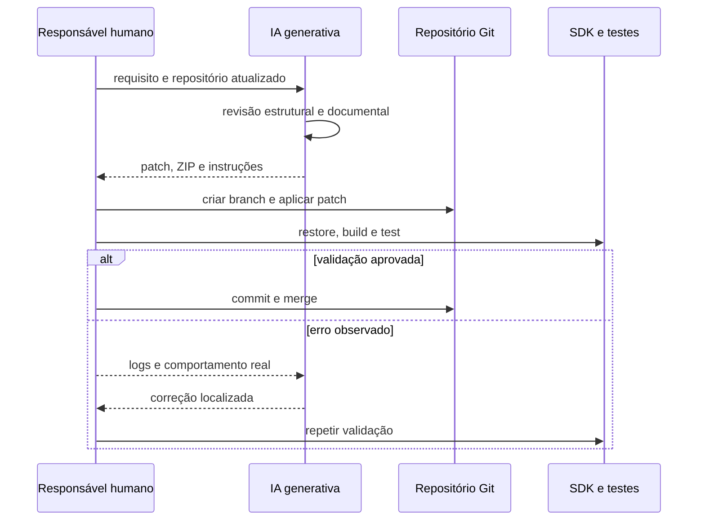

# Uso de inteligência artificial generativa

## 1. Declaração de transparência

Este projeto utiliza inteligência artificial generativa como apoio ao processo
de refatoração, documentação e preparação de patches. A responsabilidade pelas
decisões, aplicação dos patches, execução dos testes, integração no Git e
publicação permanece humana.

A IA não opera diretamente sobre a branch principal. O trabalho é organizado
em prompts incrementais, revisões e validações explícitas.

## 2. Responsabilidades

### Responsabilidade humana

- definir requisitos e restrições;
- fornecer o repositório real;
- revisar as propostas;
- aplicar patches;
- executar build e testes no ambiente alvo;
- relatar erros observados;
- aprovar commits, merges, tags e releases;
- avaliar adequação acadêmica e técnica.

### Apoio da IA generativa

- analisar código e documentação fornecidos;
- propor alterações incrementais;
- gerar patches e arquivos de apoio;
- identificar inconsistências;
- sugerir testes;
- atualizar documentação;
- explicar procedimentos Git e .NET;
- preparar correções quando a validação humana encontra falhas.

## 3. Fluxo incremental

O fluxo abaixo representa o processo efetivamente utilizado.

A numeração pertence aos incrementos funcionais. Correções intermediárias usam
nomes descritivos para não consumir a sequência dos prompts.

## 4. Sequência de interação

O diagrama detalha a troca de evidências entre as partes.

Logs de compilação e testes são tratados como evidência superior a uma
suposição produzida durante a geração.

## 5. Controles de qualidade

O processo adota:

- patches pequenos e rastreáveis;
- branches temáticas;
- commits em português do Brasil;
- testes automatizados;
- build Release com warnings tratados como erros;
- revisão de whitespace;
- preservação do domínio contra dependências externas;
- documentação Mermaid com interpretação;
- distinção entre resultado executado e resultado apenas esperado;
- revisão humana antes de qualquer integração.

## 6. Limitações

A IA pode:

- interpretar incorretamente uma API;
- gerar código que compila apenas após ajuste;
- omitir uma dependência;
- propor um teste insuficiente;
- descrever como executada uma validação que não ocorreu, caso não haja controle.

Por isso, este projeto registra explicitamente quando o SDK não está disponível
no ambiente de geração e exige validação local antes do merge.

## 7. Autoria e atribuição

A IA generativa é uma ferramenta de apoio, não substitui a autoria e a
responsabilidade das pessoas que definem o projeto, selecionam as contribuições
e aprovam a versão final.

Alterações relevantes permanecem documentadas no histórico Git, no
`CHANGELOG.md` e nos documentos de decisão.
