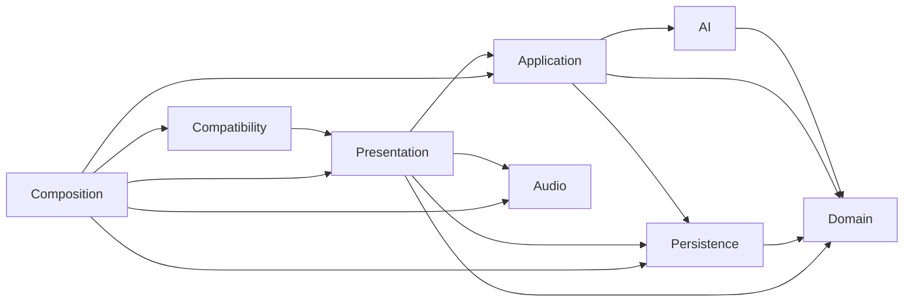
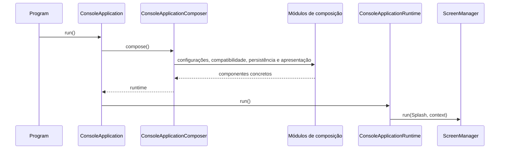
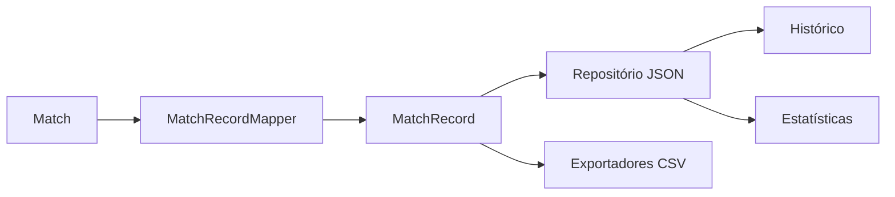

# Revisão arquitetural final

## 1. Escopo

Esta revisão confronta a arquitetura documentada com o código consolidado após
os modos automático e experimental, robustez de fronteiras, compatibilidade e
publicação.

Foram verificadas direção das dependências, exposição de estado mutável,
responsabilidades, composição, persistência, métricas e navegação.

## 2. Direção das dependências

A direção esperada permanece centrada no domínio.

`Domain` não referencia nenhum módulo externo. `Composition` é o único módulo
autorizado a conhecer todas as implementações concretas necessárias ao
executável.

## 3. Composition root

`Program.Main` permanece mínimo. `ConsoleApplication` também foi reduzido para
solicitar uma composição e executar o runtime.

A composição continua explícita e sem contêiner externo de injeção de
dependência.

## 4. Estado mutável

`Match` mantém o `Board` concreto privado e expõe apenas `IReadOnlyBoard`.
Strategies recebem `IReadOnlyBoard` e criam representações internas para
simulação.

Registros com coleções agora realizam cópias defensivas:

- `MatchRecord`;
- `MatchStatisticsRecord`;
- `ExperimentResult`;
- `SettingsValidationResult`;
- `PublishPackageValidationResult`.

Isso impede que uma lista mutável fornecida ao construtor altere o registro
depois de criado.

## 5. Persistência

Entidades do domínio não conhecem JSON ou CSV. `MatchRecordMapper` converte
`Match` em registros persistentes fora do domínio.

O histórico permanece a fonte autoritativa para recuperação de estatísticas.

## 6. Métricas experimentais

`ExperimentController` depende de contratos e não de
`MinimaxMoveStrategy`. Métricas de busca são obtidas por
`ISearchMetricsProvider`.

O resultado experimental realiza cópia defensiva das métricas acumuladas antes
de expô-las.

## 7. Navegação

Telas implementam `IScreen`, recebem dependências no construtor e retornam
`ScreenTransition`. Elas não instanciam nem chamam outras telas.

`ScreenManager` resolve estados e mantém a transição centralizada. Detectores de
ciclo são opcionais e usados principalmente em testes.

## 8. Atrasos e recursos externos

Atrasos permanecem na apresentação. Não há `Thread.Sleep`, `Task.Delay` ou
serviço de áudio em `Domain`, `AI` ou `MatchController`.

Console, arquivos, JSON, CSV, áudio e detecção do ambiente permanecem em
adaptadores externos.

## 9. Testes arquiteturais

Foram adicionados testes para:

- API pública do domínio sem exposição de módulos externos;
- `Match.Board` somente como `IReadOnlyBoard`;
- Strategies recebendo `IReadOnlyBoard`;
- cópia defensiva dos registros com coleções.

Esses testes complementam os testes funcionais que já verificam preservação do
tabuleiro original pelas Strategies.

## 10. Conclusão

A arquitetura mantém domínio independente, aplicação coordenadora, adaptadores
externos separados e composição explícita.

Os principais ajustes desta revisão foram a decomposição do composition root e
a substituição de imutabilidade superficial por cópias defensivas.
