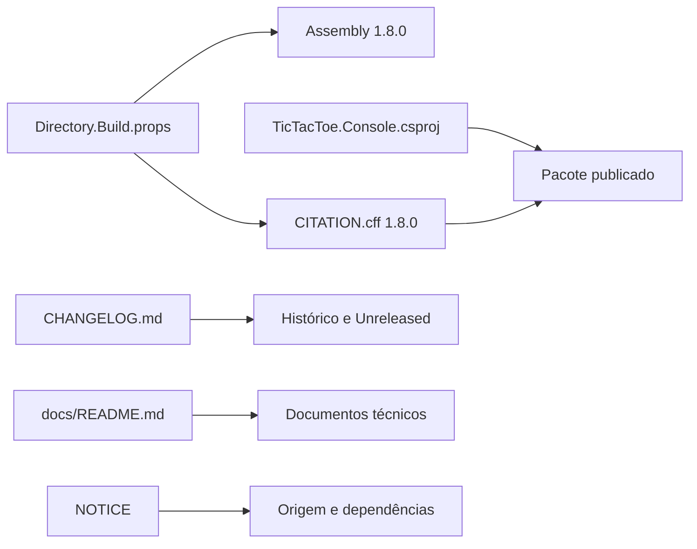

# Revisão legal e documental

## 1. Escopo

Esta revisão verifica os artefatos legais, metadados de versão, documentação,
esquemas e instruções operacionais contra o código consolidado da versão
`1.8.0` com alterações ainda em `Unreleased`.

## 2. Licença e atribuições

O arquivo `LICENSE` contém o texto integral da Apache License 2.0.
`LICENSE.md` apresenta uma explicação acessível sem substituir o texto legal.

`NOTICE` registra:

- origem do legado sob licença MIT na tag `v1.0.0`;
- refatoração posterior sob Apache License 2.0;
- autoria;
- ausência de recursos artísticos de terceiros;
- dependências reais de desenvolvimento e teste.

A aplicação de produção não possui `PackageReference`. Os pacotes NuGet
declarados pertencem somente ao projeto de testes.

## 3. Versão e citação

A versão permanece `1.8.0` em:

- `Directory.Build.props`;
- `CITATION.cff`;
- assembly produzido pelo MSBuild.

A data `2026-07-18` identifica a release `v1.8.0`. Alterações dos prompts
posteriores permanecem em `Unreleased` e não alteram a citação até a próxima
release formal.

O arquivo `CITATION.cff` é copiado explicitamente para build e publicação por
`TicTacToe.Console.csproj`.

## 4. Idioma e nomes

A política consolidada é:

- identificadores de código em inglês;
- classes e tipos em `CamelCase`;
- métodos e variáveis em `snake_case`;
- documentação, mensagens públicas e commits em português do Brasil;
- nomes técnicos consagrados preservados quando melhoram precisão.

Os documentos foram comparados com nomes reais, incluindo
`ConsoleApplicationComposer`, `TransitionLimitCycleDetector`,
`ExperimentController`, `ReferenceExperimentRunner`,
`PublishPackageVerifier` e `CitationMetadataLoader`.

## 5. Dependências documentais

O fluxo real entre código e documentação é apresentado abaixo.

A próxima versão deve atualizar assembly, `CITATION.cff`, `CHANGELOG.md` e tag
na mesma alteração de release.

## 6. Esquemas e comandos

Os esquemas documentados continuam usando:

- JSON em camelCase;
- CSV UTF-8 sem BOM;
- separador ponto e vírgula;
- datas ISO 8601;
- números com cultura invariável.

Os comandos foram revisados para PowerShell e Bash. Artefatos temporários,
publicações, cobertura e resultados brutos permanecem fora do versionamento.

## 7. Dropbox e dados locais

Substituições atômicas podem coincidir com a sincronização do Dropbox e causar
bloqueios transitórios. Experimentos e publicações devem preferir diretórios
locais, como `%LOCALAPPDATA%`, e copiar apenas resultados concluídos.

A aplicação normal ainda resolve `data/` e `exports/` em relação ao diretório
do executável. Essa decisão é diferente do diretório opcional fornecido ao
comando do experimento de referência.

## 8. Resultado

Não foram alterados os termos da Apache License 2.0. Foram atualizados
`LICENSE.md`, `NOTICE`, índices, matriz documental e descrições que ainda
refletiam arquiteturas intermediárias.
