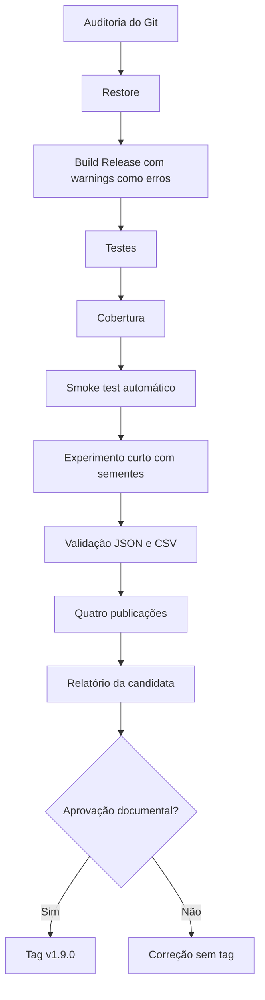

# Preparação da versão v1.9.0

## 1. Estado

A versão `1.9.0` é preparada como candidata final em `2026-07-21`. A tag
`v1.9.0` permanece proibida até que o checklist seja executado em ambiente com
SDK .NET 9 e a documentação seja aprovada.

## 2. Escopo da versão

A versão consolida:

- modo automático IA contra IA;
- modo experimental reproduzível;
- robustez das fronteiras externas;
- compatibilidade Windows e Linux;
- publicação dependente do framework e autocontida;
- revisão arquitetural;
- cobertura e qualidade dos testes;
- experimento de referência;
- revisão legal e documental.

## 3. Fluxo de validação

O script `scripts/validate-release-v1.9.0.ps1` centraliza as verificações.



A tag é a última operação e não deve ser usada para contornar uma validação
incompleta.

## 4. Execução no Windows

Como políticas de execução podem bloquear scripts PowerShell:

```powershell
powershell.exe `
    -NoProfile `
    -ExecutionPolicy Bypass `
    -File .\scripts
alidate-release-v1.9.0.ps1
```

Os artefatos de validação são produzidos em:

```text
%LOCALAPPDATA%\TicTacToe
elease
1.9.0
```

Isso reduz conflitos com o Dropbox.

## 5. Verificações realizadas pelo script

- consistência da versão `1.9.0`;
- ausência de binários e dados locais rastreados;
- busca por segredos e caminhos pessoais;
- `git diff --check`;
- restore;
- build Release com `-warnaserror`;
- suíte completa;
- Cobertura XML;
- smoke test de `AutomaticMatchRunner`;
- experimento curto com duas repetições por cenário;
- semente base `1900`;
- commit registrado;
- análise e validação de JSON e CSV;
- quatro perfis de publicação;
- arquivos obrigatórios do pacote;
- relatório JSON da candidata.

## 6. Experimento curto

O experimento de validação não substitui o experimento de referência de 600
partidas. Ele usa:

```text
2 repetições por cenário
6 cenários
12 partidas
semente base 1900
```

O objetivo é validar o pipeline, os esquemas, os hashes e a reprodutibilidade
antes da release.

## 7. Auditoria do repositório

Não podem estar rastreados:

- `bin/`;
- `obj/`;
- `artifacts/`;
- resultados de cobertura;
- `data/*.json`;
- `exports/*.csv`;
- resultados experimentais brutos;
- arquivos `.user`, `.suo`, `.trx` ou pacotes NuGet;
- caminhos pessoais;
- chaves privadas ou segredos.

## 8. Aprovação e tag

Depois de revisar `release-validation.json`, cobertura, publicações,
documentação e resultados:

```powershell
git status
git log -1 --oneline
git tag -a v1.9.0 -m "release: v1.9.0"
git push origin v1.9.0
```

A tag não deve ser criada se a árvore estiver suja, se houver warnings, falhas,
dados locais rastreados ou documentação pendente.

## 9. Codificação no Windows PowerShell

Os scripts `.ps1` da validação são versionados em UTF-8 com BOM. Essa
codificação é necessária para que o Windows PowerShell 5.1 interprete acentos
antes que o script configure a página de código 65001.

Quando PowerShell 7 estiver disponível, o comando equivalente também pode ser
executado com:

```powershell
pwsh `
    -NoProfile `
    -File .\scripts\validate-release-v1.9.0.ps1
```


O relatório `release-validation.json` é gravado por
`System.IO.File.WriteAllText` com `UTF8Encoding(false)`. Essa abordagem evita o
valor `utf8NoBOM`, que não existe em `Set-Content` no Windows PowerShell 5.1.

Cada perfil de publicação executa seu próprio restore implícito. Isso é
necessário porque `project.assets.json` precisa conter o alvo específico do
RID, como `net9.0/win-x64` ou `net9.0/linux-x64`.
