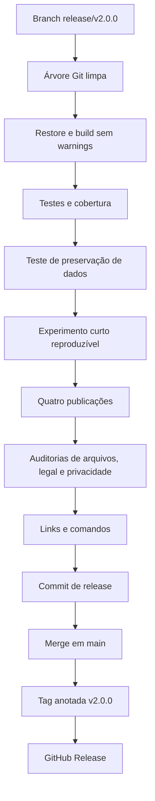

# Consolidação da versão v2.0.0

## 1. Finalidade

A versão `2.0.0`, datada de 22 de julho de 2026, conclui a refatoração do
Tic-Tac-Toe Console AI. Ela representa a arquitetura modular e os fluxos
funcionais documentados, e não apenas uma alteração nominal de versão.

O escopo funcional planejado está encerrado. Interface gráfica, rede,
tabuleiros alternativos, novos agentes e telemetria visual são possibilidades
posteriores independentes, sem bloquear esta release.

## 2. Escopo consolidado

- domínio e regras independentes da infraestrutura;
- Strategies Random, Heuristic e Minimax;
- partida interativa, modo automático e modo experimental;
- apresentação Console, temas, animações e áudio com fallback;
- configurações, partidas e estatísticas em JSON;
- exportações CSV;
- experimento de referência reproduzível;
- testes automatizados e cobertura;
- publicações Windows e Linux, dependentes e autocontidas;
- documentação técnica, legal, experimental e acadêmica;
- histórico de prompts e patches.

## 3. Fluxo de validação

O fluxo abaixo deve ser concluído antes da tag.



A tag só deve ser criada quando todas as verificações aplicáveis forem
aprovadas. Resultados não executáveis no ambiente atual precisam ser realizados
em Windows e, quando disponível, em Linux.

## 4. Comando principal

No Windows PowerShell:

```powershell
powershell.exe `
    -NoProfile `
    -ExecutionPolicy Bypass `
    -File .\scripts\validate-release-v2.0.0.ps1
```

O script centraliza versão, restore, build, testes, auditoria e publicações. A
saída deve ser preservada como evidência da release, mas não precisa ser
versionada quando contiver artefatos volumosos ou informações locais.

## 5. Validações obrigatórias

1. `dotnet restore`;
2. `dotnet build --configuration Release -warnaserror`;
3. `dotnet test --configuration Release --no-build`;
4. cobertura conforme `tests/coverage.runsettings`;
5. teste de atualização com dados produzidos pela v1.9.0;
6. experimento curto repetido com as mesmas sementes;
7. publicação `win-x64` e `linux-x64`, framework-dependent e self-contained;
8. smoke test das publicações executáveis no ambiente disponível;
9. auditoria de arquivos sensíveis e resíduos locais;
10. auditoria de licença, `NOTICE` e `CITATION.cff`;
11. auditoria de dados e privacidade;
12. verificação dos links locais e comandos documentados.

## 6. Artefatos e checksums

Após publicar, calcule SHA-256:

```powershell
Get-ChildItem .\artifacts\release\v2.0.0 -File -Recurse |
    Get-FileHash -Algorithm SHA256 |
    Sort-Object Path |
    Format-Table -AutoSize
```

Para um arquivo consolidado de checksums:

```powershell
Get-ChildItem .\artifacts\release\v2.0.0 -File -Recurse |
    Get-FileHash -Algorithm SHA256 |
    ForEach-Object { "{0}  {1}" -f $_.Hash.ToLowerInvariant(), $_.Path } |
    Set-Content .\artifacts\release\v2.0.0\SHA256SUMS.txt -Encoding UTF8
```

Os checksums permitem verificar integridade após download.

## 7. Commit, merge e tag

```powershell
git switch release/v2.0.0
git status
git add Directory.Build.props CITATION.cff CHANGELOG.md README.md .gitignore
git add docs scripts tests
git commit -m "release: consolidar versão 2.0.0"

git switch main
git pull --ff-only origin main
git merge --no-ff release/v2.0.0 -m "merge: integrar versão 2.0.0"
git push origin main

git tag -a v2.0.0 -m "release: v2.0.0"
git push origin v2.0.0
```

A branch de release pode ser enviada para revisão antes do merge:

```powershell
git push -u origin release/v2.0.0
```

## 8. GitHub Release

Crie uma release a partir da tag `v2.0.0` e use como notas:

- resumo da arquitetura consolidada;
- funcionalidades principais;
- plataformas suportadas;
- instruções de atualização;
- limitações conhecidas;
- licença e citação;
- checksums.

Anexos recomendados, conforme disponibilidade:

- quatro pacotes publicados;
- `SHA256SUMS.txt`;
- resultados de referência e manifesto;
- relatório de validação;
- documentação adicional em PDF, se desejado.

## 9. Critério de conclusão

A release está concluída quando a tag `v2.0.0` aponta para o commit integrado em
`main`, os metadados estão coerentes, os artefatos possuem checksums e as notas
de release informam claramente instalação, migração, limitações e citação.
